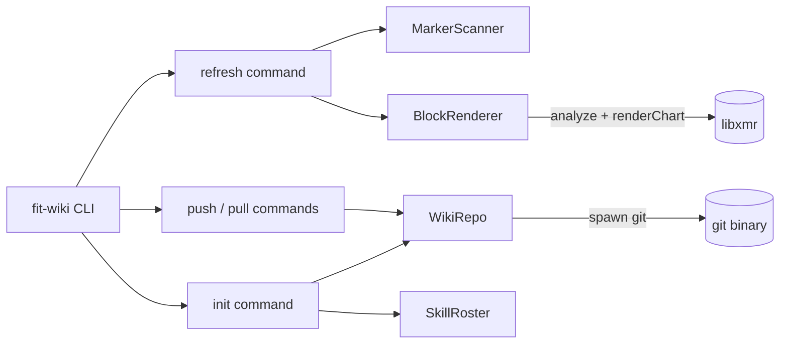
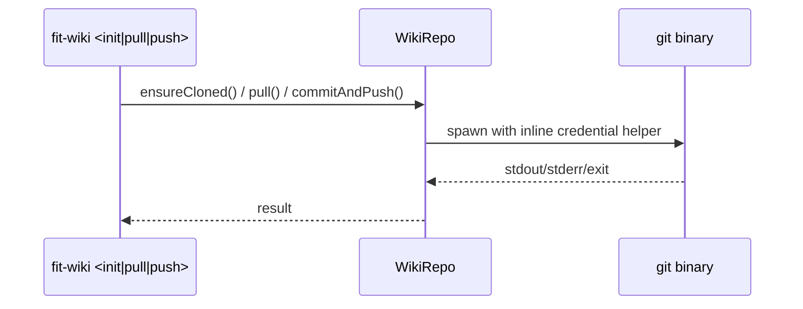

# Design A — Spec 780 Wiki lifecycle commands

## Architecture

Spec 780 extends the `fit-wiki` CLI (introduced in spec 770) with three
operational subcommands. Each subcommand is a thin orchestrator over a small
component owned by `libwiki`. `refresh` is the only command with a new
cross-library edge — it depends on `libxmr` for analyze + chart rendering.
`init`, `push`, and `pull` operate purely on the wiki git working tree.



## Components

| Component                | Package | Responsibility                                                                                                                                                  |
| ------------------------ | ------- | --------------------------------------------------------------------------------------------------------------------------------------------------------------- |
| `MarkerScanner`          | libwiki | Parse a markdown file; return `[{metric, csvPath, openLine, closeLine}]` for each `<!-- xmr:metric:path -->` … `<!-- /xmr -->` pair.                            |
| `BlockRenderer`          | libwiki | Given metric + csvPath, call `libxmr.analyze`, filter to the metric, format the `**Latest:** … **Status:** …` line, fenced chart, and `**Signals:** …` line.   |
| `refresh` command        | libwiki | Orchestrates `MarkerScanner` and `BlockRenderer` over a storyboard file; produces a single rewrite with all owned spans replaced.                                |
| `WikiRepo`                | libwiki | Wrap the `./wiki/` git working tree. Methods: `ensureCloned(url)`, `pull()`, `commitAndPush(message)`, `isClean()`. Owns credential helper + identity inheritance. |
| `SkillRoster`            | libwiki | Discover the skills in the installation; derive `wiki/metrics/<skill>/` paths.                                                                                   |
| `init` command           | libwiki | `WikiRepo.ensureCloned` for the wiki URL; for each `SkillRoster` entry create `wiki/metrics/<skill>/`. Idempotent.                                              |
| `push` / `pull` commands | libwiki | One-line wrappers over `WikiRepo.commitAndPush` / `WikiRepo.pull`.                                                                                              |

The dependency graph stays a tree: `libwiki → libxmr`, `libwiki → libutil`
(Finder, reused from `memo`). `libxmr` does not import `libwiki`.

## Marker contract

Spec § Scope 1 fixes the marker shape; the design pins the concrete
contract:

- **Token order.** `xmr:<metric>:<path>` — metric first (primary identifier),
  CSV path second (locator). Single colon separator.
- **Path format.** Relative to the project root (resolved via `Finder`),
  forward-slash separated. Example:
  `<!-- xmr:findings_count:wiki/metrics/kata-security-audit/2026.csv -->`.
- **Owned span.** Lines strictly between open and close markers belong to
  `refresh` and are replaced wholesale. The marker lines themselves and the
  preceding `#### {metric_name}` heading are preserved.
- **Generated content.** Three parts in order: `**Latest:** {value} ·
  **Status:** {status}` line, blank line, fenced chart from
  `libxmr.renderChart`, blank line, `**Signals:** {rules or "—"}` line.
  `{status}` is the value libxmr returns verbatim
  (`predictable | signals_present | insufficient_data`); no statuses are
  invented in this layer.

## Refresh flow

```mermaid
sequenceDiagram
  participant CLI as fit-wiki refresh
  participant FS as filesystem
  participant Lib as libxmr
  CLI->>FS: read storyboard
  CLI->>CLI: MarkerScanner → blocks
  loop per block (bottom-up)
    CLI->>FS: read csvPath
    CLI->>Lib: analyze(csv); filter to metric
    CLI->>Lib: renderChart for the metric
    CLI->>CLI: BlockRenderer formats Latest/Chart/Signals
    CLI->>CLI: splice into line buffer
  end
  CLI->>FS: write storyboard once
```

- **Single read + single write.** Splicing is bottom-up (highest open-line
  first) so earlier line indices remain valid throughout the loop.
- **No-op on no markers.** When `MarkerScanner` returns empty, skip the
  write entirely (`git diff` empty, criterion #3).
- **Idempotent.** Output is a pure function of the storyboard markers and
  the referenced CSV contents (criterion #2). `BlockRenderer` defers all
  status semantics — including low-N behaviour — to `libxmr.analyze` and
  `libxmr.renderChart`.

## Init / push / pull flow

`WikiRepo` shells out to system `git`, inheriting the credential pattern
from `scripts/wiki-sync.sh`:



- **Wiki URL.** Derived from the parent repo's `origin` URL by appending
  `.wiki.git`.
- See decisions W2–W3 and W5 below for credential, push-conflict, and
  pull-conflict policies; I3 covers identity inheritance.

## Key decisions

| #   | Choice                          | Decision                                                                                                                                                          | Rejected alternative                                                                                                                                                    |
| --- | ------------------------------- | ----------------------------------------------------------------------------------------------------------------------------------------------------------------- | ----------------------------------------------------------------------------------------------------------------------------------------------------------------------- |
| R1  | Marker token order              | `xmr:<metric>:<path>` — metric first.                                                                                                                              | `xmr:<path>:<metric>` — reads as a file locator with metric appended; metric-first foregrounds the primary identifier.                                                 |
| R2  | Block parser                    | Line-based scan for the two literal comment patterns.                                                                                                              | Full markdown AST — pulls a parser into libwiki for one regex-equivalent task; the marker is unambiguous on its own line.                                              |
| R3  | Chart rendering source          | Reuse `libxmr.analyze` + `libxmr.renderChart` unchanged.                                                                                                           | Reimplement chart formatting in libwiki — duplicates the canonical 14-line chart logic and risks drift between `fit-xmr chart` and `fit-wiki refresh` output.          |
| R4  | Splicing direction              | Bottom-up (highest open-line index first).                                                                                                                         | Top-down — every splice shifts subsequent indices and forces a re-scan after each block.                                                                                |
| R5  | Path resolution                 | CSV path in marker is relative to the project root; `Finder.findProjectRoot` joins it (matches `memo` and `record`).                                              | Absolute paths in markers — unportable across clones and CI runners. Wiki-relative paths — diverges from the agent-facing path everyone already types.                  |
| W1  | Git operations                  | Shell out to system `git` via `child_process.spawn`.                                                                                                               | Use isomorphic-git — 1.5 MB dependency and a second git implementation; existing `wiki-sync.sh` behaviour is already specified in terms of system git.                |
| W2  | Credential injection            | Inline `-c credential.helper=…` per call.                                                                                                                          | Write token to `.git/config` — leaks credentials onto disk and persists across sessions.                                                                                |
| W3  | Push conflict policy            | Local wins via `merge -X ours` after rebase failure.                                                                                                               | Hard-fail on conflict — wiki writes are streaming agent output; failing push aborts the whole session. Local-wins matches the wiki's role as agent-authored memory.   |
| W4  | Wiki URL discovery              | Derive from parent repo's `origin` + `.wiki.git`.                                                                                                                  | Hardcode the monorepo URL — kills portability to downstream Kata installations (the spec's central goal).                                                              |
| W5  | Pull conflict policy            | Abort the rebase and exit non-zero with a diagnostic line — matches `wiki-sync.sh pull`.                                                                          | Auto-resolve in favour of remote — silently overwrites locally drafted memos that have not yet been pushed.                                                            |
| I1  | Skill discovery for init        | Enumerate the installed kata skills under `.claude/skills/`; derive directory names from their slugs.                                                              | Hardcoded list — edit every time a skill is added. Glob `wiki/metrics/*/` — circular (the directory may not exist yet on first init).                                  |
| I2  | Empty-directory persistence     | Skip placeholder files. `record` creates the directory on demand if missing.                                                                                       | Drop a `.gitkeep` per skill — clutters the wiki with zero-content files; on-demand creation is already supported.                                                       |
| I3  | Identity source                 | Inherit from parent repo's `git config user.name/email`.                                                                                                           | CLI flags for identity — agents would replumb identity through every command; the parent repo already declares it.                                                    |

## Boundaries

- `libwiki → libxmr` is the only new cross-package edge. `libxmr` stays
  unchanged for this spec.
- `WikiRepo` depends on Node `child_process` only — no libxmr, no libutil.
  It is a pure git wrapper, reusable beyond this spec.
- The bootstrap composite action (`bootstrap/action.yml`) is unchanged. It
  continues to call `just wiki-push`; the recipe is what flips to
  `bunx fit-wiki push` underneath.
- Existing `scripts/wiki-sync.sh` and `scripts/wiki-audit.sh` remain in the
  repo — superseded but not deleted (per spec § Scope (out)).

## Risks

| Risk                                                                            | Mitigation                                                                                                                                                                            |
| ------------------------------------------------------------------------------- | ------------------------------------------------------------------------------------------------------------------------------------------------------------------------------------- |
| `libxmr.analyze` throws on a malformed CSV during refresh, aborting the file.   | `BlockRenderer` catches per-block; on failure leaves the existing block contents untouched and prints `refresh-error <file:line> <reason>` to stderr. The marker pair survives so the next refresh retries cleanly. |
| Unmatched open marker without a `<!-- /xmr -->`.                                | `MarkerScanner` skips the unmatched open, prints a `dangling-marker file:line` warning to stderr, and continues with the well-formed pairs. Refresh exit code stays 0.                |
| Credentials missing in non-CI use.                                              | `WikiRepo` falls back to plain `git` (anonymous). For a private wiki, the underlying `git` call fails with its own message — the credential helper is additive, not required.        |
| Skill set drifts between `init` time and runtime.                               | `record` already calls `mkdirSync(..., {recursive:true})` — new skills materialize their directory on first use. Init pre-creates the known set; drift is self-healing.              |
| Two agents push to the wiki concurrently.                                       | `WikiRepo.commitAndPush` re-fetches and rebases on every call; conflict path falls through to `merge -X ours`. Same race characteristics as today's `wiki-sync.sh`.                   |
