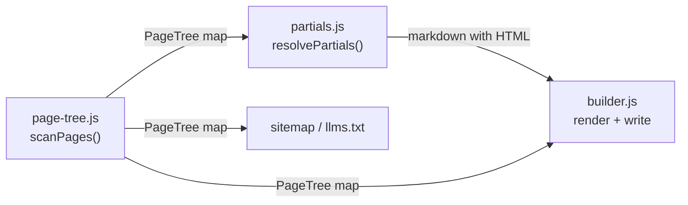
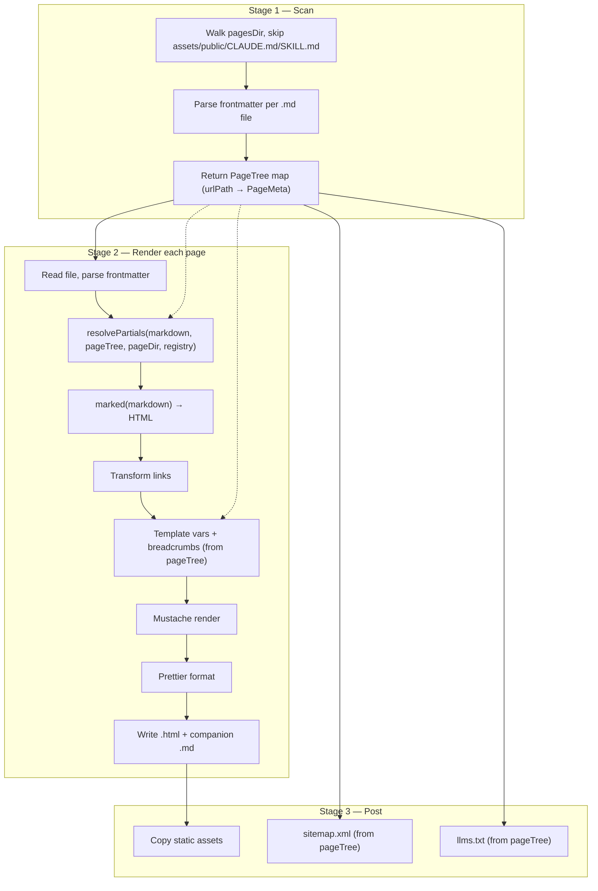

# Design-A — Spec 790: Libdoc Content Partials

## Architecture

The build pipeline shifts from a two-pass class (discover files, collect titles,
then render each page) to a three-stage pipeline: **scan** pages once,
**resolve** partials per page, then **render**. Two new modules
(`page-tree.js`, `partials.js`) own the first two stages; `PagesBuilder`
orchestrates the pipeline and owns rendering, template application, and output.



## Design Goals

### Naming alignment with libpages

All new and renamed code uses `Page` / `Pages` vocabulary — `PagesBuilder`,
`PageTree`, `scanPages`, `pagesDir` — instead of the current `Docs` / `Site`
naming. The rearchitecture is the natural moment to align internal names before
the planned libdoc-to-libpages rename. Clean break, no backward-compatibility
shims for old names.

## Components

| Component | Module | Responsibility |
|---|---|---|
| `scanPages` | `page-tree.js` (new) | Walk pages dir, parse frontmatter, return `PageTree` map |
| `resolvePartials` | `partials.js` (new) | Replace `<!-- part:type:path -->` markers with HTML from the registry |
| `defaultRegistry` | `partials.js` (new) | `card` and `link` partial type renderers |
| `PagesBuilder` | `builder.js` (modified) | Orchestrate: scan, resolve, render, template, format, write |
| transforms | `transforms.js` (minor change) | Link rewriting, breadcrumbs, TOC, hero vars |
| `parseFrontMatter` | `frontmatter.js` (unchanged) | YAML frontmatter extraction |

## Data Structures

### PageTree

```
Map<urlPath, PageMeta>

PageMeta = {
  filePath: string     // relative to pagesDir, e.g. "docs/getting-started/index.md"
  urlPath:  string     // e.g. "/docs/getting-started/"
  title:    string
  description: string
}
```

Built once by `scanPages`, passed immutably through the pipeline. Replaces both
the `pageTitles` map from Pass 1 and the `pages` array accumulated during
Pass 2 — sitemap and llms.txt generation read directly from the page tree.

Only pages with a `title` in frontmatter are included (matching current
behavior where titleless pages are skipped). PageMeta holds scan-time metadata
only — per-page rendering still reads the full file for markdown content and
layout/hero/toc frontmatter fields.

### Partial registry

```
Record<string, (meta: PageMeta, href: string) => string>
```

Two initial entries:

| Type | Output |
|---|---|
| `card` | `<a href="${href}">\n<h3>${title}</h3>\n<p>${description}</p>\n</a>` |
| `link` | `<a href="${href}">${title}</a>` |

Adding a third type means adding one entry to this object — no changes to the
resolver or builder (success criterion 10).

## Build Pipeline



## Key Decisions

| Decision | Choice | Rejected | Why |
|---|---|---|---|
| Naming vocabulary | `Page`/`Pages` throughout (`PagesBuilder`, `PageTree`, `scanPages`, `pagesDir`) | Keep `Docs`/`Site` names from current codebase | Rearchitecture is the natural moment to align before the planned libdoc → libpages rename; a clean break avoids a future rename-only churn commit |
| Page tree scope | Single upfront scan collects path, title, description | Extend `pageTitles` map with extra fields | Adding fields piecemeal perpetuates the two-pass design; a complete scan is simpler and feeds partials, sitemap, and llms.txt from one structure |
| Partials processing order | Resolve before `marked` | Resolve after markdown-to-HTML | Partial output is raw HTML that `marked` passes through unchanged, matching how hub pages work today; post-render resolution risks double-escaping |
| Partial implementation | Pre-processing function with regex | Custom `marked` extension | HTML comments are not markdown syntax; a standalone function is simpler and independently testable without coupling to marked's extension API |
| Type dispatch | Plain object registry | Switch/case in resolver | A registry entry per type satisfies criterion 10 (no resolver changes to add a type) |
| Module decomposition | Two new focused modules (`page-tree.js`, `partials.js`) | More private methods on PagesBuilder | The class already has 12 private methods; separate modules with explicit inputs are independently testable and reduce per-module concept count |
| Module decomposition | Two focused modules | Plugin architecture with lifecycle hooks | Over-engineering; spec calls for fewer concepts, not an extensibility framework |

## Partials

### Marker syntax

```
<!-- part:<type>:<path> -->
```

Matched by: `/<!--\s*part:(\w+):([\w./-]+)\s*-->/g`

### Path resolution

Given `<!-- part:card:getting-started -->` in `docs/products/index.md`:

1. Source directory: `docs/products/`
2. Join with partial path: `docs/products/getting-started`
3. Normalize (resolve `..` segments)
4. Compute urlPath → `/docs/products/getting-started/`
5. Look up in PageTree
6. Fail with source file and partial path if not found

### Href computation

Relative URL from current page to target page, computed via `path.relative()`:

| Current page | Target | Href |
|---|---|---|
| `/docs/` | `/docs/getting-started/` | `getting-started/` |
| `/docs/products/` | `/docs/libraries/typed-contracts/` | `../libraries/typed-contracts/` |
| `/docs/products/` | `/map/` | `../../map/` |

### Errors (both fatal)

- Unknown type: `Unknown partial type "foo" in docs/index.md`
- Missing target: `Partial target "nonexistent" not found in page tree (referenced from docs/index.md)`

## Builder Changes

### Renamed

`DocsBuilder` → `PagesBuilder`. The `docsDir` parameter becomes `pagesDir`
across the public API and all internal methods. The `DocsServer` in `server.js`
becomes `PagesServer`.

### Removed from PagesBuilder

`#findMarkdownFiles`, `#collectMarkdownEntry`, `#collectPageTitles` — replaced
by `scanPages`.

### Modified in PagesBuilder

- **`build()`** — calls `scanPages()` instead of two-step discovery; passes
  `pageTree` to rendering, sitemap, and llms.txt; no longer accumulates a
  `pages` array.
- **`#renderPage()`** — calls `resolvePartials(markdown, pageTree, pageDir,
  registry)` before `this.#marked(markdown)`.
- **`#buildTemplateVars()`** — receives `pageTree` instead of `pageTitles`.
- **`buildBreadcrumbs()`** in `transforms.js` — accepts `PageTree` map and
  reads `.title` from each entry instead of receiving a `Map<string, string>`.
- **`#generateSitemap()` / `#augmentLlmsTxt()`** — iterate `pageTree.values()`
  instead of receiving a separate pages array.

### Unchanged

Public API shape (`async build(pagesDir, distDir, baseUrl)`), dependency
injection pattern, CLI interface, template, CSS.

## Migration

Replace `<a>` card content inside `<div class="grid">` on the 17 hub pages
(all except `websites/fit/index.md`) with `<!-- part:card:path -->` markers.
The `<div class="grid">` wrappers and `## Job Heading` sections stay
hand-written. Success criterion 6 verifies identical HTML output via diff.
