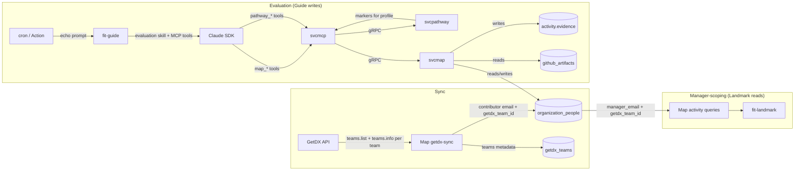
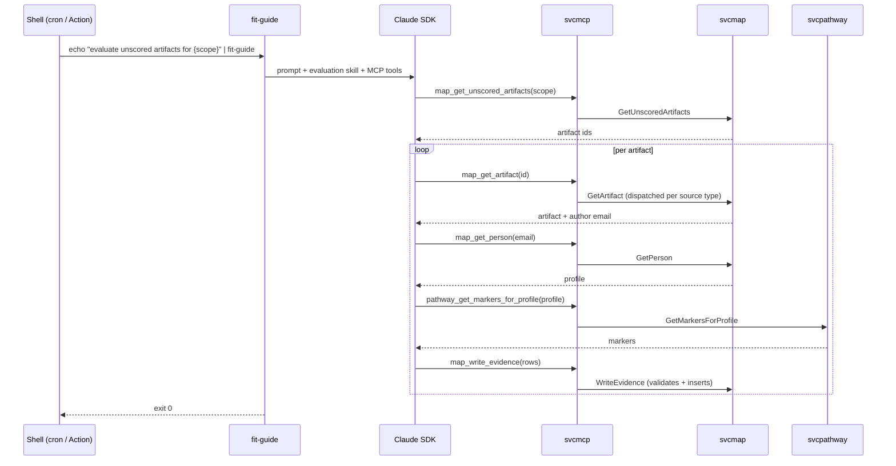

# Design 800-A — Landmark Evidence Pipeline

Spec 800 has two architectural surfaces. The first repairs the manager-scoping
data chain inside Map's existing query layer. The second introduces a new gRPC
service (`svcmap`) and extends `svcpathway`, both surfaced through `svcmcp`, so
that Guide — a Claude-SDK-over-MCP agent — can evaluate activity artifacts
against engineering-standard markers and write evidence rows. Evaluation is
invoked by piping a prompt to `fit-guide`; an evaluation skill provides the
protocol. There is no new product subcommand.

## Components

| Component | Role | Status |
|---|---|---|
| `organization_people` (Map activity DB) | Source of truth for manager → direct-report relationships and engineer profile | Existing; gains `getdx_team_id` column |
| `getdx_teams` (Map activity DB) | GetDX team metadata | Existing; `manager_email` no longer consulted by any scoping query |
| `activity.evidence` (Map activity DB) | Evidence rows written by Guide | Existing; gains `NOT NULL` on `rationale` and `level_id` |
| GetDX sync (Map Supabase function) | Pulls GetDX teams/snapshots/comments | Existing; extended to call `teams.info` per team and write `getdx_team_id` back to each contributor's `organization_people` row |
| Map activity query layer | Read functions consumed by Landmark | Existing; manager-scoping rewritten against `organization_people`; team/org scope added to unscored-artifact retrieval |
| `fit-landmark` | CLI presenter for activity reads | Existing; `initiative` command group removed; `health`/`voice`/`snapshot trend` consume rewritten manager-scoping queries |
| `svcpathway` | gRPC service exposing pathway data | Existing; gains `GetMarkersForProfile` |
| `svcmap` | gRPC service exposing activity reads/writes for agent consumption | **New** |
| `svcmcp` | MCP server bridging gRPC services to Claude tools | Existing; gains tools for `svcmap` and the new `svcpathway` method |
| `fit-guide` | Claude-SDK agent harness | Existing REPL gains a non-interactive stdin mode (single-prompt, exit on completion) so the evaluation skill can run unattended |
| Evaluation skill | Markdown skill describing the artifact-evaluation protocol | **New** |

## Architecture

## Data model changes

Spec authority: the `getdx_team_id` column is this design's chosen mechanism
for "the specific query strategy is a design decision"; the other two changes
are explicit in spec Gap 1 and §Evidence output contract.

| Table | Change | Rationale |
|---|---|---|
| `organization_people` | Add nullable `getdx_team_id` (FK to `getdx_teams`) | Establishes person → GetDX team mapping required to filter snapshot scores by manager scope |
| `activity.evidence` | `NOT NULL` on `rationale` and `level_id` | Spec requires both on every row; DB enforcement is a backstop to svcmap validation |
| `getdx_snapshot_comments` | Add nullable `driver_name` | Capture the field returned by `snapshots.driverComments.list` (spec Gap 1) |

## Manager-scoping query patterns

The broken `getdx_teams.manager_email` chain is replaced by two patterns rooted
at `organization_people.manager_email`, both reusing the existing recursive
`get_team` RPC.

| View | Pattern | Filter table.column |
|---|---|---|
| `voice --manager` | `get_team(manager) → emails`, then filter `getdx_snapshot_comments` by `email IN emails` | `getdx_snapshot_comments.email` (already present) |
| `health --manager`, `snapshot trend --manager` | `get_team(manager) → emails`, look up each direct report's `organization_people.getdx_team_id`, drop nulls, then filter scores by `getdx_team_id IN team_ids` | `getdx_snapshot_team_scores.getdx_team_id` |

A direct report with a null `getdx_team_id` is silently excluded from the
score filter (score-table rows only exist for known GetDX teams); `voice`
filtering is unaffected. `getdx_teams.manager_email` stays in the schema but
no scoping query consults it; repairing it is out of scope here.

## svcmap interface

Four gRPC methods, all consumed by `svcmcp` and exposed as MCP tools.

| Method | Purpose | MCP tool |
|---|---|---|
| `GetUnscoredArtifacts(scope)` | Returns artifact ids (with their source type) that have no evidence rows; `scope` is `{ email? }`, `{ manager_email? }`, or `{ org: true }` | `map_get_unscored_artifacts` |
| `GetArtifact(artifact_id)` | Returns artifact detail dispatched through a per-source handler | `map_get_artifact` |
| `WriteEvidence(rows)` | Validates and inserts evidence rows; idempotent on `(artifact_id, skill_id, level_id, marker_text)` | `map_write_evidence` |
| `GetPerson(email)` | Returns the engineer's `(discipline, level, track)` profile from `organization_people` | `map_get_person` |

A `SourceTypeRegistry` inside svcmap keys per-source modules on the activity
record's `artifact_type`. All three artifact-touching methods route through
the registry — `GetUnscoredArtifacts` joins each source's activity table to
`activity.evidence`, `GetArtifact` dispatches detail retrieval, and
`WriteEvidence` validates the FK against the source the artifact came from.
Adding Copilot or Claude Code activity adds a new registry entry; the gRPC
methods, MCP tools, and evaluation skill remain unchanged.

`WriteEvidence` is the single enforcement point for marker grounding: every
incoming row must carry a non-null `rationale`, `level_id`, and `matched`
boolean (including `matched: false` rows, which are valid per spec), and the
`(skill_id, level_id, marker_text)` triple must match the engineering standard
returned by `svcpathway.GetMarkersForProfile`. Rows that fail validation are
rejected at the service boundary.

## svcpathway extension

One new gRPC method:

| Method | Returns |
|---|---|
| `GetMarkersForProfile(discipline, level, track)` | Flat list of `{ skill_id, level_id, marker_text }` covering markers the engineer is expected to demonstrate |

Implementation reads the already-loaded capability YAML and projects each
proficiency's `markers` array under the matched `(discipline, level, track)`.
No new file loading.

## Evaluation flow

Idempotency comes from two facts: `WriteEvidence` upserts on the full
`(artifact_id, skill_id, level_id, marker_text)` key (so the same marker text
at two levels yields two rows, neither overwritten), and `GetUnscoredArtifacts`
excludes any artifact that already has evidence. Re-running the same prompt
produces no new rows. Scheduling is external — a cron entry or GitHub Actions
workflow invokes the same prompt on cadence; no scheduler lives inside Guide
or svcmap.

## Synthetic data changes

| Generator | Change |
|---|---|
| `libsyntheticprose` (pathway capability prompts) | Generate a representative `markers:` array under each proficiency, sufficient to exercise Landmark's evidence-based commands |
| `libsyntheticrender` (pathway YAML render) | Serialise the new `markers` arrays |
| BioNova `story.dsl` | `organization_people` rows carry accurate `manager_email` values from the roster |

## Initiative removal

`fit-landmark`'s `initiative list`, `initiative show`, and `initiative impact`
command group is removed entirely, along with the corresponding initiatives
query module in Map's activity query layer and the `health` view's initiative
attachment. No replacement is designed here; spec 800 explicitly defers
re-modelling initiative impact to a future spec.

## Key Decisions

| Decision | Choice | Rejected alternative |
|---|---|---|
| Person → GetDX team mapping | Single `getdx_team_id` column on `organization_people` | Separate `organization_people_getdx_teams` join table — over-engineers a one-primary-team reality and complicates every score query |
| Source of member emails for `getdx_team_id` population | Extend GetDX sync to call `teams.info` per team (returns a `contributors` array of `{id, name, email}`) | Stay on `teams.list` only — that endpoint omits members; no other documented path returns per-team membership |
| Voice scoping route | Filter comments by direct-report email set | Filter through `team_id` after fixing `getdx_teams.manager_email` — keeps a brittle dependency on a chain we're abandoning |
| Activity data exposure to Guide | New `svcmap` gRPC service surfaced via MCP | Open Supabase directly from Guide — leaks schema and credentials into an agent process; couples Guide to the storage layer |
| Marker access layer | New `GetMarkersForProfile` on `svcpathway` | Pure `libskill` helper — would force Guide to load pathway YAML on every run and duplicate svcpathway's data layer |
| Evaluation invocation | Stdin prompt + evaluation skill, no `fit-guide` subcommand | Dedicated `evaluate` subcommand with its own handler — duplicates the Claude SDK loop and divides Guide into conversational vs. batch surfaces |
| Multi-source extensibility | Per-source registry keyed on `artifact_type` inside svcmap | Branching on source type inside the evaluation skill — pushes schema knowledge into the LLM and breaks the “one evaluation path” property |
| Scheduling | External (cron / GitHub Actions) | Built-in scheduler in Guide or svcmap — adds an operational surface for no capability gain over `cron` |
| Evidence required-field enforcement | DB `NOT NULL` plus svcmap validation | App-level only — relies on every future writer remembering the contract |

## Out of scope (deferred)

Excluded by the spec and not addressed by this design: additional source types
(Copilot, Claude Code — registry slot exists for future specs), GetDX survey
evaluation, initiative-impact re-design, Landmark presentation-layer changes,
`activity.evidence` column additions, and marker authoring tooling.
