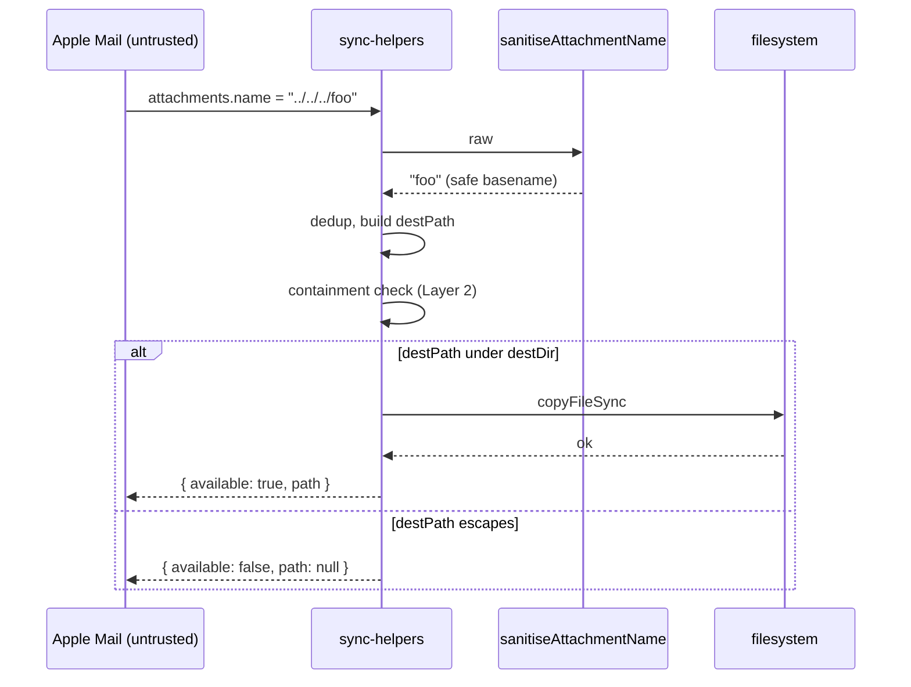

# Design 810 — Outpost Mail Sync Attachment Path-Traversal Hardening

## Architecture

Two layers, defended independently. **Layer 1** is a pure function that turns
an arbitrary `attachments.name` value into a safe single-basename string.
**Layer 2** is a containment assertion in `copySingleAttachment`: the resolved
`destPath` must be strictly under the resolved `destDir`, or the copy is
refused. Either layer alone closes the spec's exploit; both together make the
post-condition hold even if a future change breaks one of them.

```mermaid
flowchart LR
  A["att.name (untrusted)"] --> B[sanitiseAttachmentName]
  B -->|safe basename| C[dedup branch]
  C -->|destName| D[join destDir, destName]
  D --> E{resolve(destPath)<br/>under resolve(destDir)?}
  E -- yes --> F[copyFileSync]
  E -- no --> G["return { available: false }"]
  F --> H[return path]
```

## Components

| Component | Location | Responsibility |
|---|---|---|
| `sanitiseAttachmentName(raw)` | `sync-helpers.mjs` (new export, pure) | Coerce any input to a single non-empty basename that is not `.` or `..`. |
| `copySingleAttachment` (revised) | `sync-helpers.mjs` (existing, in scope) | Call sanitiser, run dedup against sanitised name, assert containment, then copy. |
| `sanitiseAttachmentName.test.{mjs,js}` | `products/outpost/test/` (new) | Unit tests for the sanitiser against the spec's worked-example inputs. |
| `copySingleAttachment.test.{mjs,js}` | `products/outpost/test/` (new) | Integration-style test: traversal inputs never produce a write outside `destDir`. |

The renderer in `sync.mjs:94` is **out of scope** per the spec — content-injection
only, not arbitrary file write. No design changes there.

## Interfaces

### `sanitiseAttachmentName(raw): string`

| Input | Output |
|---|---|
| `null`, `undefined`, `""`, `"."`, `".."` | `"unnamed"` (post-sanitiser fallback) |
| `"../../../foo"`, `"/etc/passwd"`, `"..\\..\\..\\foo"` | last basename-equivalent segment if non-empty/non-dot, else `"unnamed"` |
| `"\u0000bar"` and other control chars | control bytes stripped; if remainder empty → `"unnamed"` |
| benign UTF-8 (`"café résumé.pdf"`, `"image (2).png"`) | byte-for-byte unchanged |

**Algorithm (specification, not code):**

1. Coerce non-string inputs to `""`.
2. Strip ASCII control characters (`\x00`–`\x1f`, `\x7f`) and the path separators
   `/` and `\`. (Backslash stripping is forward-defence only — POSIX
   `path.join` does not normalise `\`, so the on-disk exploit on macOS uses
   `/`. The spec's success-criteria input set includes `"..\\..\\..\\foo"`,
   so the sanitiser strips both separators.)
3. Take the trailing segment after the last separator. (Equivalent to applying
   `basename` after stripping; specified explicitly so test expectations are
   independent of `path.basename`'s POSIX-only behaviour.)
4. If the result is `""`, `.`, or `..`, return the fallback `"unnamed"`.
5. Otherwise return the result.

The function never throws and never returns a string containing `/`, `\`, or
control characters.

### Revised `copySingleAttachment` contract

| Step | Behaviour |
|---|---|
| 1 | `safeName = sanitiseAttachmentName(att.name)` (replaces `att.name || "unnamed"`). |
| 2 | Dedup branch operates on `safeName`: `destName = seenFilenames.has(safeName) ? sanitiseAttachmentName(`${mid}_${safeName}`) : safeName`. The re-sanitisation of the prefixed form is a no-op in practice (`mid` is numeric) but keeps the invariant local. |
| 3 | After `destPath = join(destDir, destName)`, assert `resolve(destPath)` starts with `resolve(destDir) + sep`. If not, return `{ name, available: false, path: null }`. |
| 4 | Copy as today; return shape unchanged. |

**Post-condition (invariant):** every successful return has `path` strictly
inside `destDir`.

## Data flow



## Key Decisions

| # | Decision | Rejected alternative | Why |
|---|---|---|---|
| 1 | Two-layer defence (sanitiser + containment) | Sanitiser alone | Spec § Success Criteria requires both an isolated sanitiser unit test **and** a `copySingleAttachment` integration assertion that `destPath` cannot escape. Two layers are the simplest shape that satisfies both unit-testably; one layer would force the integration test to re-test sanitiser internals. |
| 2 | Strip and re-segment, not regex-allowlist | `replace(/[^a-zA-Z0-9._-]/g, "_")` allowlist | Spec demands benign UTF-8 names round-trip byte-for-byte. An ASCII allowlist mangles `"café résumé.pdf"`. |
| 3 | Strip both `/` and `\` | Strip `/` only (POSIX-correct minimum) | Spec's success-criteria input set names `"..\\..\\..\\foo"`. Stripping `\` is zero-cost and keeps the sanitiser portable if Outpost ever runs on win32. |
| 4 | Fallback string `"unnamed"` | Skip the attachment (return `available: false`) | Existing code already uses `"unnamed"` for null `att.name`. Reusing it preserves observable behaviour for the benign null-name path; only the genuinely traversal-shaped cases change behaviour. |
| 5 | Sanitiser exported from `sync-helpers.mjs`, not a new module | New `attachment-name.mjs` module | One function, one caller, one test target. A new module multiplies surface for no leverage. The existing helpers file already exports pure utilities. |
| 6 | Layer 2 returns `{ available: false }` rather than throwing | `throw new Error("traversal")` | The function's contract today is "best-effort copy"; throwing would propagate to `copyThreadAttachments` and abort the whole thread's attachments on a single hostile name. Refuse-and-continue matches the existing `try/catch` shape. |
| 7 | `path.resolve` + prefix check, not `path.relative + startsWith("..")` | `relative(destDir, destPath).startsWith("..")` | Symlink chasing is moot here (`destDir` is freshly `mkdirSync`'d under `~/.cache/fit/outpost/`), and prefix-of-resolved-paths is the form most reviewers can verify by eye. Add `+ sep` to the prefix to avoid the `dest/foo` vs `dest-evil/...` substring trap. |

## Failure modes

| Mode | Layer 1 result | Layer 2 result | Final outcome |
|---|---|---|---|
| Benign UTF-8 name | unchanged | passes | copy succeeds, name preserved |
| `null` / `undefined` / `""` | `"unnamed"` | passes | copy succeeds as `unnamed` |
| `"../../../foo"` | `"foo"` | passes | copy succeeds as `foo` inside `destDir` |
| `"."` / `".."` | `"unnamed"` | passes | copy succeeds as `unnamed` |
| Future regression breaks Layer 1 (returns `"../foo"`) | bad value | fails containment | `available: false`, no write |
| `destDir` itself is a symlink to outside `~/.cache` | unchanged | passes (resolved path may escape; documented as out-of-scope) | covered by `~/.cache` parent assumption; not in spec scope |

## Out of scope (restated from spec)

- `att.name` rendering at `sync.mjs:94` — content-injection only.
- TOCTOU window in `socket-server.js` (`listen` → `chmod`).
- Defense-in-depth across other Outpost templates (`sync-teams`, etc.).
- Hardening `path.join` consumers across `libraries/`.

— Staff Engineer 🛠️
