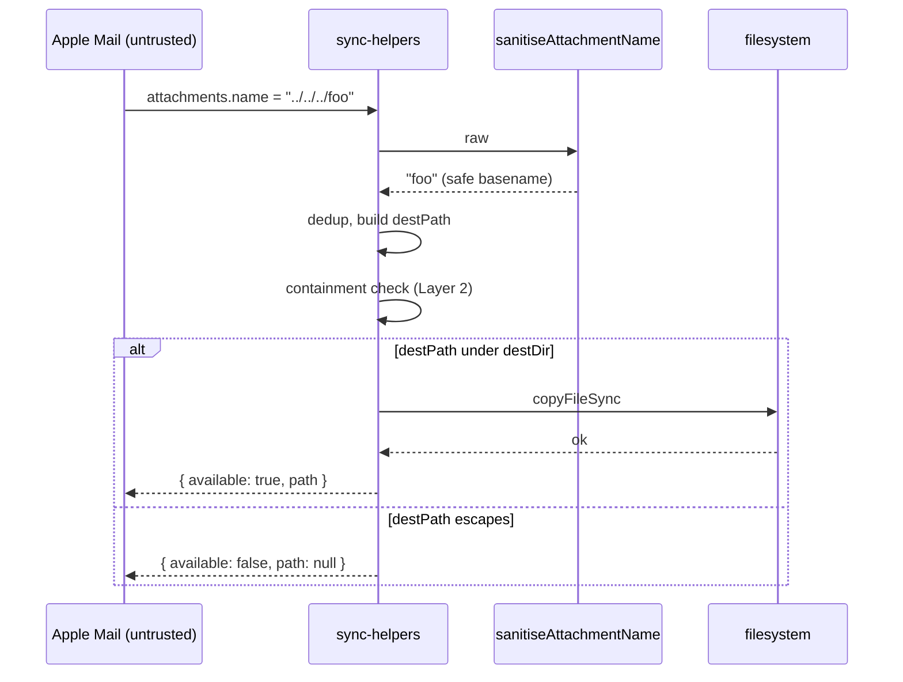

# Design 810 — Outpost Mail Sync Attachment Path-Traversal Hardening

## Architecture

Two layers, defended independently. **Layer 1** is a pure function that turns
an arbitrary `attachments.name` value into a safe single-basename string.
**Layer 2** is a containment assertion in `copySingleAttachment`: the resolved
`destPath` must be strictly under the resolved `destDir`, or the copy is
refused. Either layer alone closes the spec's exploit; both together make the
post-condition hold even if a future change breaks one of them.

```mermaid
flowchart LR
  A["att.name (untrusted)"] --> B[sanitiseAttachmentName]
  B -->|safe basename| C[dedup branch]
  C -->|destName| D[join destDir, destName]
  D --> E{resolve(destPath)<br/>under resolve(destDir)?}
  E -- yes --> F[copyFileSync]
  E -- no --> G["return { available: false }"]
  F --> H[return path]
```

## Components

| Component | Location | Responsibility |
|---|---|---|
| `sanitiseAttachmentName(raw)` | `sync-helpers.mjs` (new export, pure) | Coerce any input to a single non-empty basename that is not `.` or `..`. |
| `copySingleAttachment` (revised) | `sync-helpers.mjs` (existing, in scope) | Call sanitiser, run dedup against sanitised name, assert containment, then copy. |
| Sanitiser unit-test surface | new test file under `products/outpost/test/` | Exercises the sanitiser against the spec's worked-example inputs. |
| Containment integration-test surface | new test file under `products/outpost/test/` | Asserts traversal inputs never produce a write outside `destDir`. |

## Interfaces

### `sanitiseAttachmentName(raw): string`

| Input | Output |
|---|---|
| `null`, `undefined`, `""`, `"."`, `".."` | `"unnamed"` (post-sanitiser fallback) |
| `"../../../foo"`, `"/etc/passwd"`, `"..\\..\\..\\foo"` | last basename-equivalent segment if non-empty/non-dot, else `"unnamed"` |
| `"\u0000bar"` and other control chars | control bytes stripped; if remainder empty → `"unnamed"` |
| benign UTF-8 (`"café résumé.pdf"`, `"image (2).png"`) | byte-for-byte unchanged |

**Invariants (the algorithm is a plan-phase choice):**

- Total: never throws; non-string inputs (including `null`) yield the fallback.
- Closed: the return string contains no `/`, `\`, or ASCII control bytes
  (`\x00`–`\x1f`, `\x7f`).
- Single basename: the return string equals its own basename under both POSIX
  and win32 separator semantics.
- Non-trivial: the return string is never `""`, `.`, or `..`. The fallback for
  these and the closed/single-basename failure cases is the literal string
  `"unnamed"`.
- Identity on benign UTF-8: any input that already satisfies the four
  invariants above is returned byte-for-byte unchanged.

### Revised `copySingleAttachment` contract

| Aspect | Behaviour |
|---|---|
| Input handling | The raw `att.name` is consumed only through the sanitiser; the existing `att.name || "unnamed"` short-circuit is removed. |
| Dedup | The collision check and any `mid`-prefixed alternative both operate on a sanitised name. Whatever string ultimately becomes `destName` satisfies the sanitiser's invariants. |
| Containment | Before the copy, the resolved `destPath` must be strictly inside the resolved `destDir` (separator-boundary prefix). If not, the function returns `{ available: false, path: null }` and performs no write. |
| Return shape | Unchanged from today (`{ name, available, path }`). |

**Post-condition (invariant):** every return with `available: true` has `path`
strictly inside `destDir`. No reachable code path writes outside `destDir`.

## Data flow



## Key Decisions

| # | Decision | Rejected alternative | Why |
|---|---|---|---|
| 1 | Two-layer defence (sanitiser + containment) | Sanitiser alone | Spec § Success Criteria requires both an isolated sanitiser unit test **and** a `copySingleAttachment` integration assertion that `destPath` cannot escape. Two layers are the simplest shape that satisfies both unit-testably; one layer would force the integration test to re-test sanitiser internals. |
| 2 | Strip and re-segment, not regex-allowlist | `replace(/[^a-zA-Z0-9._-]/g, "_")` allowlist | Spec demands benign UTF-8 names round-trip byte-for-byte. An ASCII allowlist mangles `"café résumé.pdf"`. |
| 3 | Strip both `/` and `\` | Strip `/` only (POSIX-correct minimum) | Spec's success-criteria input set names `"..\\..\\..\\foo"`. Stripping `\` is zero-cost and keeps the sanitiser portable if Outpost ever runs on win32. |
| 4 | Fallback string `"unnamed"` | Skip the attachment (return `available: false`) | Existing code already uses `"unnamed"` for null `att.name`. Reusing it preserves observable behaviour for the benign null-name path; only the genuinely traversal-shaped cases change behaviour. |
| 5 | Sanitiser exported from `sync-helpers.mjs`, not a new module | New `attachment-name.mjs` module | One function, one caller, one test target. A new module multiplies surface for no leverage. The existing helpers file already exports pure utilities. |
| 6 | Layer 2 returns `{ available: false }` rather than throwing | `throw new Error("traversal")` | The function's contract today is "best-effort copy"; throwing would propagate to `copyThreadAttachments` and abort the whole thread's attachments on a single hostile name. Refuse-and-continue matches the existing `try/catch` shape. |
| 7 | Containment check is a separator-boundary prefix on resolved paths | `relative(destDir, destPath).startsWith("..")` | Either form is sound; the resolved-prefix form is the one most reviewers can verify by inspection, and the separator-boundary requirement avoids the `dest/foo` vs `dest-evil/...` substring trap. The plan picks the literal `path` API surface. |

## Failure modes

| Mode | Layer 1 result | Layer 2 result | Final outcome |
|---|---|---|---|
| Benign UTF-8 name | unchanged | passes | copy succeeds, name preserved |
| `null` / `undefined` / `""` | `"unnamed"` | passes | copy succeeds as `unnamed` |
| `"../../../foo"` | `"foo"` | passes | copy succeeds as `foo` inside `destDir` |
| `"."` / `".."` | `"unnamed"` | passes | copy succeeds as `unnamed` |
| Future regression breaks Layer 1 (returns `"../foo"`) | bad value | fails containment | `available: false`, no write |

## Out of scope (restated from spec)

- `att.name` rendering at `sync.mjs:94` — content-injection only.
- TOCTOU window in `socket-server.js` (`listen` → `chmod`).
- Defense-in-depth across other Outpost templates (`sync-teams`, etc.).
- Hardening `path.join` consumers across `libraries/`.

— Staff Engineer 🛠️
