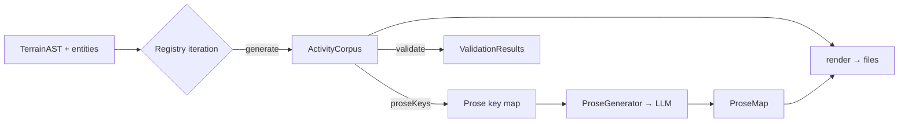

# Design 820-A — ActivityType registry across four call sites

> **Note:** Spec 820 is not yet merged on `main` at the time this design is
> being written. The design proceeds at the user's direction; under normal
> kata-design preconditions we would wait for the spec PR to merge before
> drafting.

## Architecture summary

Introduce a single named `ActivityType` contract owned by `libsyntheticgen`.
The four existing pipeline call sites — activity composition, prose-context
collection, raw rendering, validation — iterate one shared registry of
`ActivityType` implementations rather than naming individual activity types
in hand-written if-chains. The DSL-derived domain context that crosses into
the LLM is unified behind one `ProseContext` shape that always carries a full
`drivers` array; snapshot-comment context populates that array (it does not
today), eliminating the asymmetry the spec calls out.

## Components

| Component                 | Lives in                         | Responsibility                                                                                                                                       |
| ------------------------- | -------------------------------- | ---------------------------------------------------------------------------------------------------------------------------------------------------- |
| `ActivityType` contract   | `libsyntheticgen/src/activity/`  | Named interface with four optional methods: `generate`, `proseKeys`, `render`, `validate`. One module per activity type implements it.               |
| Activity registry         | `libsyntheticgen/src/activity/`  | Ordered list of `ActivityType` modules. Single source of truth for which activity types exist; consumers iterate it.                                 |
| `ProseContext` schema     | `libsyntheticgen/src/activity/`  | Single named JSDoc typedef for the LLM-bound context object. Always carries `drivers: DriverImpact[]` (may be empty); other fields are well-defined. |
| `ActivityCorpus`          | (return type of registry × DSL)  | The aggregate `{ [typeId]: TypeOutput }` produced by iterating `generate`. Replaces today's hand-named keys (`webhookKeys`, `commentKeys`, …).        |
| Pipeline call-site shims  | existing files at the four seams | `activity.js`, `prose-keys.js`, `raw.js`, `validate-activity.js` each replace their per-type list with a registry iteration.                         |

`libsyntheticrender` and `libsyntheticprose` import the contract and registry
from `libsyntheticgen` — no new package is introduced. The four-library
boundary is preserved (the spec deferred the boundary question).

## Contract shape

Each `ActivityType` module exports a default object:

```text
{
  id:        "comment" | "webhook_pr" | "webhook_review" | "commit" | …
  generate:  (ast, rng, entities) → TypeOutput
  proseKeys: (typeOutput, ctx)    → Iterable<[key, ProseContext]>   // optional
  render:    (typeOutput, files, proseMap) → void                   // optional
  validate:  (entities)           → ValidationResult[]              // optional
}
```

Methods are optional so types without prose (e.g. push/commit webhooks today)
register as `{ id, generate, render, validate }` with no `proseKeys`. Methods
do not call each other — composition is the registry consumer's job — which
keeps every method individually unit-testable.

## Data flow



## Comment driver-context fix

The asymmetry has two sources. (1) `collectAffectCandidates` in
`activity-comments.js` keeps only the top driver per affect. (2)
`addSnapshotCommentKeys` in `prose-keys.js` passes only scalar
`driver`/`direction`/`magnitude` into the LLM context. Under the new contract:

- The comment activity type's `generate` carries the full team-affect
  `drivers: DriverImpact[]` on each comment-key (the top driver remains the
  topic driver but is no longer the only one passed).
- Its `proseKeys` populates `ProseContext.drivers` from that array. The
  scalar `driver`/`direction`/`magnitude` fields, if retained for prompt
  compatibility, are derived from `drivers[0]` rather than being the only
  carried value.
- `prose-user.prompt.md` already conditionally renders `{{#driverContext}}`;
  no template change is required for the comment fix to manifest. (The spec
  excludes prompt-wording changes.)

## Key decisions

| #   | Decision                                                                                                                                | Rejected alternative                                                                                                                       | Why                                                                                                                                                                                  |
| --- | --------------------------------------------------------------------------------------------------------------------------------------- | ------------------------------------------------------------------------------------------------------------------------------------------ | ------------------------------------------------------------------------------------------------------------------------------------------------------------------------------------ |
| 1   | Contract lives in `libsyntheticgen`; other libs import it.                                                                              | New `libsyntheticactivity` package.                                                                                                        | The contract is fundamentally a data-shape contract; `libsyntheticgen` already owns the data shapes. New package adds three import-graph changes for no boundary-clarity gain.       |
| 2   | One unified `ProseContext` shape across all activity types, including a `drivers: DriverImpact[]` field that may be empty.              | Per-type prose-context shapes (one schema per activity type).                                                                              | The spec requires a single named shape (Scope (in)). Per-type shapes recreate the asymmetry the spec is fixing; an empty `drivers` array is a clearer signal than a missing field.   |
| 3   | Methods are optional on the `ActivityType` contract.                                                                                    | All methods required; types without prose return empty maps.                                                                               | Optionality keeps the contract honest about which activity types participate at which stage; a no-op `proseKeys` falsely implies a type is prose-bearing.                            |
| 4   | Registry is an ordered list (file order = pipeline order).                                                                              | Registry is a `Map` keyed by `id`; topology is implicit from method calls.                                                                 | Some current behaviour depends on render order (e.g. roster snapshots before summit YAML). Ordered list preserves that without a new ordering mechanism.                             |
| 5   | The unit of registration is the activity *type*, not the activity *stage*.                                                              | One registry per stage (a generators registry, a prose-keys registry, a renderers registry).                                               | The spec's success criterion #6 is "single registration of one implementation"; per-stage registries multiply registration sites by four.                                            |
| 6   | Top-driver topic stays explicit; full drivers array travels alongside.                                                                  | Drop the topic driver concept; let the LLM pick from the array.                                                                            | Comment metadata exists today downstream of `collectAffectCandidates`; downstream code (file naming, fixture matching) reads `driver_id`. Keep it as a derived view of the array.    |
| 7   | Prompt template stays single-file for now; per-type templates deferred.                                                                 | Introduce a per-type template registry alongside the activity registry.                                                                    | Spec excludes prompt-wording changes. The activity contract makes per-type templates a follow-on, not a prerequisite.                                                                |
| 8   | `ActivityCorpus` replaces today's named fields on the `activity` object (`webhookKeys`, `commentKeys`, …).                              | Keep named fields; add the registry beside them.                                                                                           | Two parallel sources of truth invite drift. Consumers that read `activity.commentKeys` directly migrate to `activity.byType.comment.keys` (or equivalent) as part of the same change. |

## Testing strategy

Per-activity unit tests at the contract surface (one test file per registered
activity type), exercising each implemented method against a synthetic AST
fixture. The comment activity type's tests include at least one fixture with
multi-driver-declining affects, asserting that the resulting `ProseContext`
entry's `drivers` array contains every declining driver from the team's
affect (not just the top one). A smoke test iterates the registry and asserts
that for every type with `proseKeys`, the produced contexts conform to the
`ProseContext` schema.

## Migration boundary

The change is a single coordinated edit at the four call sites; no staged
rollout is required because the registry replaces existing call sites rather
than running alongside them. The existing tier-0 generator functions
(`generateWebhooks`, `generateCommentKeys`, …) become the bodies of each
activity type's `generate` method — moved, not rewritten.

## Out of scope (re-affirming spec)

Library boundary changes; DSL grammar changes; pipeline DAG/cache topology;
prose template wording; new activity types; online evaluation of LLM output.
