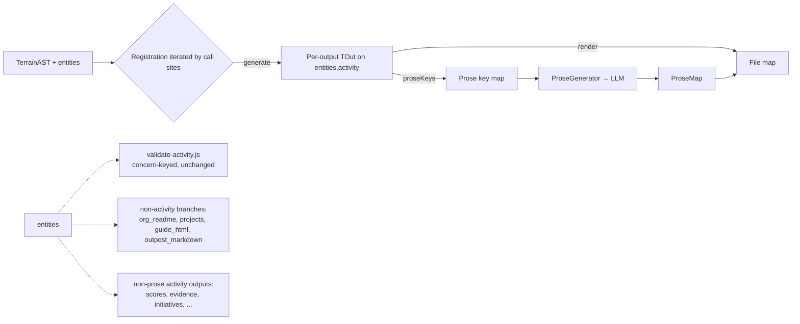

# Design 820-A — Prose-bearing activity contract

> **Process note:** Spec 820 is not yet merged on `main` at the time this
> design is being written. The design proceeds at user direction; under
> normal kata-design preconditions the spec PR would merge first.

## Architecture summary

Introduce a `ProseActivity` contract that binds the in-scope prose-bearing
activity outputs (snapshot comments and the GitHub webhook stream) to the
three pipeline stages they share: deterministic generation,
prose-context construction, and output rendering. The three pipeline call
sites (activity composition, prose-context collection, raw rendering)
consult one shared registration of `ProseActivity` implementations and no
longer name `commentKeys`/`webhookKeys` in their own bodies. The
DSL-derived domain context that crosses into the LLM is unified behind a
`ProseContext` shape with an enumerated field list; snapshot-comment
context populates the `drivers` array (it does not today). Validation,
non-prose activity outputs, and non-activity prose surfaces stay outside
the contract per spec scope.

## Components

| Component                | Lives in                          | Responsibility                                                                                                                                       |
| ------------------------ | --------------------------------- | ---------------------------------------------------------------------------------------------------------------------------------------------------- |
| `ProseActivity` contract | `libsyntheticgen/src/activity/`   | Three required methods on a per-output module: `generate`, `proseKeys`, `render`. One module per in-scope prose-bearing output.                       |
| Activity registration    | `libsyntheticgen/src/activity/`   | One source-code location names every in-scope prose-bearing output. Consumers consult it to dispatch the three stages.                                |
| `ProseContext` schema    | `libsyntheticgen/src/activity/`   | One JSDoc typedef for the LLM-bound context. Field list below. The TS-style typedef is illustrative; the implementation is JSDoc per house style.    |
| `DriverImpact` typedef   | `libsyntheticgen/src/activity/`   | `{ driver_id; trajectory; magnitude }`. Element type of `ProseContext.drivers`. Trajectory values follow whatever the DSL parser admits.              |
| Pipeline call-site shims | three existing files at the seams | `activity.js`, `prose-keys.js`, `raw.js` consult the registration for the in-scope prose-bearing outputs while still dispatching everything else inline. |

`libsyntheticrender` and `libsyntheticprose` import the contract from
`libsyntheticgen`. The four-library boundary is preserved (spec deferred).

## Contract shape

```ts
type ProseActivity<TOut> = {
  id: string;
  generate: (ctx: GenerateContext) => TOut;
  proseKeys: (output: TOut, ctx: ProseKeysContext) => Iterable<[string, ProseContext]>;
  render: (output: TOut, files: FileMap, prose: ProseMap) => void;
};

type GenerateContext  = { ast: TerrainAST; rng: SeededRNG; entities: Entities };
type ProseKeysContext = { domain: string; orgName: string; entities: Entities };
```

`TOut` is opaque per-output and may carry multiple sub-collections — the
webhook implementation's `TOut` is `{ events, keys }` (today's
`webhooks` + `webhookKeys`), and `render` consumes the `events` slice
while `proseKeys` consumes the `keys` slice. Internal branching inside
one output's own method (e.g. webhook `proseKeys` branching by
`prose_type` to emit PR-body vs review-body keys) is allowed — criterion
#2 governs the call sites, not the per-output method bodies.

## ProseContext shape

```ts
type ProseContext = {
  topic: string;
  tone: string;
  length: string;
  maxTokens?: number;
  domain?: string;
  orgName?: string;
  role?: string;
  scenario?: string;
  drivers?: DriverImpact[];
};
```

The scalar `driver`/`direction`/`magnitude` fields the prompt template
reads today are derived in `#buildPrompt` from `drivers[0]`, not carried
as separate `ProseContext` fields. This collapses the comment/webhook
shape difference at the schema boundary.

## Data flow



## Comment driver-context fix

The asymmetry has two upstream sources (per spec Problem § 1) and the
contract fixes both:

1. The comment activity module's `generate` carries the **full**
   team-affect `drivers: DriverImpact[]` on each comment-key. The
   top-driver-only filtering that today's `collectAffectCandidates`
   performs (`drivers[0]`) is removed; the top driver remains the
   *topic* driver but is no longer the only one carried forward.
2. Its `proseKeys` populates `ProseContext.drivers` from that array.
   The prompt template's `{{#driverContext}}` block in
   `prose-user.prompt.md` is fed by `#buildPrompt` from
   `context.drivers`; once the comment context populates `drivers`, the
   block fires for comments without a template change.

`#buildPrompt` is updated to derive the scalar
`driver`/`direction`/`magnitude` (consumed by the template's
`{{#scenario}}` block) from `drivers[0]` rather than reading separate
context scalars. This change applies uniformly to all in-scope
prose-bearing outputs and is the only modification to
`libsyntheticprose`. The prompt becomes a function of the
`ProseContext` entry alone (criterion #4).

## Key decisions

| #   | Decision                                                                                                                                                  | Rejected alternative                                                                                                              | Why                                                                                                                                                                                          |
| --- | --------------------------------------------------------------------------------------------------------------------------------------------------------- | --------------------------------------------------------------------------------------------------------------------------------- | -------------------------------------------------------------------------------------------------------------------------------------------------------------------------------------------- |
| 1   | Contract lives in `libsyntheticgen`; other libs import it.                                                                                                | New `libsyntheticactivity` package.                                                                                               | The contract is a data-shape contract; `libsyntheticgen` already owns the data shapes. New package adds three import-graph changes for no boundary-clarity gain.                             |
| 2   | One unified `ProseContext` shape with explicit fields, including `drivers: DriverImpact[]`.                                                               | Per-output prose-context shapes.                                                                                                  | Spec requires a single named shape. Per-output shapes recreate the asymmetry the spec is fixing.                                                                                             |
| 3   | The contract binds only the prose-bearing outputs (snapshot comments, webhook stream); non-prose outputs stay top-level on `entities.activity`.            | Bind every activity-data output (scores, evidence, initiatives, scorecards, roster snapshots, project teams) to the contract.     | Spec § Scope (out) excludes non-prose activity outputs. They do not exhibit the asymmetry, do not consume `ProseContext`, and forcing them through the contract would inflate it without solving any spec criterion. |
| 4   | Validation stays in `validate-activity.js`, concern-keyed, outside the contract.                                                                          | Add `validate` to the contract and decompose validate-activity per output.                                                         | Existing validators are cross-cutting (snapshot refs span comments, scores, evidence, initiatives; delivery-id uniqueness spans the webhook stream). Decomposing per output would either duplicate checks or pick an arbitrary primary owner. |
| 5   | Internal branching inside an output's `proseKeys` is allowed (e.g. webhook `proseKeys` branches by `prose_type` to emit PR-body vs review-body entries). | Split webhooks into two `ProseActivity` registrations (`webhook_pr`, `webhook_review`).                                            | Webhook events and keys share generation and render — splitting them creates a fake registration boundary. Criterion #2 governs the call sites; per-output internal branching is not a call site. |
| 6   | Webhook `TOut` carries both events and keys (`{ events, keys }`).                                                                                         | Force every output to a single flat shape.                                                                                        | The webhook stream's events feed render and its keys feed prose-context — carrying both as one `TOut` matches the data flow.                                                                  |
| 7   | `#buildPrompt` derives `driver`/`direction`/`magnitude` scalars from `drivers[0]` rather than reading separate context fields.                            | Keep scalars on `ProseContext`; populate them everywhere they are used.                                                            | Carrying redundant fields invites them to drift again (the same shape of bug as the original asymmetry). Single-source the array and derive the scalar at one site.                          |
| 8   | `validate-activity.js` reads from the post-refactor field shape (e.g. wherever `commentKeys` and `webhook` events live after the contract).               | Leave validators reading the old field names.                                                                                     | The contract may move `commentKeys` under a per-output `TOut`; validators that read those names must be updated mechanically. The change is mechanical (renames), not a redesign of validators. |

## Migration boundary

Today's per-output logic moves into the corresponding `ProseActivity`
module's `generate`/`proseKeys`/`render` methods, with one substantive
change: the comment module's `generate` removes the top-driver filter so
the full driver array is carried forward. The plan picks file moves; the
design fixes that the per-output logic moves intact except for that fix,
the call sites consult the registration, and validators read the
post-refactor field shape.

## Out of scope (re-affirming spec)

Library boundary changes; DSL grammar changes; pipeline DAG/cache
topology; prose template wording; non-prose activity outputs; non-activity
prose surfaces; new prose-bearing outputs; online evaluation of LLM
output.
