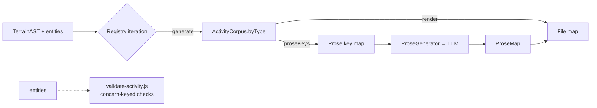

# Design 820-A — ActivityType registry across three call sites

> **Process note:** Spec 820 is not yet merged on `main` at the time this
> design is being written. The design proceeds at user direction; under
> normal kata-design preconditions the spec PR would merge first.

## Architecture summary

Introduce a single named `ActivityType` contract owned by `libsyntheticgen`.
The three pipeline call sites that today bind activity-data outputs by hand
— activity composition, prose-context collection, raw rendering — iterate
one shared registry of `ActivityType` implementations rather than naming
individual outputs in their own bodies. The DSL-derived domain context that
crosses into the LLM is unified behind one `ProseContext` shape with an
explicit field list; snapshot-comment context populates the `drivers`
array (it does not today), eliminating the asymmetry the spec calls out.
Validation stays concern-keyed in `validate-activity.js`, outside the
registry, because today's validators are cross-cutting (snapshot refs,
delivery-id uniqueness, …) rather than per-output.

## Components

| Component               | Lives in                          | Responsibility                                                                                                                                              |
| ----------------------- | --------------------------------- | ----------------------------------------------------------------------------------------------------------------------------------------------------------- |
| `ActivityType` contract | `libsyntheticgen/src/activity/`   | Named interface with three optional methods on a per-output module: `generate`, `proseKeys`, `render`. Validation is not a contract method (see note).      |
| Activity registry       | `libsyntheticgen/src/activity/`   | Ordered list of `ActivityType` modules. Single source of truth for which activity-data outputs the contract binds; consumers iterate it.                    |
| `ProseContext` schema   | `libsyntheticgen/src/activity/`   | One JSDoc typedef for the LLM-bound context. Fields listed below; smoke-test asserts conformance at registry boundaries.                                    |
| `DriverImpact` typedef  | `libsyntheticgen/src/activity/`   | `{ driver_id: string; trajectory: 'declining' \| 'rising' \| 'stable'; magnitude: number }`. Element type of `ProseContext.drivers`.                        |
| `ActivityCorpus` shape  | `libsyntheticgen/src/activity/`   | Aggregate produced by iterating `generate`: `{ byType: Record<TypeId, TypeOutput>, … }`. Replaces today's named `webhookKeys`/`commentKeys` on the activity object; non-activity-type fields (`scores`, `evidence`, …) stay where they are. |
| Pipeline call-site shims | existing files at the three seams | `activity.js`, `prose-keys.js`, `raw.js` each iterate the registry for activity-data outputs while still dispatching non-activity branches inline.          |

`libsyntheticrender` and `libsyntheticprose` import the contract from
`libsyntheticgen`. The four-library boundary is preserved (spec deferred).

## Contract shape

Each `ActivityType` module exports a default object:

```ts
type ActivityType<TIn, TOut> = {
  id: string;
  generate: (ctx: GenerateContext) => TOut;
  proseKeys?: (output: TOut, ctx: ProseKeysContext) => Iterable<[string, ProseContext]>;
  render?: (output: TOut, files: FileMap, prose: ProseMap) => void;
};

type GenerateContext  = { ast: TerrainAST; rng: SeededRNG; entities: Entities };
type ProseKeysContext = { domain: string; orgName: string; entities: Entities };
```

`TOut` is opaque per-type and may carry multiple sub-collections — a
webhook implementation's `TOut` is `{ events, keys }` (today's
`webhooks` + `webhookKeys`), and downstream stages destructure the slice
they need. Methods are optional so non-prose-bearing outputs (push events,
scores, evidence, …) register as `{ id, generate, render }` with no
`proseKeys`.

## ProseContext shape

```ts
type ProseContext = {
  topic: string;
  tone: string;
  length: string;
  maxTokens?: number;
  domain?: string;
  orgName?: string;
  role?: string;
  scenario?: string;
  drivers?: DriverImpact[];
  audience?: string;
  projectTopic?: string;
  projectTone?: string;
};
```

The scalar `driver`/`direction`/`magnitude` fields the prompt template
reads today are derived from `drivers[0]` at prompt-construction time, not
carried as separate context fields. This collapses the comment/webhook
shape difference at the schema boundary.

## Data flow



## Comment driver-context fix

The comment activity type's `generate` carries the full team-affect
`drivers: DriverImpact[]` on each comment-key — fixing the upstream loss
where today only the top driver is kept. Its `proseKeys` populates
`ProseContext.drivers` from that array. The prompt template's existing
`{{#driverContext}}` block (in `prose-user.prompt.md`) is fed by
`#buildPrompt` from `context.drivers`; once the comment context populates
`drivers`, the block fires for comments without a template change.

## Key decisions

| #   | Decision                                                                                                                                | Rejected alternative                                                                                                                       | Why                                                                                                                                                                                  |
| --- | --------------------------------------------------------------------------------------------------------------------------------------- | ------------------------------------------------------------------------------------------------------------------------------------------ | ------------------------------------------------------------------------------------------------------------------------------------------------------------------------------------ |
| 1   | Contract lives in `libsyntheticgen`; other libs import it.                                                                              | New `libsyntheticactivity` package.                                                                                                        | The contract is fundamentally a data-shape contract; `libsyntheticgen` already owns the data shapes. New package adds three import-graph changes for no boundary-clarity gain.       |
| 2   | One unified `ProseContext` shape with explicit fields, including `drivers: DriverImpact[]`.                                             | Per-type prose-context shapes (one schema per output).                                                                                     | The spec requires a single named shape. Per-type shapes recreate the asymmetry the spec is fixing.                                                                                   |
| 3   | Methods are optional on the `ActivityType` contract.                                                                                    | All methods required; non-prose outputs return empty maps.                                                                                 | Optionality keeps the contract honest about which outputs participate at which stage; a no-op `proseKeys` falsely implies the output is prose-bearing.                               |
| 4   | Validation is not part of the registry; concern-keyed validators stay as they are today.                                                | Add `validate` to the contract and decompose `validate-activity.js` into per-type validators.                                              | `validate-activity.js` checks are cross-cutting (snapshot refs span comments, scores, evidence, initiatives; delivery-id uniqueness spans the whole webhook stream). Decomposing them per-type would either duplicate checks or pick an arbitrary primary owner. |
| 5   | Registry is an ordered list (file order = pipeline order).                                                                              | `Map` keyed by `id`.                                                                                                                       | Render output is order-sensitive (the existing snapshot fixtures fix the order of webhook events relative to comments). Ordered list preserves it without a new ordering mechanism. |
| 6   | The unit of registration is the activity-data output, not the pipeline stage.                                                           | One registry per stage (a generators registry, a prose-keys registry, a renderers registry).                                               | Spec property: a new output is a single registration. Per-stage registries multiply registration sites by three.                                                                     |
| 7   | The contract does not consume non-activity prose surfaces (`org_readme`, projects, `guide_html`, `outpost_markdown`).                   | Bring all prose surfaces under the same contract.                                                                                          | Spec § Scope (out) excludes them. The call-site shims continue to dispatch them inline alongside the registry iteration.                                                             |
| 8   | `TOut` is opaque per-type; a single output may carry multiple sub-collections (e.g. webhook's `{ events, keys }`).                      | Force every output to a single flat shape; split webhooks into two activity types.                                                         | The webhook stream's events feed render and its keys feed prose-context — splitting them creates a fake activity-type boundary; carrying both as one `TOut` matches the data-flow.   |
| 9   | `ActivityCorpus.byType` replaces today's named fields on the `activity` object (`webhookKeys`, `commentKeys`); non-activity fields stay top-level. | Replace the whole `activity` object with `ActivityCorpus`.                                                                                  | Non-activity fields (`scores`, `evidence`, `initiatives`, `scorecards`, `rosterSnapshots`, `projectTeams`) are not activity-data outputs the contract binds; they remain unchanged.  |

## Migration boundary

Today's tier-0 generator functions become the bodies of each activity
type's `generate` method. The plan picks the file moves; the design only
fixes that the per-output logic moves intact, the call sites switch to
registry iteration, and `ActivityCorpus.byType` replaces the named
activity fields the call sites read.

## Out of scope (re-affirming spec)

Library boundary changes; DSL grammar changes; pipeline DAG/cache
topology; prose template wording; new activity-data outputs; online
evaluation of LLM output.
