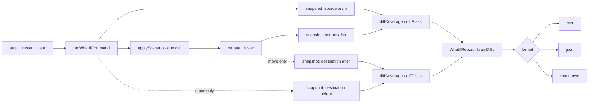

# Design 830 — `fit-summit what-if --move` two-sided rendering

## Context

[Spec 830](./spec.md) makes `what-if --move` show both source and destination
team impact in a single invocation, in all three formats (text, JSON, markdown),
while leaving `--add`, `--remove`, and `--promote` byte-identical.

The spec already pinpoints the computation primitives that exist
(`applyScenario`, `diffCoverage`, `diffRisks`) and confirms that the destination
team's after-state is recoverable from the same `mutated` roster the command
already produces. The architectural question is therefore not _what to compute_
but _where the per-team list lives_ in the pipeline and _what shape it takes_
between the command handler, the formatters, and JSON consumers.

## Components

| Component                          | Location                                                  | Role                                                                                                        |
| ---------------------------------- | --------------------------------------------------------- | ----------------------------------------------------------------------------------------------------------- |
| Command handler                    | `products/summit/src/commands/what-if.js`                 | Resolves source (and, for move, destination) targets; computes per-team `before`/`after` snapshots; calls diffs; assembles the `WhatIfReport` value passed to formatters. |
| Per-team diff struct (new typedef) | same file (typedef in `aggregation/what-if.js`)           | `{ teamId, role, coverageDiff, riskDiff }` — one entry per team rendered.                                    |
| `WhatIfReport` (new typedef)       | `aggregation/what-if.js`                                  | `{ scenario, teamDiffs }` — single shape every formatter consumes.                                           |
| Text / JSON / Markdown formatters  | `products/summit/src/formatters/what-if/{text,json,markdown}.js` | Consume `WhatIfReport`. Render N labelled sections (N=1 keeps the legacy layout byte-for-byte; N=2 only when `scenario.type === "move"`). |
| CLI definition                     | `products/summit/bin/fit-summit.js` (the `what-if` block) | Help strings for the `<team>` positional and the `--move` / `--to` options name source/destination roles.    |
| Snapshot fixtures (new)            | `products/summit/test/fixtures/what-if/`                  | Pre-change captured output for the five non-move scenarios; tests assert byte-identity post-change.          |

## Data flow



`applyScenario` is called exactly once. The destination-team `before` snapshot
is taken from the unmutated roster; both `after` snapshots come from the same
`mutated` roster. This satisfies success criterion 7 by construction.

## Internal contract

```text
WhatIfReport
  scenario : Scenario             // unchanged shape
  teamDiffs: TeamDiff[]            // length 1 for add/remove/promote, 2 for move
                                   // order: [source, destination] for move,
                                   // [target] otherwise

TeamDiff
  teamId        : string
  role          : "source" | "destination" | "target"
  coverageDiff  : { capabilityChanges: [...] }   // existing diffCoverage shape
  riskDiff      : { added, removed, unchanged }  // existing diffRisks shape
```

The destination team's `coverageDiff` / `riskDiff` are the existing pure
functions called against the destination team's pre/post snapshots — no new
diff logic is introduced.

## JSON output shape

| Scenario         | JSON top-level under `diff`                                    | Rationale                                                                |
| ---------------- | -------------------------------------------------------------- | ------------------------------------------------------------------------ |
| add/remove/promote | `{ capabilityChanges, riskChanges }` (current shape)         | Preserves byte-identity required by spec criterion 4.                    |
| move             | `{ teams: [ { teamId, role, capabilityChanges, riskChanges }, … ] }` | Each entry is self-describing (`teamId` + `role`); two entries always.  |

JSON consumers branch on `scenario.type === "move"` to choose which shape to
read, exactly as spec criterion 2 calls for. The formatter keeps the legacy
shape on the non-move path by reading `teamDiffs[0]` and emitting the
flat `{capabilityChanges, riskChanges}` object verbatim.

## Text and markdown rendering

Both formatters iterate `teamDiffs`. For N=1 they emit the existing single-
section layout (no `[teamId]` heading prefix, identical whitespace) so non-move
output stays byte-identical. For N=2 they emit two labelled sections, each
introduced by a heading naming the team and its role, with no interleaving of
capability or risk lines across teams (success criterion 1).

The text formatter's `headline()` already prints `Moving <name> from <src> to
<dst>:` and continues to do so; the per-team section labels appear below it
("Source team `<src>`:" / "Destination team `<dst>`:").

## Key decisions

| # | Decision                                                                                                  | Rejected alternative                                                                                                                                           |
| - | --------------------------------------------------------------------------------------------------------- | -------------------------------------------------------------------------------------------------------------------------------------------------------------- |
| 1 | Compute the per-team list in `runWhatIfCommand`; formatters receive a uniform `WhatIfReport`.             | Push the destination snapshot into the formatters and let each branch on `scenario.type`. Triplicates the branching logic and couples formatters to roster IO. |
| 2 | JSON shape branches on `scenario.type === "move"`: legacy flat shape for non-move, `teams: [...]` for move. | Always emit `teams: [...]`. Cleaner schema but breaks criterion 4 byte-identity, forcing every existing JSON consumer to migrate.                              |
| 3 | Carry `role` ("source" / "destination" / "target") on every `TeamDiff`.                                   | Rely on array order alone. Order survives JSON round-trips but reads worse for consumers and gives the formatters no structured label for headings.            |
| 4 | Two snapshots from one mutated roster (no second `applyScenario` call).                                   | Call `applyScenario` again with the destination as the positional context. Doubles the mutation cost and risks divergence between the two teams' "after" views (criterion 7). |
| 5 | Keep the destination unrendered for non-move scenarios; do not introduce a `--to` for non-move types.     | Render every scenario as a list of teams. Expands scope beyond `--move` (spec scope-out).                                                                       |
| 6 | Capture pre-change output as fixtures committed in the implementation PR.                                 | Generate fixtures on the fly from a pre-change git ref at test time. Tighter coupling to git history and fragile under rebases.                                |
| 7 | Update `<team>` positional help to read "source team for `--move`, target team otherwise"; update `--move` and `--to` to name source/destination explicitly. | Add a separate `summit what-if move` subcommand with its own positional. Larger user-facing surface change than the spec authorises.                          |

## Out-of-scope confirmations

- **Web UI surface.** No `defineRoute` / `InvocationContext` binding exists for
  `what-if` in `products/summit/src` (verified by `rg`). The spec's
  scope-out about a "shared presenter" is moot — the contract change is CLI-
  only and no web surface needs touching.
- **Mutation behaviour, diff functions, project-team moves, `Net:` summary,
  `fit-summit compare`** — see spec § Scope (out). The design adds no surface
  in any of these areas.

## Risks and mitigations

| Risk                                                                                  | Mitigation                                                                                                                                  |
| ------------------------------------------------------------------------------------- | ------------------------------------------------------------------------------------------------------------------------------------------- |
| Non-move output drifts off byte-identity through whitespace or ordering churn.        | Snapshot fixtures committed in the implementation PR; the test asserts equality against captured strings (decision 6).                       |
| JSON consumers downstream break on schema change.                                     | Non-move shape is unchanged; only `move` carries the new shape, signalled by `scenario.type === "move"` (decision 2).                        |
| `role` field clashes with a future scenario type that has more than two teams.        | The string is open-ended — additional roles can be added without re-shaping the array. No enum validation is introduced.                     |
| Tests cover formatters but miss the command-level wiring of destination snapshots.    | Add a command-level test on `runWhatIfCommand` (or its testable core) that asserts `teamDiffs.length === 2` and roles `source`/`destination` for a move scenario.            |

— Staff Engineer 🛠️
