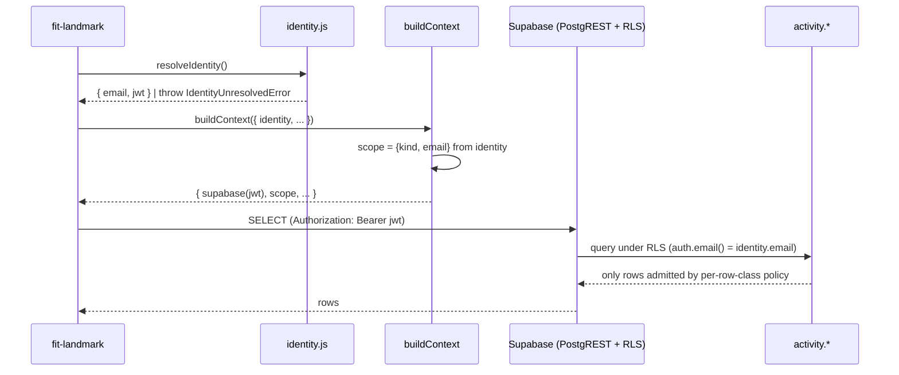

# Design 840-a — Landmark privacy substrate

## Components

| Component | Where | Role |
| --- | --- | --- |
| RLS migration | `products/map/supabase/migrations/<new>_landmark_rls.sql` | Enables RLS on the six tables; declares SELECT policies referencing `auth.email()`; revokes `anon`/`authenticated` blanket grants left by `20250101000000`; encodes retention metadata as per-table `COMMENT`. |
| Identity resolver | `products/landmark/src/lib/identity.js` (new) | Reads a Supabase Auth JWT from `LANDMARK_AUTH_TOKEN` (production) or a harness-injected token (tests). Throws `IdentityUnresolvedError` (new, code `LANDMARK_IDENTITY_UNRESOLVED`) when no token or no `email` claim. No `email` arg ever crosses this boundary. |
| Authenticated client | `products/landmark/src/lib/supabase.js` (rewrite) | `createLandmarkClient(token)` builds a Supabase client with `Authorization: Bearer <jwt>` and the `MAP_SUPABASE_ANON_KEY` transport key. Removes any reference to `MAP_SUPABASE_SERVICE_ROLE_KEY`. The service-role client lives only under `products/map/src/` for ingestion. |
| Scope contract | `products/landmark/src/lib/scope.js` (new) | Frozen value `{ kind: "engineer" \| "manager", email }`. Built once in `buildContext` from the resolved identity. Carried through `ctx.scope`; query modules accept it but only use it for client-side display filtering and for the source-inventory queries — RLS is the enforcement floor. |
| Source-inventory command | `products/landmark/src/commands/sources.js` (new) + dispatcher row in `bin/fit-landmark.js` | Implements `fit-landmark sources --email <e>`. Iterates a static `SOURCE_CLASSES` registry (one row per RLS'd table) and queries each with the authenticated client; rows the caller is out-of-scope for return zero by RLS. |
| Retention reader | `products/map/src/activity/retention.js` (new) | Reads the `COMMENT` blobs for the six tables (via `pg_class`/`pg_description`) and parses them into `{ window, clock }`. The source-inventory command consumes this. |
| Empty-state extension | `products/landmark/src/lib/empty-state.js` | Two new keys: `NO_SOURCES_FOR_PERSON(email)` (sources command, RLS-empty) and `NOT_AUTHENTICATED` (used by the error formatter when `IdentityUnresolvedError` reaches the dispatcher). |
| Documentation | new task slug `engineering-data-sources` under `websites/fit/docs/products/`; added to skill `## Documentation` and CLI `documentation[]` per `products/CLAUDE.md` | Explains the retention model and how engineers read their own row inventory. |

## Data flow



## RLS policy shape

For each row class, one `FOR SELECT TO authenticated` policy. `service_role`
keeps unrestricted access via `BYPASSRLS` semantics on the role; `anon` is
denied by absence of any policy admitting it (RLS default-deny).

| Row class | `USING` clause |
| --- | --- |
| `organization_people` | `email = (SELECT auth.email()) OR manager_email = (SELECT auth.email())` |
| `evidence` | `EXISTS (SELECT 1 FROM activity.github_artifacts ga WHERE ga.artifact_id = evidence.artifact_id AND (ga.email = (SELECT auth.email()) OR EXISTS (SELECT 1 FROM activity.organization_people op WHERE op.email = ga.email AND op.manager_email = (SELECT auth.email()))))` |
| `github_artifacts` | `email = (SELECT auth.email()) OR EXISTS (SELECT 1 FROM activity.organization_people op WHERE op.email = github_artifacts.email AND op.manager_email = (SELECT auth.email()))` |
| `getdx_snapshot_comments` | `email = (SELECT auth.email()) OR EXISTS (SELECT 1 FROM activity.organization_people op WHERE op.email = getdx_snapshot_comments.email AND op.manager_email = (SELECT auth.email()))` |
| `getdx_snapshot_team_scores` | `getdx_team_id IN (SELECT getdx_team_id FROM activity.organization_people WHERE email = (SELECT auth.email()) OR manager_email = (SELECT auth.email()))` |
| `getdx_snapshots` | `true` (org-wide cycle metadata; spec § Scope-in row 1) |

`(SELECT auth.email())` (subselect form) is the
[Supabase performance-tuning idiom](https://supabase.com/docs/guides/database/postgres/row-level-security)
— it forces the planner to evaluate the JWT once per query, not per row.

## Tier derivation

Tier is **derived inline by the policy**, not materialized as a column or a
function. A caller is "Manager" exactly when the policy's `manager_email = auth.email()` branch finds a row. There is no `is_manager()` helper, no
`tier` column on `organization_people`, no JS-side tier resolver. The single
source of truth stays `organization_people.manager_email`.

JS-side `scope.kind` is computed once for display purposes (e.g., the
empty-state copy distinguishes "engineer scope, no rows about you" from
"manager scope, none of your reports either"): `kind = "manager"` iff `SELECT 1
FROM organization_people WHERE manager_email = identity.email LIMIT 1` returns
a row. This is informational; RLS is the enforcement floor.

## Retention metadata

Per-table SQL `COMMENT` carrying two keys, parsed by the retention reader:

```sql
COMMENT ON TABLE activity.evidence IS
  'retention.window=180d retention.clock=created_at';
```

Windows declared per spec § Scope-in row "Retention metadata":
`organization_people` ⇒ tied to employment (`null`, displayed as "while
employed"); `evidence`/`github_artifacts` ⇒ `180d` from `created_at`/
`occurred_at`; `getdx_snapshots`/`getdx_snapshot_team_scores`/
`getdx_snapshot_comments` ⇒ `730d` from `imported_at`/`timestamp`. Concrete
values land in the migration; the design fixes the **mechanism**, not the
calendar.

## `get_team` interaction

The recursive function (`20250101000001_get_team_function.sql`) is `LANGUAGE
sql STABLE` with `SET search_path = ''` — implicit `SECURITY INVOKER`. RLS
applies inside the CTE: under Manager M, the recursion hits depth 1 (M's
direct reports are admitted by the `manager_email = auth.email()` branch on
`organization_people`; their reports are not, so the recursion terminates).
This matches spec criterion 4. **No change to the function.**

## CLI surface

New verb only:

```
fit-landmark sources --email <e>
```

The five existing `--email` commands and four `--manager` commands keep their
flags **as inputs** (caller can still scope a query to one report's rows for
display) but the flags no longer source scope: RLS clamps the result set to
what `auth.email()` admits regardless. A manager passing `--email <C>` for an
out-of-tree engineer C gets zero rows and the existing empty-state. Spec
criterion 9 (row-set parity for self-scope) holds because the per-row-class
rule admits all of self's rows.

## Key decisions

| Decision | Choice | Rejected | Why |
| --- | --- | --- | --- |
| Caller identity carrier | Supabase Auth JWT, `auth.email()` in RLS | (a) Per-engineer Postgres role + `SET ROLE`; (b) trusted application header | (a) explodes with org size and re-implements auth; (b) is bypassable — anyone with the connection sets the header |
| Tier source | RLS expression branch on `organization_people.manager_email` | (a) `tier` column on `organization_people`; (b) recursive walk; (c) JS-side resolver | (a) duplicates state ingestion already maintains; (b) over-scoped — spec needs only direct reports; (c) bypassable |
| Retention storage | Per-table `COMMENT` with `key=value` blob | (a) `activity.retention_policies` table; (b) JS-side constant map | (a) introduces a sync surface and a second source of truth; (b) decouples retention from the schema it constrains |
| Evidence scope shape | RLS subquery joins to `github_artifacts` | Add `email` column to `evidence` | Adding the column broadens write-path scope (every Guide writer must populate it) for marginal read-path speed; PK join is already fast |
| Source-inventory cross-tier | RLS does the filter; out-of-scope `--email` returns zero rows naturally | App-layer pre-check via `getPerson` | Single enforcement point; double-checking duplicates logic and risks divergence |
| `get_team` security mode | Keep `SECURITY INVOKER` (default) so RLS applies inside the CTE | `SECURITY DEFINER` + explicit scope check inside the function body | DEFINER would re-implement RLS in PL/SQL — two enforcement points drift |
| Auth failure UX | Throw at dispatcher boundary before any handler runs | Per-handler check | Spec criterion 3b: "no Supabase query issued" — dispatcher-level throw is the single chokepoint that satisfies it |
| Scope contract type | Frozen value object on `ctx.scope`; no class | Class with methods | Frozen plain object travels through the existing `buildContext` shape unchanged; no migration of handler signatures |

## Out of scope (restated)

Issue #829 slices 2–4, retention enforcement (deletion daemon), web UI,
ingestion-path rewrites, higher-than-Manager tiers, and the `services/map`
gRPC scope conventions. The schema declaration this design lands is the
substrate the deletion daemon will read from in a future spec.

— Staff Engineer 🛠️
