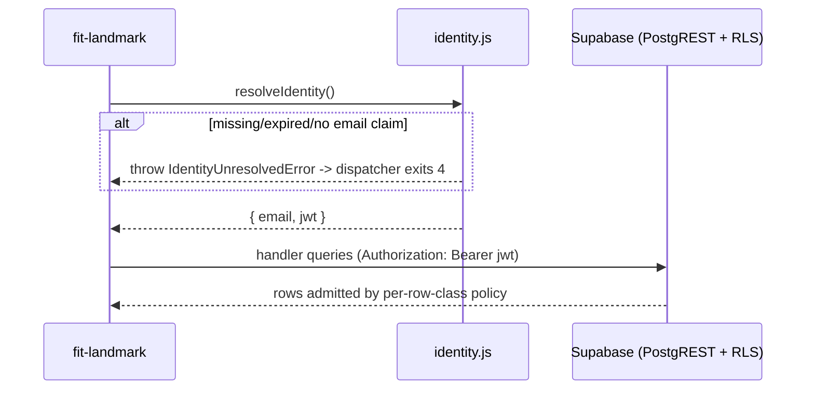

# Design 840-a — Landmark privacy substrate

## Components

| Component | Where | Role |
| --- | --- | --- |
| RLS migration | `products/map/supabase/migrations/<new>_landmark_rls.sql` | Enables RLS on the six tables; revokes the blanket DML grants to `anon`/`authenticated` from `20250101000000`; re-grants `SELECT` on the six tables to `authenticated`; declares one `FOR SELECT TO authenticated` policy per table; adds `idx_evidence_artifact_id` and `idx_github_artifacts_email`; encodes retention as per-table `COMMENT` with a `DO $$ ... $$` validation block that fails the migration if any of the six tables ends up with a malformed blob. `service_role` grants unchanged. |
| Identity resolver | `products/landmark/src/lib/identity.js` (new) | Reads a Supabase Auth JWT from `LANDMARK_AUTH_TOKEN`. Verifies the `email` claim is present and `exp` is in the future. Throws `IdentityUnresolvedError` (code `LANDMARK_IDENTITY_UNRESOLVED`); the dispatcher catches and exits **4** (1 = generic, 2 = usage, 3 = `SupabaseUnavailableError`, 4 = identity). Spec criterion 3b's "no query before error" chokepoint lives here. |
| JWT issuance — tests/CI | `signTestToken({email})` helper at `products/landmark/test/lib/sign-test-token.js` | HMAC-signs `{ role: "authenticated", aud: "authenticated", email, sub: <uuid>, exp: now+15m, iss: "supabase" }` with `MAP_SUPABASE_JWT_SECRET`. Containment: file lives only under `test/`, never imported from `src/` (verified at the same plan-level lint that closes criterion 3a). `MAP_SUPABASE_JWT_SECRET` is a CI-only secret scoped to test workflows; production deployments do not carry it, so a CI compromise cannot mint identities against production Supabase. |
| Authenticated client | `products/landmark/src/lib/supabase.js` (rewrite) | `createLandmarkClient(token)` builds a Supabase client with `Authorization: Bearer <jwt>` and `MAP_SUPABASE_ANON_KEY` as transport. No reference to `MAP_SUPABASE_SERVICE_ROLE_KEY` survives in `products/landmark/src/`; the service-role client lives only under `products/map/src/` for ingestion. |
| Source-inventory command | `products/landmark/src/commands/sources.js` (new) + dispatcher row in `bin/fit-landmark.js` | Implements `fit-landmark sources --email <e>`. Iterates a static `SOURCE_CLASSES` registry — one row per RLS'd table naming the table, the `clock` column, a label, and a per-class `keyResolver(supabase, e)` returning the filter the inventory query applies. |
| Admin provisioning verb | `products/map/src/commands/people-provision.js` (new) + dispatcher row in `bin/fit-map.js` under the existing `people` namespace | Implements `fit-map people provision`. Reconciles `auth.users` against `activity.organization_people` by email via Supabase's `auth.admin.*` API. Operator-only via `MAP_SUPABASE_SERVICE_ROLE_KEY` — the same key `people push` already consumes (`products/map/src/commands/people.js:48-80`); never registered on `fit-landmark`. Active signal: `banned_until IS NULL`. Decommissioned signal: `banned_until` set ≥100 years out. |
| Retention reader | `products/map/src/activity/retention.js` (new) | Reads the per-table `COMMENT` blob via `pg_class`/`pg_description`, parses to `{ window, clock }`. Cached for one CLI invocation. |
| Empty-state extension | `products/landmark/src/lib/empty-state.js` | One new key: `NO_SOURCES_FOR_PERSON(email)` — used by the source-inventory command when every class clamps to zero rows. No `kind`-conditional empty-state copy in slice 1. |
| Documentation | new task slug `engineering-data-sources` (engineer-facing, paired with `sources`) and `provisioning-engineers` (operator-facing, paired with `people provision`) under `websites/fit/docs/products/`; both update the relevant skill `## Documentation` list and CLI `documentation[]` array per `products/CLAUDE.md`. | Slugs are task-shaped, not product-name-shaped. The two surfaces sit on different CLIs (`fit-landmark` / `fit-map`) and address different audiences (engineer / operator). |

## Interfaces

```
identity.js   resolveIdentity(): { email, jwt }   throws IdentityUnresolvedError
supabase.js   createLandmarkClient(token): SupabaseClient
retention.js  readRetention(supabase, table): { window, clock }
sources.js    runSourcesCommand({ args, options, supabase }): { meta, items[] }
provision.js  runProvisionCommand({ args, options, supabase }): { meta, summary }
```

## Data flow



## RLS policy shape

Each row class has one `FOR SELECT TO authenticated` policy. `service_role`
keeps full access via its `BYPASSRLS` attribute (Supabase default). `anon` is
denied two ways: blanket grant revoked, no policy admits it.

| Row class | `USING` clause |
| --- | --- |
| `organization_people` | `email = (SELECT auth.email()) OR manager_email = (SELECT auth.email())` |
| `evidence` | `EXISTS (SELECT 1 FROM activity.github_artifacts ga WHERE ga.artifact_id = evidence.artifact_id)` |
| `github_artifacts` | `email = (SELECT auth.email()) OR EXISTS (SELECT 1 FROM activity.organization_people op WHERE op.email = github_artifacts.email AND op.manager_email = (SELECT auth.email()))` |
| `getdx_snapshot_comments` | `email = (SELECT auth.email()) OR EXISTS (SELECT 1 FROM activity.organization_people op WHERE op.email = getdx_snapshot_comments.email AND op.manager_email = (SELECT auth.email()))` |
| `getdx_snapshot_team_scores` | `getdx_team_id IN (SELECT getdx_team_id FROM activity.organization_people WHERE email = (SELECT auth.email()) OR manager_email = (SELECT auth.email()))` |
| `getdx_snapshots` | `true` |

The `evidence` policy delegates to `github_artifacts` RLS — `EXISTS` runs
inside RLS, so invisible artifacts drop their evidence rows. `(SELECT
auth.email())` is Supabase's per-query JWT-claim idiom. The two new indexes
keep both lookups off sequential scans; `organization_people.email` is the PK.

## Tier derivation and behavior changes

Tier is derived inline by the policy expressions; no `is_manager()` helper,
no `tier` column, no JS-side resolver. `organization_people.manager_email`
remains the single source of truth.

**Behavior changes** (intentional per spec criterion 4):

| Surface | Pre-change | Post-change |
| --- | --- | --- |
| `org show` (no flag) | full directory | self only (engineer) / self + direct reports (manager) |
| `org team --manager M` | full subtree (transitive) | M + direct reports only |
| `practice` / `practiced` / `health` `--manager M` | aggregates over full subtree | aggregates over self + direct reports |
| `voice --manager M` | comments across full subtree | comments across self + direct reports |
| `--manager <other>` / `--email <out-of-scope>` | requested rows | zero rows; each command renders through its own existing empty-state key (`NO_EVIDENCE`, `NO_COMMENTS_EMPTY`, `MANAGER_NOT_FOUND`, etc.). `NO_SOURCES_FOR_PERSON` is the source-inventory key only. |
| `getdx_snapshot_comments.email IS NULL` and `github_artifacts.email IS NULL` rows | visible to anyone | invisible to all `authenticated` callers (intentional — the per-row-class scope rule has no admit branch for unattributed rows; aggregate reads `practice`/`practiced`/`coverage` lose them too). |
| `marker` (no Supabase) | runs without auth | unchanged — `needsSupabase: false`; dispatcher skips identity resolution for this branch only. |

`--email` and `--manager` flags survive as JS-side filters within the
RLS-clamped result set; they no longer source scope. Identity resolves in
`bin/fit-landmark.js` immediately before `buildContext` for every
`needsSupabase: true` entry — the chokepoint criterion 3b requires.

## Admin user provisioning

`fit-map people provision` reconciles `auth.users` against
`activity.organization_people` via Supabase's `auth.admin.*` API, under
`MAP_SUPABASE_SERVICE_ROLE_KEY` — the same operator credential `people
push` already consumes (`products/map/src/commands/people.js:48-80`).
Sibling under `fit-map people`, never registered on `fit-landmark`.

Reconciliation reads `R = SELECT email FROM activity.organization_people`
and `A = auth.admin.listUsers()` (paginated). Emails in `R \ A` get
`createUser({ email, email_confirm: true })`. Emails in `R ∩ A` currently
banned get `updateUserById(id, { ban_duration: "none" })`. Emails in
`A \ R` get `updateUserById(id, { ban_duration: "876000h" })`.

Active signal: `banned_until IS NULL`. Decommissioned: `banned_until` ≥100
years out. Unchanged roster issues only the two reads — no writes — so
count, `id` per email, and active-state per row are unchanged (criterion
10). Removal bans; re-add restores via `ban_duration: "none"` (criterion
11). `email_confirm: true` on `createUser` skips Supabase's invite email.

## Retention metadata

Per-table `COMMENT` carrying two keys parsed by `retention.js`:

```sql
COMMENT ON TABLE activity.evidence IS
  'retention.window=P180D retention.clock=created_at';
```

Grammar: `retention.<key>=<value>` tokens, whitespace-separated; values are
ISO 8601 durations (`P180D`, `P730D`) or column identifiers
(`[a-z_][a-z0-9_]*`). Null encoding: omit the entire `retention.window`
token (and, for `organization_people`, the `retention.clock` token too) —
the parser yields `{ window: null, clock: null }`. Migration validation
fails if any table has neither token, an unrecognized token, a duration
that does not parse, or a `clock` referencing a missing column. A null
`window` renders as "while employed" with no `falloff`.

| Table | Window | Clock |
| --- | --- | --- |
| `organization_people` | null | (n/a — while employed) |
| `evidence` | P180D | `created_at` |
| `github_artifacts` | P180D | `occurred_at` |
| `getdx_snapshot_comments` | P730D | `timestamp` |
| `getdx_snapshot_team_scores` | P730D | `imported_at` |
| `getdx_snapshots` | P730D | `imported_at` |

## Source-inventory output

Per `SOURCE_CLASSES` entry the command issues asc/desc queries
(`count`+`oldest`, then `newest`) through the authenticated client; RLS
clamps both. Two of six classes need a one-shot lookup first (cached per
invocation). Per-class `keyResolver`:

| Class | Filter | Lookup before pair |
| --- | --- | --- |
| `organization_people` | `.eq("email", e)` | — |
| `evidence` | `.select("...,github_artifacts!inner(email)").eq("github_artifacts.email", e)` | — |
| `github_artifacts` | `.eq("email", e)` | — |
| `getdx_snapshot_comments` | `.eq("email", e)` | — |
| `getdx_snapshot_team_scores` | `.eq("getdx_team_id", t)`; class omitted if `t IS NULL` | one query: `t = SELECT getdx_team_id FROM organization_people WHERE email = e` |
| `getdx_snapshots` | `.in("snapshot_id", S)` | one query: `S = SELECT DISTINCT snapshot_id FROM getdx_snapshot_comments WHERE email = e UNION SELECT DISTINCT snapshot_id FROM getdx_snapshot_team_scores WHERE getdx_team_id = t` (PostgREST RPC; single round-trip) |

Output fields per class: `count`, `oldest`, `newest`, `window`,
`falloff = oldest + window` (omitted when `window` is null). Classes whose
`count` is zero are filtered out before render. Counts reflect the
**caller's view** post-RLS; the rendered header is "rows visible to you
about <e>" so a Manager M running `sources --email <report>` sees the
numbers `<report>` would see for themselves.

## `get_team` interaction

`get_team` (`20250101000001_get_team_function.sql`) is `LANGUAGE sql STABLE`
— implicit `SECURITY INVOKER`, planner-inlined. RLS on `organization_people`
applies inside the recursive CTE; recursion bottoms out at depth 1 because
grand-reports aren't admitted. **No function change.**

## Key decisions

| Decision | Choice | Rejected | Why |
| --- | --- | --- | --- |
| Caller identity carrier | Supabase Auth JWT, `auth.email()` in RLS | (a) Per-engineer Postgres role + `SET ROLE`; (b) trusted application header; (c) Supabase anonymous sign-in | (a) role explosion; (b) bypassable; (c) anonymous sign-in produces no `email` claim |
| JWT test issuance | `signTestToken` HMAC-signs against `MAP_SUPABASE_JWT_SECRET` with full claim set | (a) Bearer-token-from-stdin only; (b) shared CI service token | (a) leaves CI without a path; (b) bypass the spec is closing |
| Provisioning verb shape | `fit-map people provision` (sibling to `people push`) | (a) `fit-landmark provision`; (b) new `fit-map auth provision` namespace | (a) co-locates operator credentials with the read-only Landmark CLI; (b) parallel namespace for what is just another roster sync |
| Active/decommissioned signal | `banned_until` via `auth.admin.updateUserById({ ban_duration })` | (a) `auth.admin.deleteUser`; (b) soft-flag column on a new table | (a) loses `id` stability and audit trail across re-add cycles; asymmetric (delete vs create) where ban/unban is symmetric; (b) duplicates a signal Supabase already exposes |
| Tier source | RLS expression branch on `manager_email` | (a) `tier` column on `organization_people`; (b) recursive walk; (c) JS-side resolver | (a) duplicates state; (b) over-scoped (only direct reports needed); (c) bypassable |
| Empty-state copy | One key, tier-agnostic | Pre-probe `scope.kind` at context build to branch copy | Round-trip every command for prose-only change is a poor trade |
| Team-score admission | Admit teams any direct report sits in (via `org_people.getdx_team_id`) | Join `getdx_teams.manager_email = caller` | The `org_people` mapping is what ingestion already maintains; `getdx_teams.manager_email` would duplicate the signal and drift |
| Retention storage | Per-table `COMMENT` + post-write validation block | (a) `activity.retention_policies` table; (b) JS-side constant map | (a) sync surface; (b) decouples retention from the schema it constrains |
| `anon` lockout | Revoke blanket grants + omit any `anon` policy | Explicit `FOR SELECT TO anon USING (false)` policies | Two-belt approach (no grant + no policy) matches Supabase default-deny |
| Evidence scope shape | RLS subquery delegates to `github_artifacts` RLS | Add `email` column to `evidence` | Adding the column broadens write-path scope; `idx_evidence_artifact_id` + `idx_github_artifacts_email` cover the read path |
| `get_team` security mode | Keep `SECURITY INVOKER` (default) so RLS applies inside the CTE | `SECURITY DEFINER` + explicit scope check inside the function | DEFINER re-implements RLS in PL/SQL — two enforcement points drift |
| Auth failure UX | Throw `IdentityUnresolvedError` at dispatcher boundary; exit 4; no Supabase query issued | (a) Per-handler check; (b) treat as empty-state | (a) duplicates the chokepoint; (b) violates criterion 3b |

## Out of scope (restated)

Issue #829 slices 2–4, retention enforcement (deletion daemon), web UI,
ingestion-path rewrites, higher-than-Manager tiers, the `services/map` gRPC
scope conventions, the synthetic-data pipeline, cross-product scope, and a
static lint preventing service-role re-import under `products/landmark/src/`
(plan-level: biome rule or test). `SOURCE_CLASSES` co-evolution with the
migration when a future slice adds an RLS'd table is named here, enforced
in that slice's spec. `organization_people` ingestion continues under
`bunx fit-map people push` — not modified here.

**Engineer-side login flow — follow-up.** This slice provisions the
`auth.users` rows that identity-derived RLS depends on, but does not
deliver the path by which an engineer's CLI environment obtains a JWT
(`fit-landmark login` verb, magic-link delivery, password reset, SSO
bridge, API token storage). Tests and CI mint JWTs via `signTestToken`
against `MAP_SUPABASE_JWT_SECRET`; production rollout to engineers
requires the follow-up.

— Staff Engineer 🛠️
