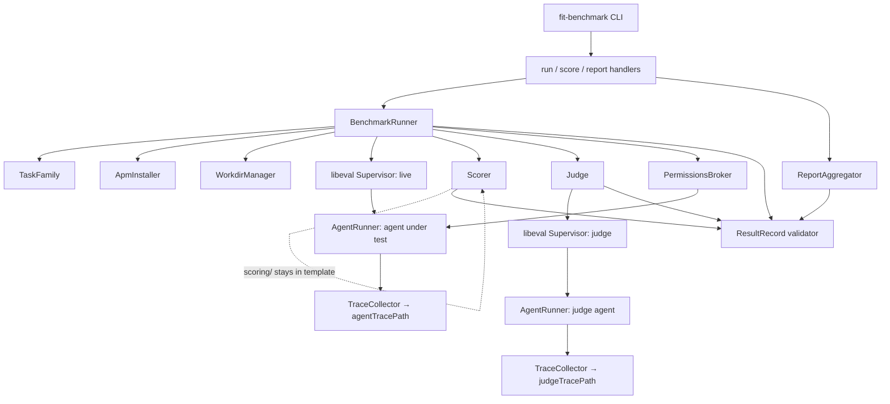
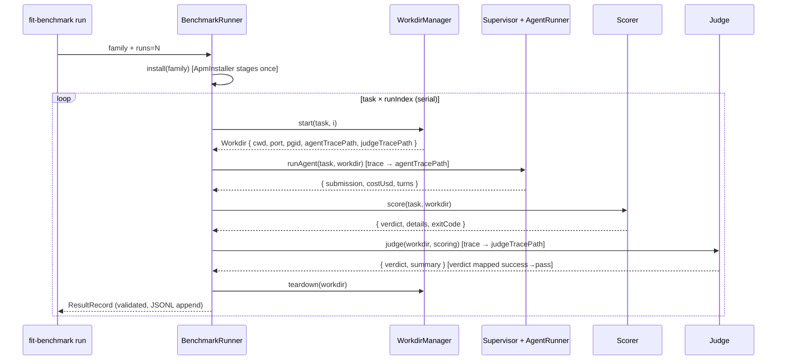

# Design 870-a — fit-benchmark Coding Agent Task Families

## Components

| Component | Where | Role |
| --- | --- | --- |
| `fit-benchmark` CLI | `libraries/libeval/bin/fit-benchmark.js` (new) | Entry point. Parses subcommand (`run`/`score`/`report`), wires real dependencies, delegates to the matching command handler. Mirrors `bin/fit-eval.js` shape. Same `@forwardimpact/libeval` package; separate bin. |
| `BenchmarkRunner` | `libraries/libeval/src/benchmark/runner.js` (new) | Sole orchestrator. Owns phase ordering for a family run: invokes `install` once, then drives each `(task, runIndex)` serially through the lifecycle by directly calling the named subsystems. Composes libeval's `Supervisor` + `AgentRunner`. Emits `ResultRecord`s as an async iterable. v1 is serial across `(task, runIndex)`; concurrent runs deferred. |
| `TaskFamily` | `libraries/libeval/src/benchmark/task-family.js` (new) | Loaded family: `rootPath`, `apm.lock.yaml` bytes, `familyRevision`, iterable of `Task`. Loaded once at family `install`; immutable thereafter. |
| `Task` | same module | One task: `id` = METR-style `task_family_name/task_name`, paths to `instructions.md`, `supervisor.task.md`, `judge.task.md`, `specs/`, `workdir/`, `scoring/`; declared `permissions` array. |
| `ApmInstaller` | `libraries/libeval/src/benchmark/apm-installer.js` (new) | At family `install`: reads `apm.yaml`/`apm.lock.yaml` (extensions match libpack at `libraries/libpack/src/stager.js:126`), materialises declared skills/agents into a single staging directory (`<output>/.apm-staging/.claude/`). Computes `skillSetHash` (sha256 over `apm.lock.yaml` bytes after LF normalisation — prevents cross-OS hash drift). At each task `start`, `WorkdirManager` copies the staging tree into the per-task CWD; `ApmInstaller` does not run per task. |
| `WorkdirManager` | `libraries/libeval/src/benchmark/workdir.js` (new) | Per-task: creates a temp CWD, copies `workdir/` and `specs/` into it (never `scoring/`), copies the apm staging tree into the CWD's `.claude/`, runs the pre-flight smoke probe, owns process-group cleanup at teardown (port free, processes reaped via process-group SIGTERM then SIGKILL after a 5 s grace). Returns a `Workdir` handle. |
| `Workdir` | same module | `{ cwd, port, pgid, scaffold, agentTracePath, judgeTracePath, preflightError? }`. Threaded through `runAgent` → `score` → `judge` → `teardown`. |
| `Scorer` | `libraries/libeval/src/benchmark/scorer.js` (new) | Spawns `<template>/tasks/<task>/scoring/run.sh` from the **template** path with `node:child_process.spawn` using `stdio: ['inherit', 'pipe', 'pipe', 'pipe']`. The 4th stdio entry is the parent-readable pipe for NDJSON `{ test, pass, message? }` rows; the script writes to fd 3 (`$RESULTS_FD=3`). `$WORKDIR` env is the post-run agent CWD. Returns `{ verdict, details, exitCode }`. **Exit code is authoritative**: `verdict = "pass"` iff `exitCode === 0`. The fd-3 NDJSON is diagnostic (per-test breakdowns surfaced on the result record) and never overrides the exit-code verdict. |
| `Judge` | `libraries/libeval/src/benchmark/judge.js` (new) | Wraps a libeval `Supervisor` over a single `AgentRunner` with its own `TraceCollector` writing to `Workdir.judgeTracePath`. Supervisor task = the family's `judge.task.md`; agent task = a structured "produce a verdict" prompt with `scoringPath` and `agentTracePath` exposed via env. `Conclude` is registered only on supervisor/facilitator tool servers (`orchestration-toolkit.js:224,311`); a bare `AgentRunner` cannot emit it, so the wrapper is required. The supervisor's `Conclude` arguments (`{verdict, summary}`, where `verdict ∈ {"success","failure"}`) are mapped into the result record by the runner: `judgeVerdict = { verdict: conclude.verdict === "success" ? "pass" : "fail", summary: conclude.summary }`. |
| `PermissionsBroker` | `libraries/libeval/src/benchmark/permissions.js` (new) | Translates METR-aligned permission strings into `AgentRunner` `allowedTools`/`disallowedTools` only. v1 closed set: `["full_internet"]`. Mapping: `"full_internet"` → include `WebFetch`; absent → exclude `WebFetch`. The spec's network-policy criterion is observable against the `WebFetch` surface only; Bash-shell egress (`/usr/bin/curl`, `node -e "fetch(...)"`, etc.) is a known v1 limitation closed only by the deferred containerised-isolation work. The plan owns any best-effort Bash-prefix advisory hardening; the design does not commit to a list. |
| `ResultRecord` validator | `libraries/libeval/src/benchmark/result.js` (new) | Schema — declared in § Result-record schema below — and a runtime validator (`validateResultRecord(record)`) that the runner calls before each JSONL append. Records are written one-per-line to `<output>/results.jsonl`. The same validator is consumed by `ReportAggregator` to reject malformed inputs. |
| `ReportAggregator` | `libraries/libeval/src/benchmark/report.js` (new) | `report` subcommand backend. Walks a run directory, validates each record, groups by `taskId`, computes pass@k via OpenAI HumanEval `1 - C(n-c, k) / C(n, k)`. |
| Subcommand handlers | `libraries/libeval/src/commands/benchmark-{run,score,report}.js` (new) | Parse CLI args, validate paths, build `BenchmarkRunner` or `ReportAggregator`, write output. Mirrors existing `commands/run.js` shape. |

`Supervisor` and `AgentRunner` are libeval primitives composed by
`BenchmarkRunner` and `Judge`; they are not new components.

## Component graph



## Lifecycle sequence



## Result-record schema

| Field | Type | Notes |
|---|---|---|
| `taskId` | string | `task_family_name/task_name` |
| `runIndex` | integer | 0-based |
| `verdict` | `"pass" \| "fail"` | combined gate: `"pass"` iff `scoring.verdict === "pass"` AND `judgeVerdict.verdict === "pass"` |
| `scoring` | `{ verdict, details, exitCode }` | `verdict` ∈ `{"pass","fail"}`; `details` parsed from `$RESULTS_FD` |
| `submission` | string | METR `submission` — the agent-under-test's final assistant text, extracted from `agentTracePath` |
| `judgeVerdict` | `{ verdict, summary }` | `verdict` ∈ `{"pass","fail"}`, mapped from libeval's `Conclude` (`success`→`pass`, `failure`→`fail`); `summary` is the supervisor's `Conclude.summary` verbatim |
| `costUsd` | number | total agent cost from the agent-under-test trace |
| `turns` | integer | total turns from the agent-under-test trace |
| `agentTracePath` | string | absolute path to the agent-under-test NDJSON trace |
| `judgeTracePath` | string | absolute path to the judge session's NDJSON trace |
| `profiles` | `{ agent, supervisor, judge }` | each is a profile name string passed to libeval at construction |
| `model` | string | model id (e.g. `claude-opus-4-7`) |
| `skillSetHash` | string | `sha256:` over `apm.lock.yaml` bytes after LF normalisation |
| `familyRevision` | string | `git:<SHA>` when family is sourced from a git repo (HEAD SHA at clone time); else `sha256:` per the canonical-tree algorithm in § Family revision algorithm |
| `permissions` | `("full_internet")[]` | METR-aligned closed set for v1 |
| `durationMs` | integer | wall-clock from `start` to `teardown` |
| `preflightError?` | `{ phase, message, exitCode }` | present only on pre-flight failure; the record is otherwise minimal (`costUsd: 0`, no submission, no scoring) |

## Pre-flight contract

`workdir/scripts/preflight.sh` is the sole pre-flight mechanism. Each task
in a family must ship one (executable). `WorkdirManager` invokes it after
the copy step with `$WORKDIR` = the per-task agent CWD and `$PORT` =
harness-allocated TCP port; exit `0` = scaffolding boots, non-zero = broken
template. The harness fails the family at `install` if any task's
`workdir/scripts/preflight.sh` is missing or non-executable, before any
agent session starts. Tasks that need no probe can `exit 0` immediately.
The harness commits to no language- or transport-specific defaults.

## Family revision algorithm

For non-git families, `familyRevision` is computed as: list every regular
file under the family root excluding `.git/` and `node_modules/`; resolve
each symlink to its target before reading; sort the resulting paths
lexicographically by their root-relative POSIX path string; for each path
compute sha256 of the file's bytes; concatenate `<rel-path>\0<hex-sha>\n`
rows in the sorted order; sha256 the concatenation; prefix `sha256:`. The
algorithm uses NFC-normalised UTF-8 for paths and LF-only line endings for
the row separator so the result is byte-identical across operating systems.

## Interfaces

```js
// runner.js
class BenchmarkRunner {
  constructor({
    family,                       // TaskFamily | path | git url
    runs,
    output,                       // run-output directory
    model,
    profiles,                     // { agent, supervisor, judge } — names
    ...opts
  });
  async *run(): AsyncIterable<ResultRecord>;
}

// runAgent flow inside BenchmarkRunner (not a separate class):
//   compose Supervisor over AgentRunner, with TraceCollector → agentTracePath,
//   tools gated by PermissionsBroker(task.permissions);
//   on session end, parse agentTracePath to extract `submission`
//   (final assistant text block before any orchestration tool call).

// task-family.js
loadTaskFamily(rootPathOrGitUrl): Promise<TaskFamily>
TaskFamily: { rootPath, familyRevision, apmLockBytes, tasks(): Iterable<Task> }
Task: {
  id, paths: { instructions, supervisor, judge, specs, workdir, scoring },
  permissions: ("full_internet")[],
}

// scorer.js
runScoring(task, workdir): Promise<{
  verdict: "pass" | "fail", details: object[], exitCode: number,
}>

// result.js
validateResultRecord(record): void   // throws on schema mismatch
```

## Key Decisions

| # | Decision | Rejected alternative | Why |
| --- | --- | --- | --- |
| 1 | Separate CLI `fit-benchmark` rather than a `fit-eval bench` subcommand. Same package. | Add `bench` to `fit-eval`. | Keeps `fit-eval` a low-level generic tool with stable surface. The benchmark layer carries opinionated semantics (lifecycle, scoring, judge, aggregation) that don't belong in the generic CLI. |
| 2 | Adopt METR task-standard vocabulary (`task family`, `instructions`, `permissions`, lifecycle hook names, `submission`, `task_family_name/task_name` ids). | Invent monorepo-specific names. | Portability — METR's standard is in production at multiple orgs. Vocabulary alignment lets the format absorb existing METR families and lets ours flow outward without renaming. |
| 3 | Hidden `scoring/` directory lives only in the template; `WorkdirManager` never copies it. The Scorer invokes scripts from the template path with `$WORKDIR` as an argument. | Copy `scoring/` to a sibling dir; rely on the supervisor to keep the agent away. | Structural beats procedural. If `scoring/` is never on disk in the agent's CWD, peeking is impossible. |
| 4 | Lockfile at family root is `apm.lock.yaml` (matching libpack); `skillSetHash` is sha256 over its bytes after LF normalisation. | `apm.lock.yml`; raw byte hash without normalisation. | `.yaml` matches `libraries/libpack/src/stager.js:126`; `.yml` would silently miss the file. LF normalisation prevents Windows/Unix CRLF flipping the hash. |
| 5 | Compose libeval primitives (`AgentRunner`, `Supervisor`, `TraceCollector`); do not fork. | New `BenchmarkAgentRunner` subclass. | One source of truth for agent execution; libeval improvements flow through automatically. |
| 6 | `BenchmarkRunner` is the sole orchestrator. No separate `LifecycleDriver`. v1 is serial across `(task, runIndex)`. | Two-tier orchestrator; concurrent runs in v1. | Fewer indirection layers; concurrency adds JSONL-append synchronisation, port-allocation, and teardown-race surface that v1 doesn't need to validate the format. |
| 7 | Judge runs through a libeval `Supervisor` over a single `AgentRunner` — not a bare `AgentRunner`. | Bare `AgentRunner` parsing final text; reuse the live supervisor. | `Conclude` is registered only on supervisor/facilitator tool servers (`orchestration-toolkit.js:224,311`); a bare `AgentRunner` cannot emit it. Reusing the live supervisor conflates help-incentives with grade-incentives — a spec-level concern. |
| 8 | `judgeVerdict` shape is `{ verdict: "pass"\|"fail", summary }`; the runner maps libeval's `Conclude.verdict` `"success"`→`"pass"` and `"failure"`→`"fail"`. | Use libeval's `success`/`failure` enum on the wire. | The result record speaks user-facing pass/fail (matching pass@k vocabulary); libeval's enum is preserved on the trace itself for round-trip. The mapping is a one-line normalisation, named here so neither side invents it. |
| 9 | v1 network policy enforced through `AgentRunner` `allowedTools`/`disallowedTools` only. Closed set: `["full_internet"]`. The spec's network-policy success criterion is observable on the `WebFetch` surface; Bash-shell egress is a documented v1 limitation. | OS-level network gating in v1. | `AgentRunner` exposes only tool allow/deny; OS-level isolation is the deferred containerised-isolation follow-up. Constraining v1 to the tool surface keeps the spec criterion verifiable without committing to fragile Bash-prefix heuristics. |
| 10 | One result record per task-run, JSONL-appended to `<output>/results.jsonl`. Each record passes a runtime schema validator before append. | Aggregated JSON per run; no validator. | Append-only writes survive partial failures. Validator catches schema drift at write time rather than at report time. |
| 11 | `ApmInstaller` runs once per family `install`, materialising into a single staging directory; `WorkdirManager` copies the staged tree into each per-task CWD. | Re-install per task; reference-count a shared `.claude/`. | Hashes once, copies many. Staged tree is read-only after install — task isolation is provided by the per-task copy. |
| 12 | `Scorer` passes results via fd 3 (`$RESULTS_FD=3`) using `child_process.spawn` `stdio: ['inherit','pipe','pipe','pipe']`. POSIX-only in v1. | Sentinel file in `$WORKDIR`; stdout interleaved. | Sentinel file pollutes the post-run workdir (visible in repo-state grading); stdout interleaving requires a delimiter convention. Fd 3 is portable across POSIX shells; Windows support is deferred. |
| 13 | Two symmetric trace fields per task-run: `agentTracePath` and `judgeTracePath`. No `tracePath` alias. | Single trace shared between supervisor and judge; discard judge trace; expose only one trace via `tracePath`. | The judge is an independent session — its trace is a first-class artifact for debugging "why did the judge fail this run?" Symmetric naming avoids the drift that arises when two field names refer to the same value, and keeps the schema explicit about which trace consumers want. |

## Test surfaces

The design names two surfaces; the plan picks the layering and fixture composition.

| Surface | What it covers |
| --- | --- |
| `benchmark/*.js` unit | `WorkdirManager` excludes `scoring/`. `ApmInstaller` produces stable `skillSetHash` and runs once per family. `Scorer` parses fd-3 NDJSON and exit codes. `PermissionsBroker` maps METR strings to `allowedTools`/`disallowedTools`. `validateResultRecord` rejects malformed records. `ReportAggregator` computes pass@k. |
| End-to-end fixture | A minimal task family driving the full lifecycle, asserting result-record validation, scoring isolation (sentinel-filename property), pre-flight failure path, network-policy enforcement on the `WebFetch` surface, JSONL append integrity, and verdict-enum mapping (`success`→`pass`). |

## Out of scope (carried from spec)

Containerised isolation, library-API and CLI-invocation grading, cross-model
leaderboards, live PR-gate integration, retroactive grading, family-level
cost caps, replay-from-trace, intermediate scoring, concurrent runs, and
Windows scoring-channel support are unchanged from spec § Out of scope, deferred.

— Staff Engineer 🛠️
