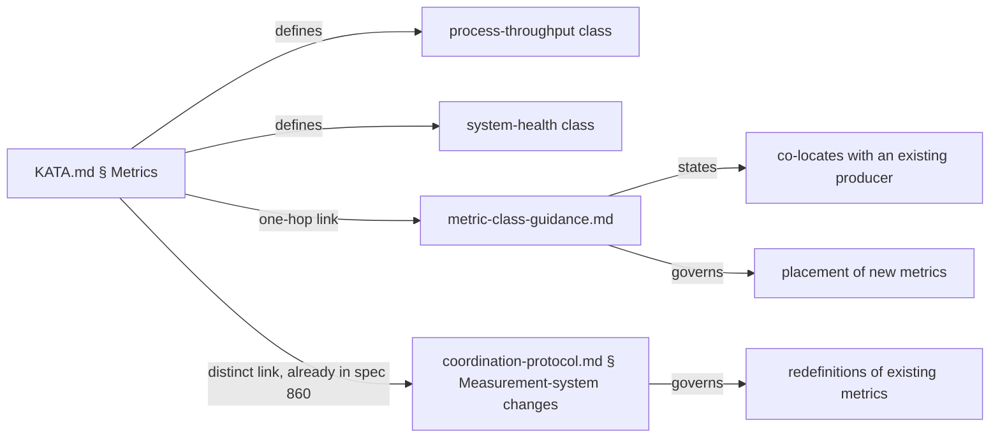

# Design 880-a — Canonical-metric cardinality and the class boundary

Spec: [spec.md](spec.md) · KATA.md § Metrics is the artifact under amendment.
This design picks WHICH components carry the class boundary and WHERE the
co-location pointer lives. Wording shape is design's choice (spec SC3 fixes
only the substring `co-locates with an existing producer`).

## Decision

Pick spec § Notes shape **(a) — admit a named system-health class alongside
process-throughput**. Hold the one-skill-per-process-throughput-metric
invariant *within* the process-throughput class. System-health metrics carry
their own placement rule (co-location with an existing producer).

Rejected: spec § Notes shape (b) — hold the singleton invariant and push
producer-selection prose elsewhere. (b) cannot satisfy SC1 without naming a
second class anyway (to define what gets excluded); once named, the
binding-constraint metric family becomes a class either way. Naming the class
in § Metrics moves the decision from "exception" to "schema."

## Two named classes

| Class             | Counts                                                                        | Producer-skill cardinality        | Producer-selection rule                                                                                          |
| ----------------- | ----------------------------------------------------------------------------- | --------------------------------- | ---------------------------------------------------------------------------------------------------------------- |
| process-throughput | Units of work the producer skill produced in its own run                      | One per process-skill (unchanged) | Producer = the skill that *is* the process (already the rule today).                                            |
| system-health     | Events about the loop the producer skill *observes* while producing its own units | Unconstrained at the producer     | Producer **co-locates with an existing producer** that already reads the relevant GitHub/repo state at no extra cost. |

Class-name candidates considered: `binding-constraint` (the term spec 880
uses 6× as shorthand throughout § Problem and § Notes; mirrors spec 860 § Goal
vocabulary, but reads as a per-metric value judgment — "binding *today*?" —
not a stable schema, and ages poorly once the bottleneck shifts);
`loop-health` and `cross-cutting` (less precise about what the metric
counts). `system-health` is class-stable and parallels `process-throughput`
in shape. **Vocabulary note for plan/implementation:** spec 880's
`binding-constraint` references describe the *member shape* (the first such
member reads the approval-throughput binding constraint); the design names
the *class* `system-health` so the schema survives bottleneck shifts. The
two terms are not synonyms — spec prose is not edited, KATA.md § Metrics
adopts `system-health` as the class name.

## Membership criterion (one sentence, class-aware per SC2)

> A new metric is **process-throughput** if it counts units of work the
> producer skill produced in its own run, and **system-health** if it counts
> events about the loop that the producer skill observes while producing its
> own units.

The criterion turns on what the metric counts and where the producer reads it,
not on any metric name. Verified by SC2 grep across the 13 tokens spec 880 SC2
enumerates (the canonical-11 metric names plus `approvals_recorded_per_run`,
i.e. the canonical set after spec 860 plan-b lands the 12th metric): no token
appears in the criterion sentence.

## Where the boundary lives

**Three components:**

1. **§ Metrics cardinality rule (amended).** Names both classes; states the
   one-per-skill invariant on process-throughput only; states that
   system-health metrics co-locate per the pointer.
2. **§ Metrics rationale paragraph (amended).** Covers both classes — XmR
   drives both, but process-throughput rides the producer's natural run
   cadence and system-health rides the producer's natural read of loop state.
   SC4 grep: each class-name token appears ≥1× in this paragraph.
3. **`metric-class-guidance.md` pointer page.** New file at
   `.claude/agents/references/metric-class-guidance.md`. Linked once from
   § Metrics (the "one link hop" SC3 names). Body contains the required
   substring `co-locates with an existing producer` exactly once, in the
   sentence that states the system-health placement rule.

## Why a new reference file, not inline or in coordination-protocol.md

| Option                                                 | Verdict                                                                                                                                              |
| ------------------------------------------------------ | ---------------------------------------------------------------------------------------------------------------------------------------------------- |
| Inline in § Metrics                                    | Rejected. Pushes § Metrics past its current 18-line footprint; spec asks for "reachable in one link hop," explicitly modeling a separate target.    |
| `coordination-protocol.md` § Measurement-system changes | Rejected. Spec 860's Edit 2b already links § Metrics to that section; its scope is *redefinitions* of existing metrics. Co-location is a *placement* question for *new* metrics — distinct surface. SC3 calls this out: "Distinguishes from spec 860 Edit 2b's `coordination-protocol.md § Measurement-system changes` link, which addresses redefinitions, not co-location." |
| New `KATA.md` subsection                                | Rejected. The constitution stays small; the pointer pattern (already used for `coordination-protocol.md`) is the precedent.                          |
| New `.claude/agents/references/metric-class-guidance.md` | **Chosen.** Sits alongside `coordination-protocol.md` and `memory-protocol.md`; § Metrics gains one new markdown link; the two pointers remain orthogonal. |

## Pointer page shape (`metric-class-guidance.md`)

A short reference page, structured:

1. **Lead** — one paragraph stating that § Metrics names two classes and this
   page tells future spec/design authors which class a new metric joins and
   where its producer lives.
2. **Decision table** — two-row table reproducing the class table above for
   author convenience.
3. **Placement rule** — one paragraph containing the substring
   `co-locates with an existing producer`. The system-health placement rule:
   choose a producer skill that already reads the relevant state for its
   process-throughput work; do not create a new skill solely to host a
   system-health metric. Cites `kata-release-merge`/`approvals_recorded_per_run`
   as the worked precedent (the skill already reads `<phase>:approved` label
   state for its existing `prs_merged` work).
4. **Process-throughput rule** — one sentence: cardinality stays one
   process-throughput metric per process-skill; new process-skills register
   one (and only one) process-throughput metric in their
   `references/metrics.md`.

The page is plain prose with one table. No YAML shape, no detection grep — the
spec 860 surface owns those for redefinitions; this page owns placement.

## Success-criterion mapping

| SC | Satisfied by                                                                                                                  |
| -- | ----------------------------------------------------------------------------------------------------------------------------- |
| 1  | § Metrics names `process-throughput` and `system-health` and states the membership criterion in one sentence.                |
| 2  | Membership-criterion sentence contains no canonical-set metric name (verified by `rg` across the 13 tokens spec SC2 enumerates). |
| 3  | § Metrics has one new markdown link to `metric-class-guidance.md`; that page's body contains `co-locates with an existing producer`. |
| 4  | Rationale paragraph mentions `process-throughput` ≥1× and `system-health` ≥1×.                                                |

## Out of scope (design-level)

- Class-membership of every existing canonical metric. The implementation does
  not retag the existing canonical-11 rows in their `references/metrics.md`
  files. The design's working assumption is that the canonical-11 members are
  process-throughput by inspection and `approvals_recorded_per_run` is the
  first system-health member; if a later spec finds an existing canonical-11
  metric that reads loop state rather than producer output, a backfill spec
  retags it. This design does not pre-audit that question.
- Closure of the system-health class. The class is named open. Spec 880 § Notes
  lists candidates (queue dwell, ratification-cycle length, agent-react fan-in
  delay) but the design does not pre-admit them; each enters via its own
  spec/design/plan/implement chain, classified at spec time by the criterion.
- Routing of system-health metrics through `fit-xmr`. Unchanged from
  process-throughput; XmR semantics, rules, and control-limit math are
  identical for both classes (this is why the rationale paragraph covers
  both).
- Producer-selection enforcement (e.g., CI checking that a new system-health
  metric's producer already reads the relevant state). Out of scope; the
  guidance page is a pointer for authors, not a CI gate.

## Interfaces

| Surface                                  | Change kind | Touched by                  |
| ---------------------------------------- | ----------- | --------------------------- |
| `KATA.md` § Metrics                      | Amend       | Implementation              |
| `.claude/agents/references/metric-class-guidance.md` | Create      | Implementation              |
| `.claude/agents/references/coordination-protocol.md`  | Read-only   | Linked from new page (no edit) |
| `.claude/skills/kata-*/references/metrics.md`         | Read-only   | Authoritative for class-name absence (SC2) |

Plan turns these into ordered steps with exact diffs; this design fixes WHICH
components and WHERE the boundary sits.

— Staff Engineer 🛠️
