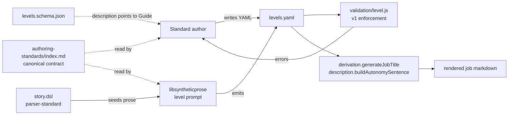
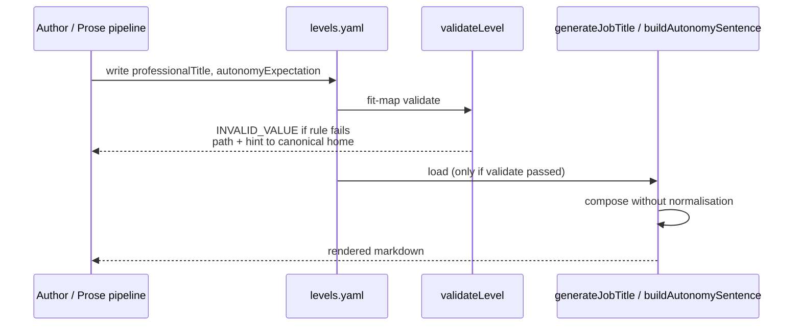

# Design 900 — Pathway Job Formatter Data Conventions

## Restate the problem

Two of #874's rendering bugs are symptoms of a contract the pathway job
formatter relies on but never writes down. `generateJobTitle`
(`libraries/libskill/src/derivation.js:264`) silently assumes
`professionalTitle` is a rank prefix; `buildAutonomySentence`
(`products/pathway/src/formatters/job/description.js:30`) silently assumes
`autonomyExpectation` opens with a base-form verb. The starter happens to
satisfy both; BioNova does not. v1 must (a) name the contract for these two
fields in one canonical location, (b) bring every emitter into alignment,
(c) catch violations before render.

## Components

Two consumers (`generateJobTitle`, `buildAutonomySentence`) live downstream of
one validator (`validateLevel`). One canonical contract document is read by
authors, by the prose prompt, and is pointed at by the schema's `description`
field. Three emitter paths — the starter `levels.yaml`, the DSL `parser-standard`
+ `story.dsl`, and the `libsyntheticprose` level prompt — must agree on the
contract; the validator is the enforcement gate they all pass through before
render.

## Key Decisions

| Decision                                                              | Chosen                                                                                                                                                            | Rejected                                                                                                                                                                                                                                                                            |
| --------------------------------------------------------------------- | ----------------------------------------------------------------------------------------------------------------------------------------------------------------- | ----------------------------------------------------------------------------------------------------------------------------------------------------------------------------------------------------------------------------------------------------------------------------------- |
| **K1. Canonical home**                                                | `websites/fit/docs/products/authoring-standards/index.md` (existing Step 1 section) — single source of truth, public URL, already the page authors land on.       | Schema `description` strings — too cramped for compliant/non-compliant examples and a rationale; readers reach descriptions via `fit-map validate` errors, not as a first-class read. Starter YAML inline comments — local to one example file; can't carry a non-compliant example without confusing the example itself; not the surface external authors search. |
| **K2. `professionalTitle` shape**                                     | **Rank token** — a short ordinal or seniority prefix (`Level I`, `Senior`, `Staff`). The formatter composes it with the discipline's `roleTitle`.                | **Role-complete** (`Senior Engineer`) — drops the `{roleTitle}` join entirely and forces every discipline to repeat the role token across every level (10 disciplines × 6 levels = 60 redundant strings); also obsoletes the existing starter shape. **Marker-distinguished** — adds a per-level flag for an inconsistency we are removing, not preserving. |
| **K3. `professionalTitle` rule**                                      | Must match `^(?:Level [IVX]+\|[A-Z][a-z]+(?:[ -][A-Z][a-z]+)?)$` — either the `Level <roman>` shape (Level-branch in `generateJobTitle`) or a 1–2 word title-case prefix (else-branch). | Plain prose rule with no machine check — the validator can't enforce "is a rank prefix" without a regex. Free-form with formatter heuristics — what we have today; ships the bug. |
| **K4. `autonomyExpectation` shape**                                   | **Base/imperative verb** — opens with an infinitive ("Work…", "Lead…", "Define…"). Composes cleanly into the existing `"You will " + lowercase(value)` template. | **Third-person** ("Works…") — requires verb-form normalisation in the formatter, hiding the verb-agreement bug rather than catching it. **Either, formatter normalises** — normalisation is brittle (irregular verbs, "is responsible for", elided subjects); the contract is cheaper and clearer. |
| **K5. `autonomyExpectation` rule**                                    | First token is a base-form verb. The validator's check: (a) the value matches `^[A-Z][a-z]+\b` (one capitalised word), and (b) that first word is not in a finite stop-list of third-person and copular forms (`Works`, `Leads`, `Drives`, `Owns`, `Defines`, `Shapes`, `Builds`, `Coordinates`, `Manages`, `Is`, `Has`, `Will`, `Should`). Subject-opening sentences (`The …`, `You …`) fail (a). | Pattern-only (regex in schema) — JSON-schema `pattern` cannot express "not third-person `-s`" cleanly across irregular and copular verbs; the stop-list keeps the check small and inspectable, and the contract document carries the English rule for novel cases. Allow-list of permitted verbs — couples the rule to a closed vocabulary the standard author cannot extend. |
| **K6. Enforcement substrate**                                         | **Validator** (`products/map/src/validation/level.js`) — adds two new rules, returning `INVALID_VALUE` errors with `path` pointing at the field and a `hint` linking to the canonical home. | **Schema-only** — JSON `pattern` can express K3 but not K5 cleanly; mixing modes for the two fields adds surface area. **Formatter-side normalisation** — hides the data bug at the engineer's 1:1; spec explicitly forbids ("contract is the contract"). **Hybrid** (schema + validator) — two homes for one rule, the spec calls "one home per decision". |
| **K7. Synthetic-prose alignment**                                     | Update the level prompt (`libraries/libsyntheticprose/src/prompts/pathway/level.js`) to instruct rank-only `professionalTitle` and base-verb `autonomyExpectation`, with the contract's compliant examples inlined. | **Post-processing pass** — the prose generator already produces structured JSON; a post-process is a parallel enforcement path that drifts. **Schema-driven generation** — overkill for two fields; covered by the prompt update. |
| **K8. DSL seed alignment**                                            | Update `data/synthetic/story.dsl` level entries from role-complete (`title "Engineer"`) to rank-only (`title "Associate"`, `title "Senior"`, `title "Staff"`, `title "Lead"`, `title "Principal"`). The DSL `title` field semantically becomes "rank token". | Leave DSL role-complete and reshape downstream — keeps the bug source alive; any future regen reintroduces "Engineer Engineer". |
| **K9. BioNova regeneration command**                                  | `bunx fit-terrain build --only=pathway` against `data/synthetic/story.dsl` at the same `seed 42` pin already in the DSL (line 6). No new pin file; the seed is part of the DSL.                                            | A separate seed-pin file — duplicates the DSL's own `seed` directive. Regenerating the entire terrain — slow; only the `pathway` output is needed for the spec's BioNova parity test. |
| **K10. Starter migration**                                            | `products/map/starter/levels.yaml` already uses rank-only (`Level I`, `Level II`) and base-verb (`Work with supervision`, `Work independently…`) — no data change. The starter is the reference exemplar in the contract document.            | Leaving the starter unchanged but documenting an inconsistent contract — would invalidate the existing exemplar. |

## Data Flow — validation gate

Validation is the single chokepoint. `fit-map validate` runs before render in
every supported workflow (`fit-pathway dev`, CI, `fit-terrain build`), so a
non-compliant standard cannot reach the engineer's 1:1.

## Interfaces

**Validator additions** (`products/map/src/validation/level.js`)

Two new checks inside `validateLevel`, each returning a structured error:

- `validateProfessionalTitleShape(level, path)` → `INVALID_VALUE` when the K3
  regex does not match. Error message names the field, shows the value, and
  links to the canonical-home anchor.
- `validateAutonomyExpectationShape(level, path)` → `INVALID_VALUE` when the K5
  rule fails. Same error shape.

Both checks live in the same module; no new files. They follow the existing
`createError` contract — no change to the validator's return type.

**Schema update** (`products/map/schema/json/levels.schema.json`)

The `professionalTitle` and `autonomyExpectation` `description` strings change
to point at the canonical home (one line each, with the URL). No `pattern`
addition — the rules are enforced by the validator (K6). The schema stays a
shape contract; the engineering-standard contract stays in the guide.

**Formatter** — no interface change. `generateJobTitle` and
`buildAutonomySentence` keep their signatures; they receive validated input.

**Prompt** — `buildLevelPrompt` keeps its signature. The prompt body changes;
the function still returns `{ system, user }`.

## Out of Scope (named in spec)

`impactScope`, `complexityHandled`, `influenceScope`, `managementTitle`, and
`qualificationSummary` are not covered. The validator's new module structure
(two helpers next to the existing checks) leaves room for a follow-up spec to
add parallel rules without restructuring.

## Risks

- **Irregular-verb stop-list churn.** K5 names a finite list of third-person
  verbs to reject. A long-tail verb (`Synthesises`) slips through. **Mitigation:**
  the contract document gives the rule's intent in English; reviewers catch
  novel third-person openings during PR review. The validator can grow the list
  in-tree without a contract change.
- **DSL semantic drift.** Changing `title` from role-complete to rank-only in
  the DSL (K8) changes a token's meaning. **Mitigation:** the DSL is internal,
  not user-facing; the only consumer is `parser-standard` → `libsyntheticprose`,
  both updated in the same PR. A comment in `story.dsl` near the `levels` block
  names the contract.

— Staff Engineer 🛠️
