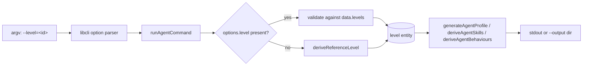
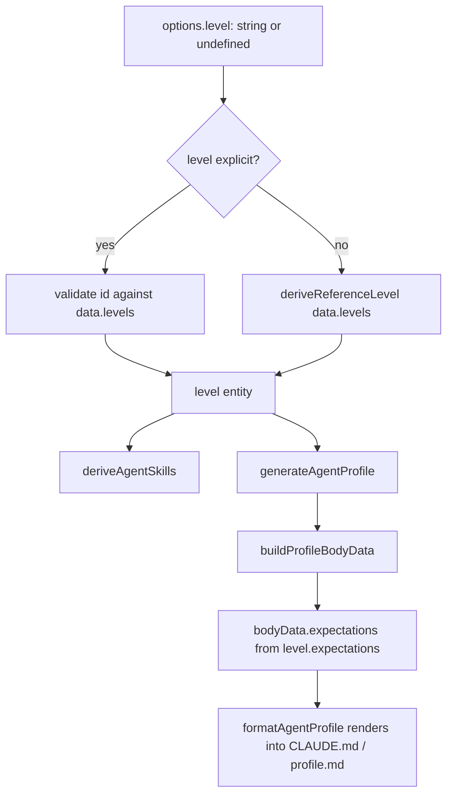

# Design 910-a — Pathway `agent` `--level` Flag

## Architectural Intent

Surface a single calibration knob — the engineering level — on the
`fit-pathway agent` command. The level already flows end-to-end inside
`libskill` (`deriveAgentSkills`, `generateAgentProfile`, `deriveAgentBehaviours`
all accept a `level` argument); the missing piece is a CLI binding that lets
the caller name which level to pass in. No new derivation logic, no new data
schema, no new threading paths.

The change lives at the **CLI/library boundary** — the seam between argv
parsing and the library's existing `level`-aware functions. Validation reuses
the same shape `--track` already uses; default resolution reuses the existing
`deriveReferenceLevel` library function unchanged.

## Components

| Component                      | Module                                  | Change                                                                                                                  |
| ------------------------------ | --------------------------------------- | ----------------------------------------------------------------------------------------------------------------------- |
| `agent` CLI definition         | `products/pathway/bin/fit-pathway.js`   | Add a `--level` option entry symmetric in shape with the existing `--track` entry on the same command                   |
| `runAgentCommand`              | `products/pathway/src/commands/agent.js`| Read `options.level`; when present, resolve against `data.levels`; when absent, fall through to existing default-resolve|
| Level validation               | same module                             | Reuse the existing `requireEntity` helper with `data.levels` and an "Available levels:" header — same shape as `--track`|
| `deriveReferenceLevel`         | `libraries/libskill/src/agent.js`       | **Unchanged.** Remains the default path when `--level` is absent                                                        |
| Library threading              | `libraries/libskill/src/agent.js`       | **Unchanged.** `generateAgentProfile`, `deriveAgentSkills`, `deriveAgentBehaviours` already accept `level`              |
| Help reflection                | libcli rendering                        | Implicit — adding the option entry surfaces it in `--help` automatically, in the same slot/shape as `--track`           |
| Test fixture                   | `products/pathway/test/`                | Pinned baseline of today's output for a fixed `(discipline, track)` against the starter standard — anchors SC2          |
| Guide cascade                  | `agent-teams` + `organizational-context`| Each documents `--level` once in its profile-generation section with one invocation answering "when do I set this?"     |

Out of scope per spec § Out of scope: the `build-packs` command and the
`agent-builder` web page continue to call `deriveReferenceLevel` directly; this
design leaves both untouched.

## Data Flow

`interpolateTeamInstructions` does not take `level` — but the rendered profile
carries `level.expectations` via `buildProfileBodyData`, satisfying SC1's
"`expectations` block of the rendered `CLAUDE.md`" condition through the
existing profile-body path. No structural change to team-instructions
formatting.

## Key Decisions

| #  | Decision                                                                       | Alternative rejected                                                          | Why                                                                                                                                                              |
| -- | ------------------------------------------------------------------------------ | ----------------------------------------------------------------------------- | ---------------------------------------------------------------------------------------------------------------------------------------------------------------- |
| D1 | Option form `--level=<id>` symmetric with `--track`                            | Positional `<level>` matching sibling `job`/`interview`/`progress`            | Spec § Coherence note rejects positional: required-positional breaks today's invocation; sibling unification is a separate spec                                  |
| D2 | Resolve level inline in `runAgentCommand`; no new library export               | Extract `resolveAgentLevel(levels, idOrNull)` into `libskill/agent.js`        | Spec defers `build-packs` and the web surface; a library extraction would tempt callers the spec says to leave alone. Inline keeps the change at one seam       |
| D3 | `deriveReferenceLevel` unchanged                                               | Refactor the default-resolution heuristic while touching the surface          | Spec § Out of scope: "Refactoring the default-resolution heuristic" — its design is not under review here                                                       |
| D4 | Validate via existing `requireEntity`; `--level` lives in the same options block as `--track` | New level-specific validator; ad-hoc help-line emission                       | The shared helper produces the exact error shape SC3 specifies; colocation in the options block places `--level` in the same `--help` slot as `--track` (SC6)   |
| D5 | Baseline fixture committed alongside test for SC2                              | Compute today's output dynamically inside the test                            | A pinned text file makes the byte-identity claim auditable across refactors and survives future starter-standard edits without silent baseline drift            |
| D6 | Two guides updated; no new guide created                                       | A single new "level calibration" guide                                        | Spec lists the two existing guides as the documentation surface. Both already speak to profile generation; a new guide would orphan the JTBD context             |

## Error Shape Contract (SC3 / SC6)

Both `--track` and `--level` rejection share one function. The contract:

- exit code: `1`
- stderr line 1: `error: Unknown <field>: <value>`
- stderr blank line
- stderr line: `Available <field>s:` followed by one bulleted line per item

For `--level`, `<field> = "level"` and items are `data.levels[*].id`.
This is what the shared validation helper already produces for `--track` and
disciplines — the design adds one call site, not one error shape.

## Risks

- **Risk 1 — Default vs. explicit divergence.** If the default-resolution path
  ever returned a level whose `id` failed the explicit-path validation, the two
  branches would diverge. The risk is structurally absent: the default branch
  consumes the resolved entity directly and does not pass through the id-based
  validation seam. The plan owns the verification that this stays true.
- **Risk 2 — `agent --list` ambiguity.** Spec § In scope: `agent --list` does
  not prompt for a level. The architectural commitment is that the `--list`
  path is level-independent — `options.level` has no effect when `options.list`
  is set. The plan owns ordering.

— Staff Engineer 🛠️
