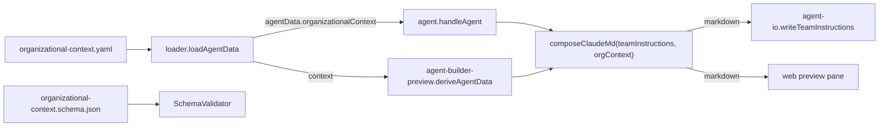

# Design 920 — Pathway Organizational Context Slot

## Architecture

The slot lives where Pathway's other installation-scoped sibling files already
live: a single YAML file at the data directory root, loaded into `agentData` by
the same loader that loads `claude-settings.yaml`, validated by the same Ajv
pipeline that validates every other Pathway entity, and consumed by a new pure
renderer that runs alongside `interpolateTeamInstructions` on both surfaces
(CLI agent command and web agent-builder preview).



The CLI and the web preview converge on the same pure composer. Byte-identical
output on the section falls out of single-source rendering, not parallel
formatting paths.

## Components

| Component | Where | Responsibility |
|---|---|---|
| **`organizational-context.yaml`** | `products/map/starter/` | Installation-scoped data carrying the six concerns. Sibling of `claude-settings.yaml`. Ships populated with placeholders in the starter; absent in many real installations. |
| **`organizational-context.schema.json`** | `products/map/schema/json/` | Ajv schema. Top-level concerns are optional (so partial population is valid); fields within structured entries (escalation paths, adjacent leads) are required when the entry exists. `additionalProperties: false` so unknown keys produce line-attributable errors. |
| **`SchemaValidator` mapping** | `products/map/src/schema-validation.js` § `SCHEMA_MAPPINGS` | New entry `"organizational-context.yaml": "organizational-context.schema.json"`. No other validator change — the existing single-file path already handles `drivers.yaml`, `levels.yaml`, `standard.yaml`. |
| **Loader extension** | `products/map/src/loader.js` § `loadAgentData` | One new `#loadRepoFile(dataDir, "organizational-context.yaml", null)` in the existing `Promise.all`, returned as `agentData.organizationalContext`. Mirrors the `claudeSettings` precedent line-for-line. `null` (not `{}`) when absent — the renderer distinguishes "no slot" from "empty slot" via nullish check. |
| **`renderOrganizationalContext(orgContext)`** | `libraries/libskill/src/agent.js` (new export, alongside `interpolateTeamInstructions`) | Pure function. Takes the loaded YAML object (or `null`), returns a markdown section string (or `null`). Lives in `libskill` because both `fit-pathway` CLI and the web preview already import `interpolateTeamInstructions` from there. |
| **`composeClaudeMd(teamInstructions, orgSection)`** | `products/pathway/src/formatters/agent/team-instructions.js` (extends existing module) | Composes the two pieces into the `content` slot of `claude.template.md`. When `orgSection` is `null`, output is byte-identical to today. When present, the section follows the `teamInstructions` body separated by a single blank line. |
| **CLI call site** | `products/pathway/src/commands/agent.js` § `handleAgent` & `printTeamInstructions` | Passes `agentData.organizationalContext` through to the composer. No other CLI change. |
| **Web call site** | `products/pathway/src/pages/agent-builder-preview.js` § `deriveAgentData` | Reads `context.organizationalContext` (supplied by the page's existing data wiring) and passes it through the same composer. Returns it in `teamInstructionsContent` — same field, no new field, no new render path on the web. |
| **Fixture for byte-identical absent-slot test** | `products/pathway/test/fixtures/claude-md-baseline.md` | Captured from `main` immediately before this change, against the unmodified starter for `software_engineering --track=platform`. New test compares the rendered output (with slot absent) against this fixture. |
| **`fit-pathway agent --help`** | libcli `documentation` entry on the agent command | Adds the org-context guide URL alongside the existing entries per [products/CLAUDE.md § Linking rule](../../products/CLAUDE.md). |
| **`fit-pathway` skill** | `.claude/skills/fit-pathway/SKILL.md` § Documentation | Same URL added to the skill's documentation list (same entries, same order as `--help`). |
| **Guide updates** | `websites/fit/docs/products/agent-teams/organizational-context/index.md` (existing) and `websites/fit/docs/products/authoring-standards/index.md` (existing) | Two-layer story: track-scoped `teamInstructions` (shared across teams) vs. installation-scoped slot (per-team facts). Authoring guide adds an entry alongside the existing six entity types. |

## Data Shape

```yaml
# products/map/starter/organizational-context.yaml
repositories: [molecularforge, data-lake-infra, api-gateway]
team: pharma-platform
manager: athena
adjacentLeads:
  - handle: iris
    role: DX
  - handle: prometheus
    role: DS/AI
projects: [drug-discovery-pipeline, lab-data-portal]
escalationPaths:
  - trigger: production page after hours
    destination: pagerduty://pharma-platform-oncall
  - trigger: security incident
    destination: security@pharma.example.com
```

Top-level keys map one-to-one with the spec's six concerns. Plural keys
(`repositories`, `projects`) take string lists. Singular keys (`team`,
`manager`) take a single string. `adjacentLeads` and `escalationPaths` take
lists of objects with required fields — the schema enforces both fields
present on each entry, which is where the spec's "line-attributable errors for
missing required fields" surfaces.

## Rendered Section

```markdown
## Organizational Context

- **Repositories:** molecularforge, data-lake-infra, api-gateway
- **Team:** @pharma-platform
- **Manager:** @athena
- **Adjacent leads:** @iris (DX), @prometheus (DS/AI)
- **Projects:** drug-discovery-pipeline, lab-data-portal
- **Escalation paths:**
  - production page after hours → pagerduty://pharma-platform-oncall
  - security incident → security@pharma.example.com
```

Section is emitted **after** the `teamInstructions` body, separated by one
blank line. Empty lists (e.g. no projects) suppress their bullet. When the
slot is absent, no section, no separator, no whitespace delta — the file is
identical to what the generator produced before this change.

## Marker Contract

The section opens with the literal line `## Organizational Context`. That
heading is the documented marker. Downstream tooling locates the section by
exact-string match on that line (no parsing of the body required). The guide
documents the marker verbatim. Markdown's natural structure stays intact —
no HTML comments, no fenced custom block. The heading is human-readable in
the rendered file (so the engineer who opens `.claude/CLAUDE.md` sees what
the slot produced) and machine-detectable (string match is sufficient).

## Key Decisions

| Decision | Choice | Rejected alternative | Why |
|---|---|---|---|
| Slot shape | Single YAML file at `products/map/starter/organizational-context.yaml` | Directory of per-concern files (e.g. `organizational-context/repos.yaml`, `manager.yaml`) | The slot is installation-scoped and small (six concerns). Existing precedents `claude-settings.yaml` and `vscode-settings.yaml` are also single sibling files. A directory adds path management for no representational gain when the data fits in <20 lines of YAML. |
| Slot location | Data directory root | Nested under `repository/` per the `#loadRepoFile` fallback convention | The `#loadRepoFile` helper already checks both locations transparently. Putting the example in the starter root surfaces it to a new user reading `ls products/map/starter/`. Installations that prefer the `repository/` subdirectory keep working without code change. |
| Library home | `libraries/libskill/src/agent.js` (new export `renderOrganizationalContext`) | A new module in `products/pathway/src/formatters/agent/` | `interpolateTeamInstructions` already lives in libskill and is imported by both CLI and web preview. Keeping both renderers in the same module preserves the "one place to look for agent-instruction composition" property the web page relies on. |
| Composer location | `products/pathway/src/formatters/agent/team-instructions.js` (extends existing) | New formatter module | `formatTeamInstructions` already owns the `content` slot of `claude.template.md`. Extending it to accept an optional org-context section keeps the single-call-site pattern intact in both `agent.js` and `agent-builder-preview.js`. |
| Section marker | `## Organizational Context` heading | HTML comment `<!-- organizational-context -->`; fenced custom block | A heading is detectable by string match (the spec's bar), survives markdown-to-HTML rendering for the web preview, and is legible to the engineer who reads the file. Invisible markers (HTML comments) optimize for tooling at the cost of human readability for a file engineers are expected to verify. |
| Section ordering | After `teamInstructions` body | Before | The track's `teamInstructions` is the stable identity Pathway carries today; putting the per-installation refinement after it preserves the existing top-of-file experience and keeps the absent-slot byte-identical test trivial (pure suffix presence/absence). |
| Loader fallback | `null` when absent | `{}` when absent | The renderer needs to distinguish "no slot at all" (emit nothing, output byte-identical to today) from "slot present but empty" (emit nothing for missing keys, but the slot's presence may carry future signal). Nullish check is the unambiguous discriminator. |
| Validation philosophy | Top-level concerns optional; structured entry fields required | All top-level concerns required | A team may know its repos and manager before knowing its escalation paths. Partial population should not block adoption. But once an engineer writes an escalation path, the `trigger` and `destination` are both meaningful — missing one is a typo to flag. |
| Schema location | `products/map/schema/json/organizational-context.schema.json` (alongside the six existing entity schemas) | A new schema directory | The existing `SCHEMA_MAPPINGS` reads from one directory. Splitting it would force a loader change for no benefit. |

## Invariants Honored

| Spec invariant | Where in design |
|---|---|
| Absent slot produces output byte-identical to today | Composer returns `teamInstructions` content unchanged when `orgContext` is `null`. Fixture captured pre-change pins the baseline. |
| CLI and web preview render the same section | Single `renderOrganizationalContext` source in libskill; single `composeClaudeMd` in the pathway formatter. Both surfaces call the same two functions. |
| "Don't edit outputs" preserved | All six concerns live in `organizational-context.yaml`. The composer is a pure function of `(teamInstructions, orgContext)`. Two runs of `fit-pathway agent` produce identical bytes. |
| Section detectable by downstream tooling without parsing | `## Organizational Context` heading, exact-match contract, documented in the existing org-context guide. |

## Scope Faithfulness

Every component above maps to a Scope row in the spec. Items the spec lists
out-of-scope (per-repository overrides, roster-backed handle validation,
per-track variation, auto-discovery, migration from other tools, structured
access from skills, removing `teamInstructions`, localization) do not appear
in any component, interface, or data shape above. The slot's contents flow
into the rendered `CLAUDE.md` and stop there; downstream skills that want
structured access get a separate spec.

— Staff Engineer 🛠️
