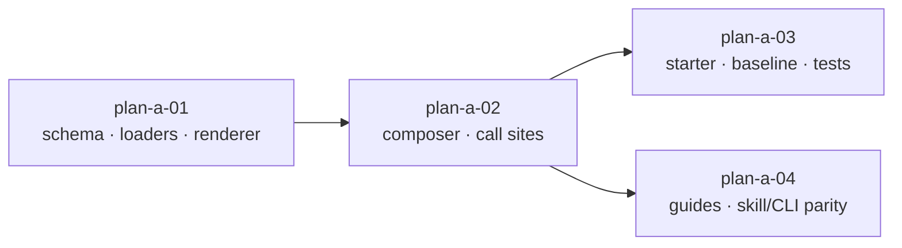

# Plan 920-a — Pathway organizational context slot for agent generation

Spec: [spec.md](spec.md) · Design: [design-a.md](design-a.md)

## Approach

The slot lands along the data-flow seam the design names: schema first so
`bunx fit-map validate` accepts the file the moment it ships, then loaders
(Node `loadAgentData` + browser `loadAgentDataBrowser`), then the pure
renderer in `libskill`, then the composer signature extension and its three
call sites (CLI, web preview, distribution `build-packs.js` — flagged because
the design omits it but it shares the composer), then the starter example,
then the pre-change baseline fixture capture, then guide and skill/CLI
documentation. The design's deliberate `null`-vs-`{}` loader divergence is
preserved.

Libraries used: none new.

## File map

| File | Change | Part |
| --- | --- | --- |
| `products/map/schema/json/organizational-context.schema.json` | **Create** | 01 |
| `products/map/src/schema-validation.js` | Modify `SCHEMA_MAPPINGS` + `#OPTIONAL_SILENT` | 01 |
| `products/map/test/validation-organizational-context.test.js` | **Create** | 01 |
| `products/map/src/loader.js` § `loadAgentData` | Modify | 01 |
| `products/map/test/data-loader.test.js` | Append cases | 01 |
| `products/pathway/src/lib/yaml-loader.js` § `loadAgentDataBrowser` | Modify | 01 |
| `libraries/libskill/src/agent.js` | Add `renderOrganizationalContext` | 01 |
| `libraries/libskill/src/index.js` | Re-export | 01 |
| `tests/model-agent.test.js` | Append cases | 01 |
| `products/pathway/src/formatters/agent/team-instructions.js` | Extend `formatTeamInstructions` signature | 02 |
| `products/pathway/src/commands/agent.js` | Thread `orgSection` | 02 |
| `products/pathway/src/commands/agent-io.js` § `writeTeamInstructions` | Update signature + gate | 02 |
| `products/pathway/src/pages/agent-builder.js` § `buildDeriveContext` | Thread context | 02 |
| `products/pathway/src/pages/agent-builder-preview.js` § `deriveAgentData` | Thread + compose | 02 |
| `products/pathway/src/commands/build-packs.js` | Thread through pack pipeline | 02 |
| `products/pathway/test/cli-command.test.js` | Append integration cases | 02 |
| `products/map/starter/organizational-context.yaml` | **Create** (populated starter) | 03 |
| `products/pathway/test/fixtures/claude-md-baseline-se-platform.md` | **Create** (pre-change baseline) | 03 |
| `products/pathway/test/agent-baseline.test.js` | **Create** (byte-identical + populated tests) | 03 |
| `websites/fit/docs/products/agent-teams/organizational-context/index.md` | Modify (introduce slot + marker + last-occurrence rule) | 04 |
| `websites/fit/docs/products/authoring-standards/index.md` | Modify (new entity entry) | 04 |
| `.claude/skills/fit-pathway/SKILL.md` § `## Documentation` | Verify URL position/order | 04 |
| `products/pathway/bin/fit-pathway.js` § `documentation` | Verify URL position/order | 04 |

No deletions. Expected `git diff --stat` total: ~23 files.

## Parts

| Part | Title | Depends on | Steps it owns |
| --- | --- | --- | --- |
| [plan-a-01.md](plan-a-01.md) | Schema, loaders, renderer | — | Schema + validator wiring · Node + browser loaders · `renderOrganizationalContext` in libskill |
| [plan-a-02.md](plan-a-02.md) | Composer + call sites | 01 | `formatTeamInstructions` signature extension; CLI, web preview, and `build-packs` call sites; CLI integration tests |
| [plan-a-03.md](plan-a-03.md) | Starter content + baseline fixture | 02 | Populated `organizational-context.yaml` in starter; pre-change baseline fixture; byte-identical-absent + populated-starter regression tests |
| [plan-a-04.md](plan-a-04.md) | Documentation + skill/CLI parity | 02 | `agent-teams/organizational-context` guide reframing with explicit **last-occurrence marker rule**; `authoring-standards` new entry; skill/CLI `## Documentation` parity check |

Parts 01 and 02 are sequential — 02's composer signature change calls
`renderOrganizationalContext` (added by 01) and reads
`agentData.organizationalContext` (loaded by 01).

Parts 03 and 04 are independent of each other and may run in parallel once
02 merges. 04 is structural prose work suitable for `technical-writer`; 03
remains `staff-engineer` territory.

## Sequencing

A part is "done" when its DO-CONFIRM verifies green; the next part begins.
Parts 03 and 04 may run in the same calendar window via separate branches
and PRs that merge in either order.

## Risks

1. **`bun run format:fix` ripple on unrelated files.** Pathway and libskill
   tests may carry pre-existing biome warnings; `format:fix` will touch them.
   The implementer runs `git diff origin/main...HEAD --stat`, identifies any
   path outside the File map, and either reverts it before push or lands a
   separate `chore(format)` PR first.
2. **Browser preview cache.** `getTemplates()`/`getAgentData()` in
   `agent-builder.js` cache fetches across renders; a browser tab open at
   the moment the deploy lands may serve a stale shape with no
   `organizationalContext`. User hard-refresh fixes it; no committed-API
   regression. Not blocking, but reviewers reproducing this should not file
   it as a bug.
3. **`#loadRepoFile` precedence surprise.** The loader checks
   `<dataDir>/repository/<file>` before `<dataDir>/<file>`. An installer
   with both files silently uses the `repository/` copy. Part 01's loader
   test case pins this; Part 04's guide writes the canonical position
   (root) only.
4. **Schema $id consistency.** Ajv indexes every `*.schema.json` by `$id`.
   The new schema's `$id` follows the existing convention
   (`https://www.forwardimpact.team/schema/json/organizational-context.schema.json`);
   any typo surfaces as `SCHEMA_NOT_FOUND` in Part 01's validation tests.
5. **Distribution-pack drift.** `build-packs.js` shares
   `formatTeamInstructions` with the CLI and web preview but is not named
   in the design. Part 02 threads `orgSection` through it explicitly; if
   omitted, downstream consumers of the published packs would see different
   bytes than the local CLI produces against the same data.

## Execution recommendation

- **Part 01** — single `staff-engineer` executor, one commit per
  sub-step (schema · loaders · renderer). Three commits total.
- **Part 02** — single `staff-engineer` executor, sequential by file.
  Composer signature lands first; CLI, web, and `build-packs` updates
  follow in any order on the same branch. Six commits total (five files +
  one for the test additions).
- **Part 03** — single `staff-engineer` executor. The baseline fixture is
  captured against `origin/main` per the procedure in Part 03 before
  Part 03's test file lands.
- **Part 04** — `technical-writer` for the guide reframing in
  `agent-teams/organizational-context/index.md` (the four-layer story is a
  structural prose edit on a published external guide); `staff-engineer`
  may land Parts 04's authoring-standards entry and the skill/CLI parity
  check in the same PR.

Implementation PRs may be titled `feat(920): part NN — <title>` or merged
under one `feat(920)` PR with four commits, at the implementer's discretion.

— Staff Engineer 🛠️
