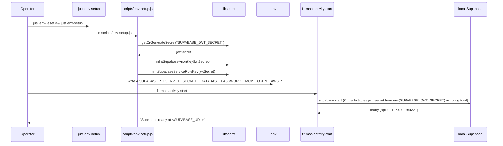

# Design 960-a — Streamline Supabase Secrets and JWT Authentication

## Components

| Component | Where | Role |
| --- | --- | --- |
| `Config` Supabase accessors | `libraries/libconfig/src/config.js` (edit) | Adds `supabaseUrl()`, `supabaseAnonKey()`, `supabaseServiceRoleKey()`, `supabaseJwtSecret()`, reusing `#resolve(keys)` and `#env(key)` exactly as `mcpToken()` does today. Credential-set membership is pinned in § Key Decisions (Decision 7). |
| `mintSupabaseAnonKey` | `libraries/libsecret/src/index.js` (edit) | New helper that wraps `generateJWT` with the long-lived `{role: "anon", iss: "supabase", iat, exp}` payload (10-year `exp` matching today's `env-storage.js:30-34` `jwtPayloadBase`). Not a wrapper of `mintSupabaseJwt`, which hardcodes `role: "authenticated"`, requires `email`, and is shaped for per-caller tokens. Removes the inline anon-payload duplication at `scripts/env-storage.js:76-79`. |
| `mintSupabaseServiceRoleKey` | same module (edit) | New helper of the same shape as above with `role: "service_role"`. Removes the duplicate `service_role` payload literals at `scripts/env-secrets.js:45-53` and `scripts/env-storage.js:37-40` / `72-75`. |
| Unified bootstrap script | `scripts/env-setup.js` (new; replaces `scripts/env-secrets.js` + `scripts/env-storage.js`) | Single CLI. Generates `SERVICE_SECRET`, `DATABASE_PASSWORD`, `MCP_TOKEN`, `SUPABASE_JWT_SECRET` once (idempotent via `getOrGenerateSecret`); derives `SUPABASE_ANON_KEY` and `SUPABASE_SERVICE_ROLE_KEY` from the JWT secret; generates `AWS_ACCESS_KEY_ID` and `AWS_SECRET_ACCESS_KEY` per storage backend. All values land in a single `.env` (the `.env.storage.*` split is removed). Carries the same `--output <path>` / `--add-mask` flags `env-secrets.js` already exposes for CI. |
| `just env-setup` recipe | `justfile` (edit) | Single recipe replacing `env-secrets` + `env-storage`. Invokes the new bootstrap script. The existing top-level `env-setup` target keeps the same name. |
| `config.toml` `[auth] jwt_secret` | `products/map/supabase/config.toml` (edit) | Adds `jwt_secret = "env(SUPABASE_JWT_SECRET)"` to the existing `[auth]` block. The Supabase CLI substitutes the value at `supabase start` time, so the local stack signs every JWT it issues with the same secret the bootstrap script wrote to `.env`. No CLI-flag override is used (the `--jwt-secret` flag does not exist on `supabase start`). |
| `fit-map activity start` wiring | `products/map/src/commands/activity.js` (edit) | Stops printing `export MAP_SUPABASE_*` lines — every value is already in `.env` after `just env-setup`, and the local Supabase stack picks up `SUPABASE_JWT_SECRET` via the `config.toml` `env(VAR)` interpolation (Decision 3) without the command threading anything through. The `start()` function (currently lines 23-39) drops the `formatSubheader("Export these variables…")` block in full and emits a one-line "Supabase ready" confirmation. No `Config` accessor is needed inside `start()`. |
| `activity-start.test.js` rewrite | `products/map/test/activity-start.test.js` (edit) | The four `assert.match(text, /export MAP_SUPABASE_*/)` lines and the order check are replaced with a single assertion on the new ready-confirmation output. No new export lines are asserted. |
| Docker Compose env passthrough | `docker-compose.yml` (edit) | Four compose services touch Supabase variables: `storage-supabase` (line 168), `supabase-db` (line 206), `supabase-kong` (line 229), and `supabase-map-storage` (line 254). All four drop the `env_file: .env.storage.supabase` line — values come from `.env` directly. Every `${MAP_SUPABASE_*}` and `${JWT_SECRET}` interpolation is rewritten to the canonical name (`PGRST_JWT_SECRET: ${SUPABASE_JWT_SECRET}`; `SERVICE_KEY: ${SUPABASE_SERVICE_ROLE_KEY}`; `SUPABASE_ANON_KEY: ${SUPABASE_ANON_KEY}`). The standalone `.env.storage.supabase` and `.env.storage.minio` files are deleted with `scripts/env-storage.js`. |
| `.env.*.example` files | `.env.local.example`, `.env.docker-native.example`, `.env.docker-supabase.example` (edit) | Each lists the same four variable names in the same Supabase block, with `SUPABASE_URL` populated to the environment-appropriate host and the three secrets as commented placeholders. The variable *names* match across all three files; only the `SUPABASE_URL` value differs (and adjacent proxy variables on the docker variants). `MAP_SUPABASE_DB_PORT` is deleted from all three. |
| Consumer call sites | 10 files across `services/`, `libraries/`, `products/` (edit) | Each replaces `process.env.MAP_SUPABASE_*` reads with the matching `Config` accessor. Injection seams per module are pinned below in § Per-module injection seams; libraries that today take no `Config` gain one as an explicit constructor or factory parameter rather than relying on a module-level singleton. |
| Live-Postgres test setup | `products/map/test/activity/{migration-rls,rls-scope,people-provision,auth-issue}.test.js`, `products/map/test/activity/lib/live.js`, `products/landmark/test/{sources,dispatcher}.test.js`, `products/landmark/test/lib/{identity,sign-test-token}.test.js`, `products/landmark/test/commands/login.test.js` (edit) | These tests read `MAP_SUPABASE_*` from `process.env` to skip when unset or to construct live clients. Each migrates to the new canonical name. Test files are exempt from the static-inspection rule (which scopes to `src/` + `bin/`), but the example env files, CI workflow secrets, and the live-test skip-gate variable name all rename in lockstep. |
| Static-inspection tests | `products/map/test/activity/service-role-still-used.test.js`, `products/landmark/test/lib/no-service-role-in-src.test.js` (edit); plus one new test under `libraries/libconfig/test/` | First two assert the new canonical name (`SUPABASE_SERVICE_ROLE_KEY`). New test walks every `src/`/`bin/` under products/services/libraries (excluding `libconfig/` and the Deno edge function) and fails on any `process.env.SUPABASE_` or `process.env.MAP_SUPABASE_` literal. |
| Documentation | 7 pages listed in spec § Documentation table (edit) | Mechanical rename of `MAP_SUPABASE_*` and `JWT_SECRET` to the canonical names. `websites/fit/docs/internals/operations/index.md` swaps `just env-secrets` / `just env-storage` for the unified `just env-setup`. |

## Component graph

```mermaid
graph TD
  EX[.env.*.example] --> SETUP[scripts/env-setup.js]
  SETUP -->|writes| ENV[.env]
  SETUP -->|signs anon + service_role| LIBSECRET[libsecret: mintSupabase*]
  ENV --> CONFIG[libconfig.Config]
  ENV --> COMPOSE[docker-compose.yml services]
  CONFIG -->|supabaseUrl/AnonKey/ServiceRoleKey/JwtSecret| MAPSVC[services/map/server.js]
  CONFIG --> MAPCLI[products/map/src/lib/client.js]
  CONFIG --> MAPAUTH[products/map/src/commands/auth-issue.js]
  CONFIG --> LM_SB[products/landmark/src/lib/supabase.js]
  CONFIG --> LM_ID[products/landmark/src/lib/identity.js]
  CONFIG --> LM_LOGIN[products/landmark/src/commands/login.js]
  CONFIG --> SUMMIT[products/summit/src/lib/supabase.js]
  CONFIG --> TERRAIN[libraries/libterrain/src/cli-helpers.js]
  CONFIG --> STORAGE[libraries/libstorage/src/index.js]
  ENV --> CFGTOML[products/map/supabase/config.toml]
  ENV --> ACTSTART[fit-map activity start]
  CFGTOML -->|jwt_secret = env(SUPABASE_JWT_SECRET)| SBCLI[supabase CLI]
  ACTSTART --> SBCLI
```

## Bootstrap sequence



## `Config` accessor interface

```js
// libraries/libconfig/src/config.js
class Config {
  static #CREDENTIAL_KEYS = new Set([
    "ANTHROPIC_API_KEY",
    "GH_TOKEN",
    "GITHUB_TOKEN",
    "MCP_TOKEN",
    "SUPABASE_ANON_KEY",
    "SUPABASE_SERVICE_ROLE_KEY",
    "SUPABASE_JWT_SECRET",
  ]);
  supabaseUrl()             { return this.#resolve(["SUPABASE_URL"], stripTrailingSlashes); }
  supabaseAnonKey()         { return this.#resolve(["SUPABASE_ANON_KEY"]); }
  supabaseServiceRoleKey()  { return this.#resolve(["SUPABASE_SERVICE_ROLE_KEY"]); }
  supabaseJwtSecret()       { return this.#resolve(["SUPABASE_JWT_SECRET"]); }
}
```

Throw shape matches the existing `#resolve` contract: `"<KEY> not found in
environment"`. No method named after `jwt` exists — accessors are named after
the Supabase concept, not the mechanism. Consumers needing optional behaviour
(Landmark identity HMAC-verify is best-effort today) wrap the call in `try`;
no separate `*Optional()` variant is added.

## Per-module injection seams

| Module | Current shape | Migration |
| --- | --- | --- |
| `services/map/server.js:13-20` | Property access (`config.supabaseUrl`, `config.supabaseKey`) on a `createServiceConfig("map")` instance, with `process.env.MAP_SUPABASE_*` fallback. The property branch is dead today (no defaults, no `config.json` entries, no `SERVICE_MAP_SUPABASEURL` env). | Replace the entire `||` chain with `config.supabaseUrl()` and `config.supabaseServiceRoleKey()`. Delete the dead property branch and the `process.env` fallback. |
| `services/map/index.js` | `MapService` constructor takes a pre-built `supabase` client — already correctly decoupled. | No change. |
| `libraries/libterrain/src/cli-helpers.js:50-72` | `resolveSupabaseClient()` reads `process.env` directly; exported and called from `bin/fit-terrain.js`. | Function takes a `Config` parameter; callers construct it via `createScriptConfig("terrain")` (matching the existing libconfig namespace pattern). |
| `libraries/libstorage/src/index.js:198-229` | `_createSupabaseStorage(prefix, process)` reads `process.env.SUPABASE_SERVICE_ROLE_KEY` directly. Public `createStorage(prefix, type, process = global.process, rootDir = null)` already uses position 4 for `rootDir`. | libstorage remains env-direct here and is added to the static-inspection allow-list alongside the Deno edge function. Rationale: libconfig already depends on libstorage (`libconfig/package.json:31` lists `@forwardimpact/libstorage`); threading a `Config` into libstorage would create a runtime cycle. The unprefixed `SUPABASE_SERVICE_ROLE_KEY` read becomes the canonical name (already correct on the env-var side), and the single env-direct read survives behind a comment that documents the cycle constraint. |
| `products/map/src/lib/client.js:12-32` | `createMapClient(opts)` reads `process.env.MAP_SUPABASE_*` with explicit-option overrides. | Accept `config` in `opts`; default to `createProductConfig("map")` when omitted. Callers (`bin/fit-map.js` and tests) pass an already-built Config or rely on the default. |
| `products/map/src/commands/auth-issue.js:53-60` | Reads `process.env.MAP_SUPABASE_JWT_SECRET` inline. | Replace with `config.supabaseJwtSecret()` passed in via the existing handler `params` object. |
| `products/map/src/commands/activity.js:20` | `createSupabaseCli()` is a module-level singleton. | Construct it inside `start()` (and other handlers that need it) so the secret can flow in from `Config` at call time rather than at module load. |
| `products/landmark/src/lib/supabase.js:30-48` | `createLandmarkClient({ jwt, url, anonKey, schema })` reads `process.env.MAP_SUPABASE_*` as defaults. | Accept `config` instead of `url`/`anonKey`; resolve via `config.supabaseUrl()` / `config.supabaseAnonKey()`. JWT and schema remain explicit. |
| `products/landmark/src/lib/identity.js:139` (public `resolveIdentity(env, opts)`) and `:71-104` (internals `resolveFromJwt`, `refreshSession`) | Public API takes `env`; internals thread `env` through. Sole caller is `products/landmark/bin/fit-landmark.js:291` (`resolveIdentity()` with no args). | Public API becomes `resolveIdentity({config, env})` — `config` carries the three Supabase values via the new accessors; `env` is retained only for `LANDMARK_AUTH_TOKEN` (non-Supabase, external-engineer-supplied, kept on `env` to avoid expanding this spec's scope into a separate accessor). Read `config.supabaseUrl()` / `config.supabaseAnonKey()` for refresh; read `config.supabaseJwtSecret()` inside a `try` per Decision 10. The bin caller constructs `Config` via `createProductConfig("landmark")`. Tests pass a fake `{config, env}` shape (`identity.test.js` already constructs fake envs; the fake `config` is a tiny stub returning known values). |
| `products/landmark/src/commands/login.js:116-134` | `resolveAnonClient({ env, createClient, flowType })`. | Replace `env` with `config`; resolve URL + anon key through accessors. Error wording removes `MAP_SUPABASE_*` and `fit-map activity start` mentions; points at the unified bootstrap recipe. |
| `products/summit/src/lib/supabase.js:27-51` | `createSummitClient({ url, serviceRoleKey, schema })` reads env defaults. | Accept `config`; resolve URL and service-role key through accessors. |
| `products/landmark/test/lib/sign-test-token.js:14-20` | Test helper reads `process.env.MAP_SUPABASE_JWT_SECRET`, defaulted via `secret = process.env.MAP_SUPABASE_JWT_SECRET`. | Rename the read to `process.env.SUPABASE_JWT_SECRET`; keep the same default-from-env shape. This is a one-token rename, matching the spec's "only the env-var name in the test setup changes" criterion. The helper remains test-only; no Config import. |

## `.env.local.example` Supabase block (canonical shape)

```
# ==========================================
# Supabase (single instance — all products)
# ==========================================
SUPABASE_URL=http://127.0.0.1:54321
# Generated by `just env-setup`:
# SUPABASE_JWT_SECRET=
# SUPABASE_ANON_KEY=
# SUPABASE_SERVICE_ROLE_KEY=
```

The two docker variants differ only in the `SUPABASE_URL` value
(`http://supabase-kong.local:8000`) and adjacent proxy variables.

## Key Decisions

| # | Decision | Rejected alternative | Why |
| --- | --- | --- | --- |
| 1 | Unprefixed canonical names (`SUPABASE_*`). | Keep the `MAP_` prefix; introduce parallel `LANDMARK_SUPABASE_*` / `SUMMIT_SUPABASE_*`. | One Supabase instance exists. A prefix that disambiguates between nonexistent instances is dead structure. Spec § Problem documents the false presupposition. |
| 2 | Single `SUPABASE_JWT_SECRET`; anon + service_role derived from it at bootstrap. | Keep `JWT_SECRET` for storage-api, keep a separate Supabase-CLI demo secret, keep `MAP_SUPABASE_JWT_SECRET` for the auth-issue path. | The three-script triangle (env-secrets / env-storage / activity start) breaks because the three secrets diverge. Spec § Problem § defect 1 documents the exact divergence. One secret with three derived JWTs eliminates the disagreement. |
| 3 | Override the local Supabase CLI's demo secret via `jwt_secret = "env(SUPABASE_JWT_SECRET)"` in the existing `[auth]` block of `products/map/supabase/config.toml`. | (a) `supabase start --jwt-secret <ours>` CLI flag; (b) switch to the docker-compose `map-supabase` profile; (c) hand-edit `config.toml` per-developer. | (a) the `--jwt-secret` flag does not exist on `supabase start`. (b) docker-compose-only would break the existing CLI-based local workflow, larger than this spec authorizes. (c) per-developer hand-edits drift. The `env(VAR)` interpolation is a documented Supabase CLI feature; it keeps the secret out of the committed file while binding the local stack to the bootstrap-generated value with zero per-run wiring. |
| 4 | One unified bootstrap script (`scripts/env-setup.js`) replacing both `env-secrets.js` and `env-storage.js`. | Keep two scripts and have one delegate to the other. | The split is the cause of defect 1 — two scripts that write the same variable with different signing inputs. Collapsing the split removes the bug class. The combined script is shorter than today's two scripts together (the duplicate JWT-payload code disappears). |
| 5 | All generated values land in a single `.env` (not `.env.storage.minio` / `.env.storage.supabase`). | Keep the storage-profile split files. | The split was never about secrets — it was about storage-backend selection. Storage selection happens via `STORAGE_TYPE` and `AWS_ENDPOINT_URL`; the access keys can live in `.env` like every other credential. Compose's `env_file: .env.storage.supabase` lines disappear with this change. |
| 6 | New methods on `Config` named `supabase*()`, no `jwt*()` accessor at any layer. | Add a `jwtSecret()` accessor and a separate `supabaseUrl()` accessor. | The four values share one lifecycle (one bootstrap, one rotation, one Supabase instance). Splitting them by mechanism (JWT vs URL) re-introduces the conceptual fragmentation the spec dissolves. Spec § Scope is explicit that any `jwt`-prefixed variant is rejected. |
| 7 | Three Supabase secrets (`SUPABASE_ANON_KEY`, `SUPABASE_SERVICE_ROLE_KEY`, `SUPABASE_JWT_SECRET`) registered in `#CREDENTIAL_KEYS`; `SUPABASE_URL` is not. | Register all four. | `SUPABASE_URL` is published in every anon-keyed client (it has to be reachable from browsers and `npx fit-landmark`); it is by design not a secret. Hiding it from `process.env` would also break docker-compose's `${SUPABASE_URL}` interpolation, which runs at the shell level before any Node process loads `Config`. The three secret values still participate in the existing credential-isolation invariant. |
| 8 | Static-inspection test forbids `process.env.SUPABASE_` and `process.env.MAP_SUPABASE_` reads in `src/` and `bin/`. | Trust code review. | Two existing static-inspection tests (`service-role-still-used.test.js`, `no-service-role-in-src.test.js`) already lock in invariants of this shape. Extending the pattern locks the migration: after the diff lands, the only way to read Supabase env is through `Config`, and any reintroduction of `MAP_*` fails CI. |
| 9 | Delete `MAP_SUPABASE_DB_PORT` from all three examples. | Keep it for documentary value. | Zero source consumers. Spec § Scope requires removal. |
| 10 | Landmark identity HMAC verification stays best-effort. `resolveFromJwt(jwt, config)` calls `config.supabaseJwtSecret()` inside a `try`; a thrown "not found" silently skips HMAC verification, matching today's `if (env.MAP_SUPABASE_JWT_SECRET)` gate. | (a) Make HMAC verification mandatory now that the bootstrap script always writes `SUPABASE_JWT_SECRET`. (b) Add a separate `supabaseJwtSecretIfPresent()` accessor. | The bootstrap script writes the secret for monorepo contributors, but Landmark also runs via `npx fit-landmark login` for external engineers who never run the bootstrap and never get the JWT secret (the comment at `identity.js:50-51` documents the policy: engineer-side trusts shape, Postgres RLS catches forgeries). The `try` is not a backward-compat shim — it is the load-bearing distinction between operator and engineer install paths. (a) breaks `npx fit-landmark` for external users. (b) is the same shape with a different name; the `try` is already idiomatic for the "may be unset for this install" case. |

## Test surfaces

| Surface | What it covers |
| --- | --- |
| `libconfig` unit | The four accessors return env values; `SUPABASE_*` secrets do not appear on `process.env` after `Config.load()`; throw shape matches `#resolve`. |
| `env-setup` integration | Running the bootstrap script against a tmpdir produces a `.env` with all 8 expected keys; second run is idempotent; the three signed JWTs verify against the generated secret. |
| Static-inspection | No `process.env.SUPABASE_` / `process.env.MAP_SUPABASE_` in product/service/library `src/` + `bin/`; no `MAP_SUPABASE_*` anywhere in source (excluding `specs/`, `wiki/`); no hardcoded `"super-secret-jwt-token-..."` literal. |
| Consumer migration | Existing test suites for Map, Landmark, Summit, libterrain, libstorage pass after a single mechanical update to test setup (env var name changes only; no fixture or assertion logic changes). |
| Docker compose | `docker compose --profile map-supabase config` with the bootstrap-produced `.env` reports no unset-variable warnings. |
