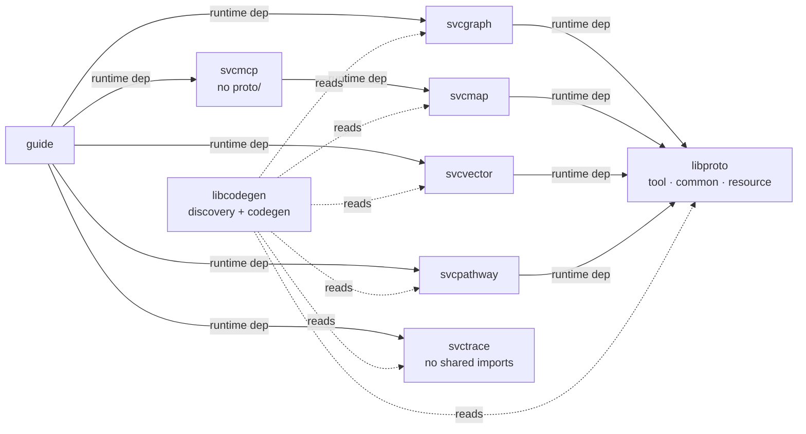

# Design 970 — Published Home for Shared Protos

## Problem recap

`tool.proto`, `common.proto`, and `resource.proto` are imported by protos in
five published packages (`@forwardimpact/guide`, `svcgraph`, `svcmap`,
`svcvector`, `svcpathway`) but the only published copy lives inside
`@forwardimpact/guide`'s `proto/` and `tool.proto` ships in no package at
all. External `npx fit-codegen --all` therefore fails with `ENOENT` on any
install path that does not pull Guide. The single editable source for each
shared proto is also split across two roots (`/proto/` and
`products/guide/proto/`).

## Components

| Component                                          | Status   | Responsibility                                                                                                                                                                                                                  |
| -------------------------------------------------- | -------- | ------------------------------------------------------------------------------------------------------------------------------------------------------------------------------------------------------------------------------- |
| **`@forwardimpact/libproto`** (`libraries/libproto/`) | **new**  | Single editable home and only published carrier for shared `.proto` schemas. Ships `proto/{tool,common,resource}.proto` (see Hosting-package-surface row below for exact `files` layout). No meaningful JavaScript export surface. Carries the mandatory `description`/`keywords`/`jobs` library metadata required by `libraries/CLAUDE.md`. |
| `@forwardimpact/libcodegen`                        | unchanged | Proto discovery, parsing, and generation. `discoverProtoDirs` scans `node_modules/@forwardimpact/*/proto/` *and* additionally appends `<projectRoot>/proto/` if it exists (both run unconditionally) — a new scoped package containing protos is picked up with no code change. |
| `@forwardimpact/guide`                             | edit     | Drops `proto/{common,resource}.proto` and the `proto/` entry from `files`. No new `libproto` runtime dep — Guide owns no proto importing a shared file post-migration, and libproto reaches Guide transitively via `svcgraph`/`svcpathway`/`svcmcp` (→ `svcmap`)/`svcvector`. |
| `services/{graph,map,vector,pathway}`              | edit     | Each adds runtime dep on `@forwardimpact/libproto`. Service-owned `proto/<svc>.proto` and `files: ["proto/"]` unchanged. `svctrace` and `svcmcp` are unaffected — neither imports a shared proto (svcmcp ships no `proto/` at all). |
| Repo root `/proto/`                                | delete   | `proto/tool.proto` moves into libproto. Directory becomes empty and is removed; the `discoverProtoDirs` fallback to `<projectRoot>/proto/` survives unused for future project-local protos. |

## Architecture



Dependency direction: libproto sits at the bottom of the graph and depends
on nothing. The rule is precise: a consumer declares libproto as a direct
runtime dependency *if and only if* the package itself ships a `.proto`
that imports a shared file. After this design, the four service packages
qualify; Guide does not (it no longer ships any proto importing shared
files), and libproto reaches Guide transitively. The Guide → svcmap edge is
indirect (via svcmcp); the diagram preserves the actual graph rather than
hand-waving the path. No new service-on-product edges; existing
`services/{map,pathway}` → `@forwardimpact/map` edges (off-graph) are
untouched.

## Discovery flow (unchanged code; new package surface)

```mermaid
sequenceDiagram
  participant U as External user
  participant N as node_modules
  participant FC as fit-codegen
  participant PD as discoverProtoDirs
  U->>N: npm install @forwardimpact/guide
  N->>N: install guide + svcgraph + svcpathway + svcmcp (→ svcmap) + svcvector + svctrace + libproto
  U->>FC: npx fit-codegen --all
  FC->>PD: scan node_modules/@forwardimpact/*/proto/
  PD-->>FC: [libproto/proto, svcgraph/proto, svcpathway/proto, svcmap/proto, svcvector/proto, svctrace/proto]<br/>(svcmcp has no proto/; guide no longer ships proto/)
  FC->>FC: collectProtoFiles dedupes by basename (common.proto first)
  FC->>FC: parse via @grpc/proto-loader with includeDirs = those dirs
  FC-->>U: generated/{types,services,definitions,proto}/ (exit 0)
```

`discoverProtoDirs` is at `libraries/libcodegen/bin/fit-codegen.js:134`.
The function already follows symlinks via `fs.realpathSync` at line 144, so
workspace linking handles internal codegen with no special case — internal
and external installs hit the *same* discovery code path. The only
difference is what's in `node_modules/@forwardimpact/`.

## Key Decisions

| Decision                                                    | Choice                                                                          | Rejected alternative & why                                                                                                                                                                                                                                              |
| ----------------------------------------------------------- | ------------------------------------------------------------------------------- | ----------------------------------------------------------------------------------------------------------------------------------------------------------------------------------------------------------------------------------------------------------------------- |
| Where shared protos live (single editable source)           | New `@forwardimpact/libproto` package at `libraries/libproto/proto/`            | (a) Embed in `@forwardimpact/libcodegen` — libcodegen is the *tool*; coupling schema evolution to tool versioning creates spurious bumps and mis-cohesion. (b) Embed in `@forwardimpact/libtype` — libtype's stated job is *generated* protobuf types (its `files: ["src/**/*.js", "README.md"]` ships JS only); mixing source `.proto` (input) with generated `.js` (output) in one package conflates input and output sides of codegen. (c) Per-package copies kept in sync by a script — violates the "exactly one editable location" success criterion regardless of who writes them. (d) Embed in `@forwardimpact/gear` — gear is a product-tier *meta-bundle* (`products/CLAUDE.md`: "Gear is a meta-package that re-exports all service and library CLIs as dependencies") carrying Platform-Builder JTBDs; its deps point *into* services and libraries, not the other way. To make schemas resolvable for service-only installs (`npm install @forwardimpact/svcgraph`) the four service packages would each need a runtime dep on gear — a service→product edge the spec scope explicitly forbids ("no new service-on-product runtime dep solely to obtain a shared proto") and the wrong layering direction (a service ought not depend on a product). Gear's version would also rev on every bundled-service bump, making schema versions noisy. Schema-source is a library-tier primitive; gear is the consumer side of that primitive, not its home. (e) Embed in `@forwardimpact/librpc` — librpc is the gRPC *transport* runtime (`Server`, `Client`, `HmacAuth`, `Tracer`, `healthDefinition`; deps on `@grpc/grpc-js`, libconfig, libtelemetry, libutil, libcli) whose published job is *"ship a service endpoint without reimplementing transport"*. Three structural rejections, each fatal on its own: (i) **Dependency direction** — a schema-source package belongs at the bottom of the graph with zero runtime deps (libproto has none). Routing through librpc forces any reader of `common.proto` — a doc generator, a schema-diff CI step, a future schema linter, any codegen tier that does not speak grpc-js — to install `@grpc/grpc-js` plus four sibling libraries to read three text files. (ii) **Cohesion / version blast radius** — schemas evolve on contract cadence; librpc revs on transport-patch cadence (auth, retry, health, tracing). Bundling them ties every `tool.proto` field rename to a librpc bump and every transport patch to a schema-carrier bump, drowning consumers' `npm install` in version noise that no longer signals "the contract changed." (iii) **Input/output conflation** — librpc is itself a *consumer* of generated services produced from these protos (`src/generated/services/` is symlinked build output, re-exported as `services`/`clients`); making the same package the editable home for `.proto` *inputs* and the runtime carrier of the generated `.js` *outputs* reintroduces the same mixing alternative (b) was rejected for, one tier closer to the transport. The fact that the four service packages already declare a librpc dep is a coincidence not a design force: `svctrace` depends on librpc and imports no shared protos; libproto cleanly inverts to "consumer declares dep iff it imports a shared file." |
| How consumers acquire shared protos                         | Direct npm `dependencies` edge from each consumer that imports a shared proto to `@forwardimpact/libproto` | Peer dep or `file:` deps — neither survives external `npm install` from the registry without consumer action.                                                                          |
| How codegen finds shared protos at install time             | Reuse existing `node_modules/@forwardimpact/*/proto/` scan; no fit-codegen edit | Teach `fit-codegen` to read a manifest or a peer-dep hint — adds a new discovery surface and a new failure mode (manifest drift) when the existing directory-scan already works for any new scoped package. |
| Hosting package surface                                     | `package.json` with `"main": "./src/index.js"` and `files: ["proto/", "src/index.js", "README.md"]`; a one-line no-op `src/index.js` (`export {};`) keeps `npm install` and `require("@forwardimpact/libproto")` clean across Node and bun. A `test/` directory satisfying `libraries/CLAUDE.md`'s "Adding a library" convention with a single smoke test (e.g., that the package imports cleanly and `proto/` files exist) — minimal but present. | (a) No `index.js` at all — npm tolerates it but some downstream tooling resolves `main` eagerly. (b) Expose a programmatic `protoDir` constant — premature; nothing currently needs to resolve the directory from JS, and the directory location is an implementation detail of the discovery scan. (c) Skip `test/` — violates the library convention; cheap to satisfy with a smoke test. |
| Guide's `proto/` directory after migration                  | Remove from `files`; delete on-disk directory (empty after the move)            | Keep `proto/` as a placeholder for future Guide-specific protos — there are none today; reintroduce only when a Guide-specific proto exists.                                                                                                                            |
| Repo-root `/proto/` directory after migration               | Remove entirely                                                                 | Keep as an internal-only escape hatch for "project-local" protos — the current scan still includes `<projectRoot>/proto/`, so the escape hatch survives unused at no cost. The directory itself goes; the code path stays.                                              |
| Whether `services/*` get a new product dependency           | No — every service depends only on `libproto` (a library, not a product)        | Have services depend on `@forwardimpact/guide` — out of scope per spec ("no new service-on-product runtime dep solely to obtain a shared proto"); also wrong direction (service ought not depend on a product).                                                          |
| Documentation block in Getting Started → Guide              | No change to the install block                                                  | Add an explicit "install libproto" step — libproto is a transitive dependency of `@forwardimpact/guide`; the engineer never names it. Adding a step expands the failure surface for no benefit.                                                                         |
| `fit-codegen --help` text                                   | Update to describe the proto-discovery behavior (`node_modules/@forwardimpact/*/proto/` scoped-package scan plus `<projectRoot>/proto/` fallback) — required by the spec's "Documentation is accurate" criterion. Exact wording is plan-side. | No update — fails the spec's documentation-accuracy criterion. |

## Single-source-of-truth invariant

After this design lands, `git ls-files '*tool.proto' '*resource.proto'
'*common.proto'` outside `generated/` returns exactly:

```
libraries/libproto/proto/tool.proto
libraries/libproto/proto/resource.proto
libraries/libproto/proto/common.proto
```

`generated/proto/` continues to carry copies as build output (produced by
`CodegenTypes` during `fit-codegen --all`), not maintained by hand.

## Internal vs external parity

Discovery code path is identical in every row — only the contents of
`node_modules/@forwardimpact/` differ:

| Surface                                            | Pre-design                                                                                                 | Post-design                                                                                            |
| -------------------------------------------------- | ---------------------------------------------------------------------------------------------------------- | ------------------------------------------------------------------------------------------------------ |
| Internal `just codegen` from monorepo root         | `node_modules/@forwardimpact/guide/proto/{common,resource}.proto` (workspace symlink) plus repo-root `/proto/tool.proto` fallback. | `node_modules/@forwardimpact/libproto/proto/*.proto` (workspace symlink); `/proto/` removed; identical `generated/` shape. |
| External `npm install @forwardimpact/guide`        | `ENOENT` on `tool.proto`.                                                                                  | libproto resolved via Guide's deps; codegen exit 0; `generated/` shape matches internal.              |
| External `npm install @forwardimpact/svcgraph`     | `ENOENT` on `common.proto` and `tool.proto`.                                                              | libproto resolved via svcgraph's deps; codegen exit 0.                                                |
| External `npm install @forwardimpact/svctrace`     | Exit 0 today (no shared imports).                                                                          | Unchanged — svctrace gains no libproto dep; trace.proto stands alone.                                  |

## Risks

- **Workspace-symlink discovery fragility.** Bun workspaces link
  `libraries/libproto` into `node_modules/@forwardimpact/libproto`. The
  existing `fs.realpathSync` call (`libraries/libcodegen/bin/fit-codegen.js:144`)
  resolves the symlink before adding to the include list, so duplicate scan
  paths cannot occur.

- **Publish ordering on releases.** libproto must publish before any
  consumer that pins a new libproto version, or `npm install` of the
  consumer fails to resolve. Release engineering pattern is already
  bottom-up across `@forwardimpact/lib*`; libproto slots into the same
  position as `libutil` and `libtype`. Plan-side concern.

- **Bun workspace caveat for non-published files.** `bun publish` follows
  the `files` array; verifying `proto/*.proto` reaches the registry tarball
  is a plan-side check (`npm pack --dry-run`).

## Out of scope (per spec)

- Schema changes to `tool`, `common`, or `resource` messages.
- `@grpc/proto-loader` include-path API changes.
- `CodegenBase`/`CodegenTypes`/`CodegenServices`/`CodegenDefinitions`/
  `CodegenMetadata` decomposition or output-tree layout.
- Pre-existing service-on-product runtime edges.
- A `fit-codegen --doctor` diagnostic subcommand.
- Migration mechanics for the file moves (`git mv` sequencing,
  CODEOWNERS updates, version-pin policy across packages) — plan-side.

## Open questions

1. None blocking. Decided above: libproto carries the `description`/
   `keywords`/`jobs` block per `libraries/CLAUDE.md` (Platform Builders →
   "Ground shared service contracts in one editable schema package" or
   equivalent — exact wording is plan-side); a one-line no-op `src/index.js`
   keeps tooling that resolves `main` happy.

— Staff Engineer 🛠️
