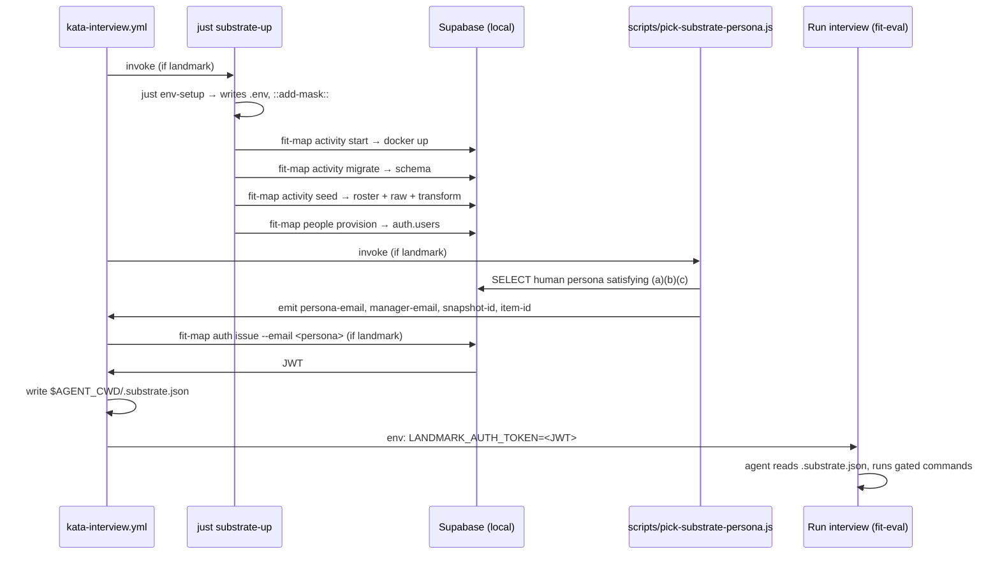

# Design 990-a — Real-Landmark Substrate for `kata-interview` Runs

Spec: `specs/990-kata-interview-real-landmark-substrate/spec.md` (status:
`spec draft`; this design is being authored under the user's in-session
instruction, ahead of formal spec approval).

## Architecture at a glance

The substrate prep boots a local Supabase stack, ingests synthetic
content, picks a persona, mints that persona a JWT, and hands the JWT
plus a JSON-encoded discovery vector to the agent process. Every new
moving part is gated by `inputs.product == 'landmark'`.

## Components

| Component | Location | Role |
|---|---|---|
| `just substrate-up` | `justfile` (new recipe) | Sequences the existing `fit-map` and `env-setup` verbs that bring the Supabase stack from cold to seeded + provisioned. Re-usable locally (`just substrate-up`) and from CI. |
| `scripts/pick-substrate-persona.js` | new | A small Node CLI that connects to the seeded Supabase with the service-role key, scans `human`-kind `organization_people` rows for one satisfying the spec's persona-corpus invariants, and writes the chosen persona's email + the matching discovery values to `$GITHUB_OUTPUT` (CI) or stdout (local). |
| `scripts/assert-substrate.js` | new | A standalone verifier that re-queries Supabase to confirm `LANDMARK_AUTH_TOKEN` is valid for the chosen persona, the discovery vector resolves, and the three named row-class smokes return non-empty. Runs as a CI step; also runnable locally for smoke debugging. |
| `kata-interview.yml` | `.github/workflows/` (modified) | Adds four new steps (each carrying `if: inputs.product == 'landmark'`): substrate-up, persona-pick, JWT mint + discovery-vector materialization, assertion-and-smoke. Adds a value-level conditional on the `Run interview` step's new `LANDMARK_AUTH_TOKEN` env entry. |
| `.claude/skills/kata-interview/SKILL.md` | modified | Step 3 staging table gains a Landmark row noting the substrate. The read-do checklist line "No product names anywhere agent-visible" is rewritten per the spec's amendment. |

## Data flow

1. **Env materialization.** `just env-setup` writes
   `SUPABASE_JWT_SECRET`, `SUPABASE_ANON_KEY`,
   `SUPABASE_SERVICE_ROLE_KEY`, `SUPABASE_URL`, plus the four other
   secrets, into `.env`. A second invocation with `--add-mask --output`
   into a throwaway path emits `::add-mask::` lines so any future
   transit of these values through step output is auto-redacted.
2. **Stack boot.** `fit-map activity start` runs the local Supabase
   CLI; `fit-map activity migrate` applies migrations. The local stack
   binds Postgres + GoTrue + PostgREST + Inbucket.
3. **Synthetic ingest.** `fit-map activity seed --data ./data` uploads
   `data/activity/roster.yaml`, the `data/activity/raw/` subtree, and
   then runs the full transform pipeline. This single verb covers
   roster → `organization_people`, GetDX snapshots → `snapshots`,
   GitHub artifacts → `github_artifacts`, and the practice/evidence
   tables.
4. **Auth provision.** `fit-map people provision` walks
   `organization_people` and provisions matching `auth.users` rows.
5. **Persona pick.** `scripts/pick-substrate-persona.js` queries
   `organization_people` for a `human`-kind row R such that
   `count(rows where manager_email = R.email) ≥ 1`,
   `count(github_artifacts where email = R.email) ≥ 1`, and
   `count(practice rows attributable to R's directs) ≥ 1`. Picks the
   first match by `email` lexicographic order. Emits
   `persona_email`, `manager_email` (= R.email — `org team` reads its
   own row as the manager-of-itself anchor), `snapshot_id` (first
   snapshot id from `snapshots` order by `created_at desc`), `item_id`
   (first driver id from `drivers.yaml` resolved against the seeded
   substrate).
6. **JWT mint.** `fit-map auth issue --email <persona>` mints a JWT
   against `SUPABASE_JWT_SECRET`. Captured into `$GITHUB_OUTPUT`.
7. **Discovery file.** A small inline step writes `$AGENT_CWD/.substrate.json`
   with shape `{ persona_email, manager_email, snapshot_id, item_id }`.
   No JWT in the file — the JWT is env-only.
8. **Agent dispatch.** The `Run interview` step gains a value-level
   conditional `env:` entry:
   `LANDMARK_AUTH_TOKEN: ${{ inputs.product == 'landmark' && steps.mint.outputs.jwt || '' }}`.

## Key decisions

| Decision | Choice | Rejected alternatives |
|---|---|---|
| Substrate orchestration shape | A `just` recipe (`just substrate-up`) called from one CI step | (a) Many inline YAML steps — bloats workflow; harder to test locally. (b) A composite action — premature; the spec defers reuse to other workflows. (c) A bash script — `just` recipes are already the local convention (`just env-setup`); a script duplicates the seam. |
| Persona selection | Post-substrate pick by `scripts/pick-substrate-persona.js`, supervisor consumes pre-chosen email | (a) Pre-substrate pick by parsing `data/synthetic/story.dsl` directly — spec's invariants are about the seeded substrate, not the DSL; verifying without reading the DB risks drift. (b) Let the supervisor LLM pick — chicken-and-egg (substrate needs an email before agent starts). |
| Persona-selection determinism | Lexicographic-first over the invariant-satisfying set | (a) Hash workflow inputs to seed RNG — spec defers cross-run determinism, but lexicographic-first is incidentally deterministic for free, and the spec doesn't forbid that. (b) Random pick — adds non-determinism without product benefit. |
| Discovery-vector encoding | JSON file at `$AGENT_CWD/.substrate.json` | (a) Env vars on `Run interview` — works for the JWT (production CLI reads `LANDMARK_AUTH_TOKEN`) but bloats env for the other four values, and any env var named `LANDMARK_*` re-opens the persona-file invariant discussion. (b) A row in agent's `CLAUDE.md` — Step 4's `CLAUDE.md` exclusion list forbids product names; the discovery file dodges that surface entirely. |
| JWT transport into agent env | Value-level ternary on the `Run interview` step's `env:` map | (a) Step-level `if:` on the whole `Run interview` step — would skip the agent entirely for non-Landmark runs (wrong; non-Landmark interviews must still run). (b) Pre-step that exports to `$GITHUB_ENV` — works but persists the JWT in the runner's environment beyond the step's scope. |
| Service-role transit between env-setup and `fit-map auth issue` | `.env` on disk, read by libconfig via `createProductConfig("map")` | (a) Export to `process.env` directly — works but bypasses the libconfig credential-isolation invariant added in PR #933 (`no-supabase-env-in-src.test.js`). (b) `$GITHUB_ENV` — env-setup.js writes lowercase keys (`scripts/env-setup.js:78`) which would clash with libconfig's uppercase expectation. |
| Secret masking timing | Two invocations of `env-setup.js`: one to write `.env`, one with `--add-mask --output /dev/null` to emit masks | The current script gates `::add-mask::` behind `--output`; this is the cleanest workaround. Extending `env-setup.js` with a `--mask-only` mode is also acceptable and a one-line change; the plan picks. |
| Smoke + assertion in the same step | One CI step invoking `scripts/assert-substrate.js` | (a) Separate steps per gated command — 11+ steps cluttering the workflow with little failure-localization gain. (b) Inline shell loop in YAML — harder to maintain and test locally. The script is a single Node program testable with `bun scripts/assert-substrate.js --persona-email <e> --jwt <t>`. |
| Workflow-step conditional uniformity | Every new step carries `if: inputs.product == 'landmark'` literally | (a) A job-level `if:` — would gate the entire interview job for non-Landmark runs, which contradicts the spec's "non-Landmark interviews are unchanged" criterion. (b) A reusable workflow extracted for the Landmark path — overkill for v1. |
| Substrate caching | None in v1 | (a) Cache the Supabase docker image layer — likely already cached by GH Actions docker layer cache; explicit caching is a follow-up. (b) Cache the seeded database — complex and brittle for the value; the spec out-of-scopes it. |

## Interfaces

- `scripts/pick-substrate-persona.js`
  - Reads `SUPABASE_URL`, `SUPABASE_SERVICE_ROLE_KEY` via `createProductConfig("map")`.
  - On success: emits `persona_email`, `manager_email`, `snapshot_id`,
    `item_id` to stdout in `key=value` form one per line (CI captures
    via `>> $GITHUB_OUTPUT`); exits 0.
  - On empty-corpus failure: exits non-zero with a stderr message
    naming which invariant failed (a/b/c) and a count of `human` rows
    scanned. Satisfies the spec's failure-surfacing criterion.

- `scripts/assert-substrate.js`
  - Inputs (from env or flags): `LANDMARK_AUTH_TOKEN`,
    `$AGENT_CWD/.substrate.json` path.
  - Re-verifies: JWT shape and claims; persona row presence in
    `organization_people` with `kind = 'human'`; discovery-vector
    resolution; the three named row-class smokes via `fit-landmark`
    invocations with `--format json`.
  - Exits non-zero on any failure with a one-line diagnostic per
    failing check.

- `just substrate-up`
  - Local: takes no arguments, assumes `.env` is writable, exits non-zero
    on any subverb failure.
  - CI: same, plus emits `::add-mask::` for generated secrets.

## Trade-offs at a glance

| Concern | Decision | Cost |
|---|---|---|
| Wall-clock budget | Boot Docker fresh each run | ~30–60 s added to every Landmark interview; spec out-of-scopes a numeric budget for v1. |
| Failure attribution | One `just` recipe runs five sub-verbs | If `fit-map activity seed` fails, the CI log line attributes to `just substrate-up`; the underlying `fit-map` log line is one frame deeper. Acceptable for v1. |
| Local-CI parity | `just substrate-up` runs both surfaces | Engineers can reproduce CI failures locally with `bun install -g supabase && just substrate-up`. |
| Persona stability | Lexicographic-first deterministic | If the synthetic content's persona-set changes, the chosen persona may swap. The spec out-of-scopes synthetic-content evolution; downstream interview findings remain comparable within a synthetic-content generation. |

## Notes on the SKILL.md amendments

- Step 3 staging table: add a sentence to the Landmark row noting that
  the substrate (including identity and `$AGENT_CWD/.substrate.json`)
  is staged automatically. No mention of `fit-landmark` by name in the
  table — that would re-introduce a product name into the same surface
  the read-do checklist still constrains.
- Read-do checklist line: replace "No product names anywhere
  agent-visible" with "No product names in the persona file or in
  supervisor-authored Ask templates; product-named environment
  variables required by the production CLI are permitted in the agent's
  environment." Step 4's `CLAUDE.md`-exclusion list is untouched.
