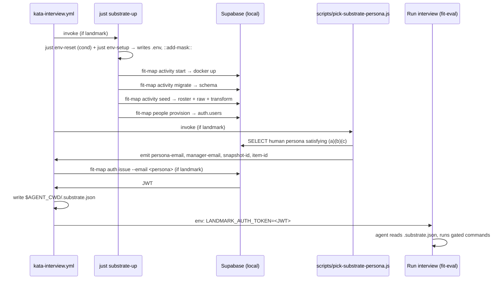

# Design 990-a — Real-Landmark Substrate for `kata-interview` Runs

Spec: `specs/990-kata-interview-real-landmark-substrate/spec.md` (status:
`spec draft`; this design is being authored under the user's in-session
instruction, ahead of formal spec approval).

## Architecture at a glance

The substrate prep boots a local Supabase stack, ingests synthetic
content, picks a persona, mints that persona a JWT, and hands the JWT
plus a JSON-encoded discovery vector to the agent process. Every new
moving part is gated by `inputs.product == 'landmark'`.

## Components

| Component | Location | Role |
|---|---|---|
| `just substrate-up` | `justfile` (new recipe) | Sequences the existing `fit-map` and `env-setup` verbs that bring the Supabase stack from cold to seeded + provisioned. Re-usable locally (`just substrate-up`) and from CI. |
| `scripts/pick-substrate-persona.js` | new | A small Node CLI that connects to the seeded Supabase with the service-role key, scans `human`-kind `organization_people` rows for one satisfying the spec's persona-corpus invariants, and writes the chosen persona's email + the matching discovery values to `$GITHUB_OUTPUT` (CI) or stdout (local). |
| `scripts/assert-substrate.js` | new | A standalone verifier that covers both gated-command success criteria from the spec: it iterates every `needsSupabase: true` entry in the `COMMANDS` map and expands user-visible subcommands via the libcli `commands` array (asserting each exits zero with options drawn from the discovery vector), *and* runs the three named row-class smokes (`org team`, `evidence`, `practice`) asserting non-empty payloads. It also re-verifies JWT shape and the persona row's presence in `organization_people`. Runs as a CI step; also runnable locally for smoke debugging. |
| `kata-interview.yml` | `.github/workflows/` (modified) | The workspace-prep boundary expands to include substrate-up, persona-pick, JWT-mint, and assertion-smoke phases. Each phase is a step or group of steps; each carries the product-Landmark gating predicate. The new `LANDMARK_AUTH_TOKEN` entry on the `Run interview` step's `env:` map uses the same value-level conditional pattern. Exact step decomposition and ordering is plan territory. |
| `.claude/skills/kata-interview/SKILL.md` | modified | The Step 3 staging table on `main` carries a combined `Map, Landmark` row; this design splits it into separate `Map` and `Landmark` rows so the Landmark row can name the substrate (including identity and the discovery file) as auto-staged. The read-do checklist line "No product names anywhere agent-visible" is rewritten per the spec's amendment. |

## Data flow

1. **Env materialization.** Two existing seams populate the env. `just env-reset` copies `.env.local.example` (which carries `SUPABASE_URL=http://127.0.0.1:54321`) to `.env`; the substrate-up recipe skips this step when `.env` already carries `SUPABASE_URL`, to avoid clobbering customized local files. `just env-setup` then writes the eight secrets generated by `scripts/env-setup.js` (`SERVICE_SECRET`, `DATABASE_PASSWORD`, `MCP_TOKEN`, `SUPABASE_JWT_SECRET`, `SUPABASE_ANON_KEY`, `SUPABASE_SERVICE_ROLE_KEY`, `AWS_ACCESS_KEY_ID`, `AWS_SECRET_ACCESS_KEY`) into the same file. A subsequent invocation in `--add-mask --output` mode (output to a throwaway path under `$RUNNER_TEMP` or `$(mktemp)`) emits `::add-mask::` lines for the secret values so subsequent transits through step output are auto-redacted. `SUPABASE_URL` is documentation, not secret, and is not masked.
2. **Stack boot.** `fit-map activity start` runs the local Supabase CLI (which boots a multi-container stack). `fit-map activity migrate` is `supabase db reset` underneath — destructive against the local DB, correct for a fresh CI runner.
3. **Synthetic ingest.** `fit-map activity seed` (invoked from a working directory whose `--data` resolves correctly via `findDataDir`) uploads `data/activity/roster.yaml`, the `data/activity/raw/` subtree, and runs the full transform pipeline. The single verb covers roster → `activity.organization_people`, GetDX snapshots → `activity.getdx_snapshots` and `activity.getdx_snapshot_team_scores`, GitHub artifacts → `activity.github_artifacts`, and the `activity.evidence` table that `practice` aggregates over.
4. **Auth provision.** `fit-map people provision` walks `organization_people` and provisions matching `auth.users` rows.
5. **Persona pick.** `scripts/pick-substrate-persona.js` queries the seeded tables for a `human`-kind row R in `organization_people` such that (i) `≥1 organization_people row exists with manager_email = R.email`, (ii) the same join `evidence --email <R.email>` performs (evidence rows whose joined `github_artifacts.email = R.email`) returns ≥1, and (iii) the same query `practice --manager <R.email>` performs (via the `get_team` RPC scoped to R) returns ≥1 row. Picks the first match by `email` lexicographic order. Emits `persona_email = R.email`, `manager_email = R.email` (R is the manager passed to `org team --manager <persona-email>` and to `practice --manager <persona-email>`), `snapshot_id` from `activity.getdx_snapshots` ordered by `imported_at desc`, and `item_id` from `activity.getdx_snapshot_team_scores` intersected with R's team's scope (any row guaranteed to be returned by `snapshot trend --item <id>` for the chosen persona).
6. **JWT mint.** `fit-map auth issue --email <persona>` mints a JWT against `SUPABASE_JWT_SECRET`. The CLI's stdout interleaves header text + the bare JWT line + a blank line + an `Export:` bullet + a success line (`auth-issue.js:87-98`). The JWT is extracted by anchored regex (`^ey[A-Za-z0-9_-]+\.[A-Za-z0-9_-]+\.[A-Za-z0-9_-]+$`) — the only line in the output matching the JWS-compact serialization — rather than by line number, which would couple to formatting changes. The extracted JWT is registered with `::add-mask::` before any subsequent step output transit, then written to `$GITHUB_OUTPUT`.
7. **Discovery file.** An inline step writes a JSON file with shape `{ persona_email, manager_email, snapshot_id, item_id }` into the agent-cwd directory at write-time (`${{ steps.agent-workspace.outputs.dir }}/.substrate.json`, the same path the existing workflow uses to stage `data/pathway/` and `data/activity/`). No JWT in the file.
8. **Agent dispatch.** The `Run interview` step gains a value-level conditional `env:` entry: `LANDMARK_AUTH_TOKEN: ${{ inputs.product == 'landmark' && steps.mint.outputs.jwt || '' }}`. The agent process is started with `cwd` set to the same directory by `fit-eval` (`libeval/src/supervisor.js` sets `cwd: agentCwd` on the spawned process); the discovery file is therefore visible to the agent at `./.substrate.json` relative to its cwd. The skill text describes the location as `./.substrate.json` rather than `$AGENT_CWD/.substrate.json` because no `AGENT_CWD` env var is exported into the agent process.

## Key decisions

| Decision | Choice | Rejected alternatives |
|---|---|---|
| Substrate orchestration shape | A `just` recipe (`just substrate-up`) called from one CI step | (a) Many inline YAML steps — bloats workflow; harder to test locally. (b) A composite action — premature; the spec defers reuse to other workflows. (c) A bash script — `just` recipes are already the local convention (`just env-setup`); a script duplicates the seam. |
| Persona selection | Post-substrate pick by `scripts/pick-substrate-persona.js`, supervisor consumes pre-chosen email | (a) Pre-substrate pick by parsing `data/synthetic/story.dsl` directly — spec's invariants are about the seeded substrate, not the DSL; verifying without reading the DB risks drift. (b) Let the supervisor LLM pick — chicken-and-egg (substrate needs an email before agent starts). |
| Persona-selection determinism | Lexicographic-first over the invariant-satisfying set | (a) Hash workflow inputs to seed RNG — spec defers cross-run determinism, but lexicographic-first is incidentally deterministic for free, and the spec doesn't forbid that. (b) Random pick — adds non-determinism without product benefit. |
| Discovery-vector encoding | JSON file at `$AGENT_CWD/.substrate.json` | (a) Env vars on `Run interview` — works for the JWT (production CLI reads `LANDMARK_AUTH_TOKEN`) but bloats env for the other four values, and any env var named `LANDMARK_*` re-opens the persona-file invariant discussion. (b) A row in agent's `CLAUDE.md` — Step 4's `CLAUDE.md` exclusion list forbids product names; the discovery file dodges that surface entirely. |
| JWT transport into agent env | Value-level ternary on the `Run interview` step's `env:` map | (a) Step-level `if:` on the whole `Run interview` step — would skip the agent entirely for non-Landmark runs (wrong; non-Landmark interviews must still run). (b) Pre-step that exports to `$GITHUB_ENV` — works but persists the JWT in the runner's environment beyond the step's scope. |
| Service-role transit between env-setup and `fit-map auth issue` | `.env` on disk, read by libconfig via `createProductConfig("map")` | (a) Export to `process.env` directly — works but bypasses the libconfig credential-isolation invariant added in PR #933 (`no-supabase-env-in-src.test.js`). (b) `$GITHUB_ENV` — works but the `--output` mode of `env-setup.js` writes lowercase keys, so a transparent reuse of that mode would not match libconfig's uppercase expectation; the default `.env` mode preserves case correctly. |
| Secret masking for env-setup secrets | A second `env-setup.js` invocation with `--add-mask --output <throwaway>` after the first writes `.env`; the masks register before the secrets transit any later step output | (a) Extending `env-setup.js` with a `--mask-only` mode that emits masks without writing files — cleaner long-term but the second-invocation pattern is one extra line of shell and avoids a script change. (b) Running env-setup once with `--add-mask --output $GITHUB_ENV` only — registers masks but loses the `.env` libconfig contract above. |
| Secret masking for the minted JWT | Explicit `::add-mask::<jwt>` echo after extracting the JWT from `fit-map auth issue` stdout and before writing to `$GITHUB_OUTPUT` | (a) Relying on env-setup's masks alone — the JWT is a newly minted value, not one of the env-setup secrets, so its bytes would never have been registered. (b) Reading the JWT from a file masked by `chmod` — GH log redaction operates on the value, not the file permissions. |
| Smoke + assertion in the same step | One CI step invoking `scripts/assert-substrate.js` | (a) Separate steps per gated command — 11+ steps cluttering the workflow with little failure-localization gain. (b) Inline shell loop in YAML — harder to maintain and test locally. The script is a single Node program testable with `bun scripts/assert-substrate.js --persona-email <e> --jwt <t>`. |
| Workflow-step conditional uniformity | Each new step carries an `if:` predicate evaluating to false for non-Landmark inputs; the `Run interview` step's new env entry uses a value-level ternary | (a) A job-level `if:` — gates the entire interview job for non-Landmark runs, which contradicts the spec's "non-Landmark interviews are unchanged" criterion. (b) A reusable workflow extracted for the Landmark path — overkill for v1. |
| Substrate caching | None in v1 | (a) Cache the Supabase docker image layer — likely already cached by GH Actions docker layer cache; explicit caching is a follow-up. (b) Cache the seeded database — complex and brittle for the value; the spec out-of-scopes it. |

## Interfaces

- `scripts/pick-substrate-persona.js`
  - Reads `SUPABASE_URL`, `SUPABASE_SERVICE_ROLE_KEY` via `createProductConfig("map")`.
  - On success: emits `persona_email`, `manager_email`, `snapshot_id`,
    `item_id` to stdout in `key=value` form one per line (CI captures
    via `>> $GITHUB_OUTPUT`); exits 0.
  - On empty-corpus failure: exits non-zero with a stderr message
    naming which of the spec's three invariants failed and a count of
    `human` rows scanned, satisfying the spec's failure-surfacing
    criterion. The invariant labels in the message match the spec's
    bullet order ("manager-of-one", "evidence-of-self",
    "practice-of-directs") so a downstream reader can cross-reference
    the spec without re-deriving the labels.

- `scripts/assert-substrate.js`
  - Inputs (from env or flags): `LANDMARK_AUTH_TOKEN`,
    `$AGENT_CWD/.substrate.json` path.
  - Re-verifies: JWT shape and claims; persona row presence in
    `organization_people` with `kind = 'human'`; discovery-vector
    resolution; the three named row-class smokes via `fit-landmark`
    invocations with `--format json`.
  - Exits non-zero on any failure with a one-line diagnostic per
    failing check.

- `just substrate-up`
  - Takes no arguments, exits non-zero on any subverb failure. Behavior
    is identical in local and CI environments — `::add-mask::` lines
    are emitted unconditionally; outside GitHub Actions they are
    harmless stdout noise.
  - Invokes `just env-reset` only when `.env` does not exist or does
    not already carry `SUPABASE_URL`; the recipe must not silently
    clobber a contributor's customized `.env` on local re-runs. The
    guard is a shell test, not a `--force` flag — contributors who
    want a forced reset can delete `.env` themselves.
  - The masking-secrets throwaway file lives under `$RUNNER_TEMP`
    (CI) or `$(mktemp)` (local) and is removed in the same recipe.

## Trade-offs at a glance

| Concern | Decision | Cost |
|---|---|---|
| Wall-clock budget | Boot Docker fresh each run | ~30–60 s added to every Landmark interview; spec out-of-scopes a numeric budget for v1. |
| Failure attribution | One `just` recipe runs the substrate sub-verbs | If `fit-map activity seed` fails, the CI log line attributes to `just substrate-up`; the underlying `fit-map` log line is one frame deeper. Acceptable for v1. |
| Local-CI parity | `just substrate-up` runs both surfaces | Engineers can reproduce CI failures locally with `bun install -g supabase && just substrate-up`. |
| Persona stability | Lexicographic-first deterministic | If the synthetic content's persona-set changes, the chosen persona may swap. The spec out-of-scopes synthetic-content evolution; downstream interview findings remain comparable within a synthetic-content generation. |
| Corpus satisfiability | Implementation must verify, before merge, that the seeded substrate contains at least one persona satisfying all three invariants | If the synthetic content as-shipped admits no such persona, the workflow is permanently red on first Landmark run. Verification is an empirical probe (run `just substrate-up && bun scripts/pick-substrate-persona.js` against a clean checkout) the plan executes; if no match exists, the spec must be amended to either widen the corpus invariants or extend the synthetic content (out of scope here). |

## SKILL.md amendments

The on-`main` Step 3 staging table groups Map and Landmark in one row.
This design splits the row so each product can be described against
the substrate it now has. The Landmark row names the substrate
(identity + discovery file) as auto-staged, without using the product
name `fit-landmark` in cell text — the read-do checklist still
constrains agent-visible product names in the persona file and Ask
templates. The Map row's existing behavior is unchanged; Map
interviews do not invoke the substrate prep. The read-do checklist
line itself is rewritten per the spec's Persona-file invariant
amendment row.
