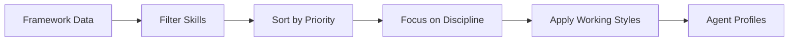

# Agent Teams

Agent teams are AI coding assistant configurations derived from the same career
framework used for human job definitions. The same skills, behaviours, and
proficiency levels that describe what a senior engineer does also describe what
an AI agent working at that level should do.

## Agent vs Human Derivation

The derivation engine produces parallel outputs from shared inputs:

| Aspect       | Human Output                                  | Agent Output                                      |
| ------------ | --------------------------------------------- | ------------------------------------------------- |
| Skills       | Job description with proficiency expectations | SKILL.md files with agent-specific markers        |
| Behaviours   | Behavioural expectations by maturity          | Working style directives for the agent            |
| Capabilities | Responsibility areas and scope                | Focused capability constraints                    |
| Stages       | Lifecycle phase expectations                  | Stage-specific agent with handoffs and checklists |
| Tools        | Tool proficiency expectations                 | Tool references and installation scripts          |

## Reference Level Selection

When generating agent profiles, the engine automatically selects the reference
level for each skill. It picks the proficiency level that best represents
competent, independent work — typically the `working` or `practitioner` level.
This means agents are configured to operate at a consistently capable level
rather than at the extremes of awareness or expert.

## Profile Derivation Pipeline

The derivation pipeline transforms framework definitions into agent
configurations through a series of steps:



1. **Filter** — Select skills relevant to the discipline and track, removing
   those outside scope
2. **Sort** — Order skills by importance based on the discipline's tier
   structure (core, supporting, broad)
3. **Focus** — Apply the discipline's T-shape, emphasizing depth in core skills
   and breadth elsewhere
4. **Style** — Translate behaviour expectations into working style directives
   the agent follows
5. **Output** — Produce `.agent.md` team files and individual `SKILL.md` files

## Output Format

The pipeline produces two types of files:

### Team File (.agent.md)

The team file defines the agent's identity, role, and working style:

```markdown
# Platform Engineering Agent

## Role
Senior platform engineer focused on infrastructure reliability
and developer experience.

## Working Style
- Makes decisions independently within established patterns
- Considers operational impact before proposing changes
- Documents trade-offs explicitly in code comments and PRs

## Skills
- system_design (working)
- infrastructure_automation (practitioner)
- observability (working)
```

### Skill File (SKILL.md)

Each skill the agent works with gets its own file containing markers, tools, and
context:

```markdown
# System Design

## Level: working

## Markers
- Generates component designs with explicit interface contracts
- Produces architecture decision records from design prompts
- Identifies failure modes and suggests circuit-breaker patterns

## Tools
- diagramming tools for architecture visualization
- documentation generators for decision records
```

## Stage-Based Agents

Each lifecycle stage produces a dedicated agent with a focused purpose. A stage
agent inherits the same skill and behaviour definitions but applies
stage-specific constraints:

- **Constraints** — What the agent should and should not do during this stage
- **Handoffs** — When and how to transition work to the next stage
- **Checklists** — What must be true before the stage is complete
- **Tool set** — Which tools are relevant for this stage's work

For example, a "design" stage agent focuses on architecture and documentation,
while an "implementation" stage agent focuses on code quality and test coverage.

## Generating Agents

Generate agent profiles for a discipline and track:

```sh
bunx fit-pathway agent software_engineering --track=platform --output=./agents
```

The output directory contains stage-specific `.agent.md` files and a `skills/`
directory with individual `SKILL.md` files:

```
./agents/
├── plan.agent.md
├── code.agent.md
├── review.agent.md
└── skills/
    ├── ARCHITECTURE.md
    ├── API-DESIGN.md
    └── ...
```

Generate a single stage agent:

```sh
bunx fit-pathway agent software_engineering --track=platform --stage=plan
```

List available disciplines and tracks:

```sh
bunx fit-pathway discipline --list
bunx fit-pathway track --list
```

## Related Documentation

- [CLI Reference](/docs/reference/cli/) — complete command documentation for
  `fit-pathway agent`
- [Data Model Reference](/docs/reference/model/) — how skills, behaviours, and
  disciplines relate
- [Lifecycle Reference](/docs/reference/lifecycle/) — stage definitions,
  constraints, and handoffs
