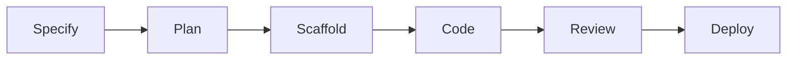
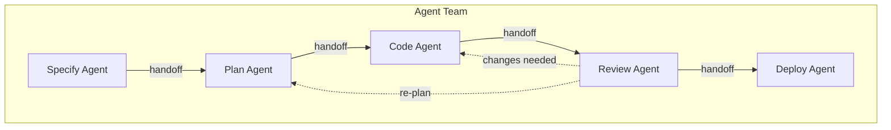

## Overview

The lifecycle model defines six stages that engineering work moves through, from
specification to deployment. Each stage has defined constraints, handoff
conditions, and checklists that ensure quality transitions.

---

## The Six Stages



| Stage        | Purpose                                               |
| ------------ | ----------------------------------------------------- |
| **specify**  | Define WHAT users need and WHY                        |
| **plan**     | Design HOW to build (architecture, technical choices) |
| **scaffold** | Prepare dev environment, dependencies, credentials    |
| **code**     | Implement the solution and write tests                |
| **review**   | Verify implementation against acceptance criteria     |
| **deploy**   | Ship to production, monitor CI/CD                     |

---

## Handoffs

Handoffs are the transitions between stages. Each stage defines named handoffs
that specify where work can flow next.

### Specify Stage

| Handoff                 | Target  | Trigger                  |
| ----------------------- | ------- | ------------------------ |
| Refine/Alternative Spec | specify | Requirements need rework |
| Plan                    | plan    | Spec accepted            |

### Plan Stage

| Handoff                 | Target   | Trigger             |
| ----------------------- | -------- | ------------------- |
| Refine/Alternative Plan | plan     | Design needs rework |
| Scaffold                | scaffold | Plan accepted       |

### Scaffold Stage

| Handoff     | Target   | Trigger                                     |
| ----------- | -------- | ------------------------------------------- |
| Retry Setup | scaffold | Environment setup failed                    |
| Update Plan | plan     | Plan needs revision based on setup findings |
| Code        | code     | Environment ready                           |

### Code Stage

| Handoff        | Target | Trigger                                |
| -------------- | ------ | -------------------------------------- |
| Request Review | review | Implementation complete, tests passing |

### Review Stage

| Handoff           | Target | Trigger                               |
| ----------------- | ------ | ------------------------------------- |
| Request Changes   | code   | Issues found, changes needed          |
| Needs Re-planning | plan   | Fundamental problems require redesign |
| Deploy            | deploy | Review approved                       |

### Deploy Stage

| Handoff      | Target | Trigger                      |
| ------------ | ------ | ---------------------------- |
| Fix Pipeline | deploy | CI/CD issues need resolution |

---

## Constraints

Each stage defines constraints that limit what actions are allowed. Constraints
are especially important for AI agents -- they prevent scope creep and ensure
agents stay within their authorized boundaries.

| Stage        | Cannot                                        |
| ------------ | --------------------------------------------- |
| **specify**  | Write code, make architectural decisions      |
| **plan**     | Commit code, go beyond specified requirements |
| **scaffold** | Implement features, change the plan           |
| **code**     | Change architecture, deviate from the plan    |
| **review**   | Add features, only verify and request changes |
| **deploy**   | Change code, only fix pipeline configuration  |

---

## Checklists

Checklists ensure quality at stage transitions. They are derived dynamically
from capability definitions based on the job's skill proficiencies.

### Two Types

| Type                | When                 | Purpose                       |
| ------------------- | -------------------- | ----------------------------- |
| **Read-Then-Do**    | Before starting work | Prerequisites and preparation |
| **Do-Then-Confirm** | Before handing off   | Verification criteria         |

### How Checklists Are Derived

```
Checklist = Stage x Skill Matrix x Capability Definitions
```

For each stage:

1. Take all skills in the derived skill matrix
2. Look up the stage definition in the skill's capability
3. Extract `readChecklist` and `confirmChecklist` items matching the derived
   skill proficiency
4. Group items by skill and capability

### Example

Given a "code" stage for a practitioner-level CI/CD skill:

**Read-Then-Do (before coding):**

- Review the deployment pipeline configuration
- Understand the test infrastructure
- Check branch protection rules

**Do-Then-Confirm (before requesting review):**

- All new code has test coverage
- Pipeline passes on the feature branch
- Documentation updated for changed interfaces

---

## Stages and Agents

Each lifecycle stage can produce a dedicated AI agent with:

- **Focused skill set** -- Only skills relevant to that stage
- **Stage constraints** -- Hard boundaries on agent actions
- **Tool set** -- Tools appropriate for the stage
- **Handoff prompts** -- Conditions that trigger stage transitions

This enables a multi-agent workflow where different agents handle different
lifecycle phases, each with appropriate permissions and knowledge.



Generate agent teams for a discipline and track:

```sh
bunx fit-pathway agent <discipline> --track=<track> --output=./agents
bunx fit-pathway agent <discipline> --track=<track> --stage=code
```

See [CLI Reference](/docs/reference/cli/) for the full `agent` command.

---

## Related Documentation

- [Core Model](/docs/reference/model/) -- Entity overview and derivation formula
- [Agent Teams](/docs/guides/agent-teams/) -- Building and using agent teams
