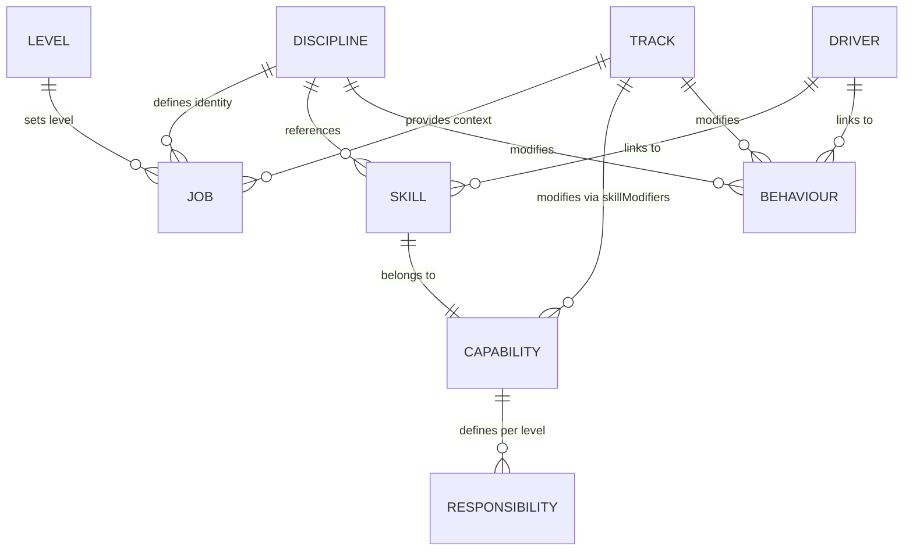
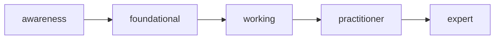
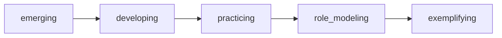

## Overview

The core model defines how your engineering terrain is traversed. Every
combination of discipline, track, and level produces a unique, consistent role
profile -- with skill proficiencies, behaviour expectations, and
responsibilities all derived from the same source data.

---

## The Core Formula

**Job Definition** = Discipline x Track x Level

**Agent Profile** = Discipline x Track

| Input          | Question                   |
| -------------- | -------------------------- |
| **Discipline** | What kind of engineer?     |
| **Track**      | Where and how do you work? |
| **Level**      | What career level?         |

Both jobs and agents use the same skill and behaviour derivation. The
difference: jobs include all skills capped by level, while agents filter out
human-only skills.

---

## Entity Overview



| Entity         | Purpose                                           | Key Question              |
| -------------- | ------------------------------------------------- | ------------------------- |
| **Discipline** | Engineering specialty and T-shaped profile        | What kind of engineer?    |
| **Track**      | Work context and capability-based modifiers       | Where/how do you work?    |
| **Level**      | Career level with base skill/behaviour levels     | What career level?        |
| **Skill**      | Technical or professional capability              | What can you do?          |
| **Capability** | Skill grouping for modifiers and responsibilities | What capability area?     |
| **Behaviour**  | Approach to work and mindset                      | How do you approach work? |
| **Driver**     | Organizational outcome                            | What outcomes matter?     |

---

## Skills

Skills represent technical and professional capabilities. Each skill belongs to
exactly one capability.

### Skill Proficiencies (5 Levels)



| Proficiency  | Description                            |
| ------------ | -------------------------------------- |
| awareness    | Learning fundamentals, needs guidance  |
| foundational | Applies basics independently           |
| working      | Solid competence, handles ambiguity    |
| practitioner | Deep expertise, leads and mentors      |
| expert       | Authority, shapes direction across org |

### Human-Only Skills

Some skills require physical presence, emotional intelligence, or relationship
building that AI cannot replicate. These are marked `isHumanOnly: true` in the
YAML definition and are excluded from agent profile derivation.

---

## Capabilities

Capabilities group skills and define level-based responsibilities. Track
modifiers apply to all skills in a capability at once.

Capabilities also define:

- **professionalResponsibilities** -- IC role expectations per skill proficiency
- **managementResponsibilities** -- Manager role expectations per skill
  proficiency
- **checklists** — Phase transition items per skill proficiency

---

## Behaviours

Behaviours represent mindsets and approaches to work.

### Behaviour Maturities (5 Levels)



| Maturity      | Description                       |
| ------------- | --------------------------------- |
| emerging      | Shows interest, needs prompting   |
| developing    | Regular practice with guidance    |
| practicing    | Consistent application, proactive |
| role_modeling | Influences team culture           |
| exemplifying  | Shapes organizational culture     |

---

## Disciplines

Disciplines define engineering specialties with T-shaped skill profiles. Each
discipline classifies every referenced skill into one of three tiers:

| Tier             | Expected Level    | Purpose                 |
| ---------------- | ----------------- | ----------------------- |
| coreSkills       | Highest for level | Core expertise          |
| supportingSkills | Mid-level         | Supporting capabilities |
| broadSkills      | Lower level       | General awareness       |

### Discipline Properties

| Property         | Type             | Purpose                                         |
| ---------------- | ---------------- | ----------------------------------------------- |
| `isProfessional` | boolean          | Uses professionalResponsibilities (IC roles)    |
| `isManagement`   | boolean          | Uses managementResponsibilities (manager roles) |
| `validTracks`    | (string\|null)[] | Valid track configurations                      |
| `minLevel`       | string           | Minimum level required for this discipline      |

---

## Tracks

Tracks define work context and modify the base profile through capability-based
skill adjustments. Tracks are pure modifiers -- they do not define role types.

Tracks define two kinds of modifiers:

- **skillModifiers** -- Shift skill proficiencies for all skills in a capability
  (e.g. `delivery: +1`)
- **behaviourModifiers** -- Shift behaviour maturity expectations for specific
  behaviours (e.g. `systems_thinking: +1`)

---

## Levels

Levels define career levels with base expectations for skill proficiency and
behaviour maturity:

The starter framework ships with two levels. Your framework may define more.

| Level | Core         | Supporting   | Broad     | Base Behaviour |
| ----- | ------------ | ------------ | --------- | -------------- |
| J040  | foundational | awareness    | awareness | emerging       |
| J060  | working      | foundational | awareness | developing     |

---

## Job Derivation

### Skill Derivation Steps

1. **Determine skill tier** -- Is this skill core, supporting, or broad for the
   discipline? Each discipline classifies every skill into one of three tiers:
   core, supporting, or broad.

2. **Get base proficiency** -- Look up the level's base proficiency for that
   skill tier. For example, J060 maps core skills to `working`, supporting to
   `foundational`, and broad to `awareness`.

3. **Apply track modifier** -- Add the track's modifier for the skill's
   capability. Track modifiers apply at the capability level, affecting all
   skills in a capability equally.

4. **Cap positive modifiers** -- Positive modifiers cannot push the result above
   the level's maximum base proficiency. If a level peaks at `practitioner`, a
   +1 modifier cannot produce `expert`.

5. **Clamp to valid range** -- Ensure the result falls between `awareness` (0)
   and `expert` (4).

### Complete Derivation Example

| Input      | Value                                                          |
| ---------- | -------------------------------------------------------------- |
| Discipline | Software Engineering                                           |
| Level      | J060 (core=working, supporting=foundational, broad=awareness)  |
| Track      | Platform (delivery: +1, reliability: +1)                       |
| Skill      | Task Completion (capability: delivery, tier: supportingSkills) |

1. **Skill tier**: supporting
2. **Base proficiency**: foundational (index 1)
3. **Modifier**: +1 (delivery capability)
4. **Cap check**: working (index 2) <= max base working (index 2) -- OK
5. **Result**: working

---

## Behaviour Derivation

```
Final Maturity = Level Base + Discipline Modifier + Track Modifier
```

| Step                | Source                    | Example        |
| ------------------- | ------------------------- | -------------- |
| Level base          | `baseBehaviourMaturity`   | developing (1) |
| Discipline modifier | `behaviourModifiers.{id}` | +1             |
| Track modifier      | `behaviourModifiers.{id}` | 0              |
| **Result**          | Clamped to valid range    | practicing (2) |

Maturities are clamped between `emerging` (0) and `exemplifying` (4).

---

## Responsibility Derivation

Responsibilities come from capabilities and vary by role type:

| Role Type         | Source                                    |
| ----------------- | ----------------------------------------- |
| Professional (IC) | `capability.professionalResponsibilities` |
| Management        | `capability.managementResponsibilities`   |

Responsibilities are selected by the derived skill proficiency for each
capability. Higher skill proficiencies unlock additional responsibilities.

---

## Driver Coverage

Drivers represent organizational outcomes. Coverage is calculated by checking
which skills and behaviours meet specific thresholds:

| Threshold          | Value                      |
| ------------------ | -------------------------- |
| Skill proficiency  | working or above           |
| Behaviour maturity | practicing or above        |
| Level              | Senior threshold and above |

Each driver specifies related skills and behaviours. If the derived job meets
the thresholds for a driver's dependencies, that driver is considered covered.

---

## Modifier Policies

### Positive Modifier Capping

When a track modifier is positive, the resulting level cannot exceed the level's
maximum base skill proficiency. This prevents lower levels from gaining
unrealistically high expertise just because a track emphasizes a particular
area.

### Negative Modifiers

Negative modifiers are not capped -- they can freely reduce a level down to
`awareness`. This models the reduced expectations in de-emphasized areas.

### Capability-Level Modifiers

Track modifiers apply at the capability level, affecting all skills in that
capability equally. This avoids per-skill configuration while still allowing
meaningful differentiation between tracks.

---

## Key Capabilities

| Capability         | What it does                                             |
| ------------------ | -------------------------------------------------------- |
| **Job derivation** | Complete role definitions with skills and behaviours     |
| **Agent profiles** | Agent instructions derived from discipline and track     |
| **Skill matrices** | Derived skill proficiencies with track modifiers applied |
| **Checklists**     | Phase transition criteria from capability definitions    |
| **Progression**    | Career path analysis and gap identification              |
| **Interviews**     | Role-specific question selection                         |
| **Job matching**   | Gap analysis between current and target roles            |

---

## Related Documentation

- [Lifecycle](/docs/reference/lifecycle/) — Phases, handoffs, and checklists
- [Career Paths](/docs/guides/career-paths/) -- Using progression and gap
  analysis
- [Agent Teams](/docs/guides/agent-teams/) -- Agent profile generation
