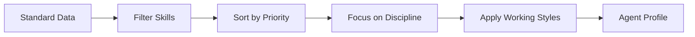

Agent teams are AI coding assistant configurations derived from the same career
agent-aligned engineering standard used for human job definitions. The same
skills, behaviours, and proficiency levels that describe what a senior engineer
does also describe what an AI agent working at that level should do.

This guide covers two topics: **generating** agent teams from standard data, and
**structuring** the exported output so agents receive clear, non-conflicting
guidance.

---

## Generating Agent Teams

### Agent vs Human Derivation

The derivation engine produces parallel outputs from shared inputs:

| Aspect       | Human Output                                  | Agent Output                               |
| ------------ | --------------------------------------------- | ------------------------------------------ |
| Skills       | Job description with proficiency expectations | SKILL.md files with agent-specific markers |
| Behaviours   | Behavioural expectations by maturity          | Working style directives for the agent     |
| Capabilities | Responsibility areas and scope                | Focused capability constraints             |
| Tools        | Tool proficiency expectations                 | Tool references and installation scripts   |

### Reference Level Selection

When generating agent profiles, the engine automatically selects the reference
level for each skill — the proficiency level that best represents competent,
independent work. It picks the first level where core skills reach
`practitioner`, falling back to `working`, then the middle level. Agents are
configured to operate at a consistently capable level rather than at the
extremes of awareness or expert.

### Pipeline Steps



1. **Filter** — Select skills relevant to the discipline and track. Remove
   `isHumanOnly` skills (mentoring, physical presence).
2. **Sort** — Order skills by importance: core → supporting → broad →
   track-added.
3. **Focus** — Apply the discipline's skill matrix to the agent profile.
4. **Style** — Translate top behaviours by maturity into working style
   directives.
5. **Output** — Produce one `.claude/agents/{role}.md` profile and the
   corresponding `.claude/skills/*/SKILL.md` files.

### Commands

Generate an agent profile for a discipline and track:

```sh
npx fit-pathway agent software_engineering --track=platform --output=./out
```

Output directory structure:

```
./out/
└── .claude/
    ├── CLAUDE.md
    ├── agents/
    │   └── software-engineer--platform.md
    └── skills/
        ├── task-completion/SKILL.md
        ├── incident-response/SKILL.md
        └── ...
```

The agent name is derived from the discipline's `roleTitle`, suffixed with
`--{track}` when a track is set (e.g. `software-engineer--platform`,
`data-engineer`). Trackless (generalist) configurations omit the suffix.

Preview without writing files:

```sh
npx fit-pathway agent software_engineering --track=platform
```

List valid discipline/track combinations:

```sh
npx fit-pathway agent --list
```

---

## The Three-Layer Architecture

When you export an agent team, standard data becomes operational guidance
distributed across three layers. Each layer has a distinct purpose, and
information flows **downward only** — team instructions inform agent behavior,
agent profiles select which skills to load, skills contain the procedure.
Information never flows upward.

| Layer                 | File                        | Answers                                         | Loaded by            |
| --------------------- | --------------------------- | ----------------------------------------------- | -------------------- |
| **Team instructions** | `.claude/CLAUDE.md`         | What platform? What conventions? What env vars? | Every agent, always  |
| **Agent profile**     | `.claude/agents/*.md`       | Who am I? What constraints? What working style? | One agent at a time  |
| **Skill**             | `.claude/skills/*/SKILL.md` | How do I do X? What must I verify?              | On demand, per skill |

### How YAML Fields Map to Layers

Each layer draws from specific fields in the standard YAML. Understanding where
each field ends up helps you decide where to put new content.

| Source File           | YAML Field                        | Exported To                                          | Layer             |
| --------------------- | --------------------------------- | ---------------------------------------------------- | ----------------- |
| `tracks/*.yaml`       | `agent.teamInstructions`          | `.claude/CLAUDE.md`                                  | Team instructions |
| `disciplines/*.yaml`  | `agent.identity`                  | profile → identity section                           | Agent profile     |
| `disciplines/*.yaml`  | `agent.priority`                  | profile → priority section                           | Agent profile     |
| `disciplines/*.yaml`  | `agent.constraints`               | profile → constraints list                           | Agent profile     |
| `tracks/*.yaml`       | `agent.identity`                  | profile → identity (overrides discipline)            | Agent profile     |
| `tracks/*.yaml`       | `agent.priority`                  | profile → priority (overrides discipline)            | Agent profile     |
| `tracks/*.yaml`       | `agent.constraints`               | profile → constraints (appended)                     | Agent profile     |
| `tracks/*.yaml`       | `roleContext`                     | profile → role context section                       | Agent profile     |
| `behaviours/*.yaml`   | `agent.workingStyle`              | profile → working style bullets                      | Agent profile     |
| `capabilities/*.yaml` | `skills[].agent.focus`            | `SKILL.md` → focus                                   | Skill             |
| `capabilities/*.yaml` | `skills[].agent.readChecklist`    | `SKILL.md` → READ-DO checklist                       | Skill             |
| `capabilities/*.yaml` | `skills[].agent.confirmChecklist` | `SKILL.md` → DO-CONFIRM checklist                    | Skill             |
| `capabilities/*.yaml` | `skills[].agent.description`      | `SKILL.md` → description                             | Skill             |
| `capabilities/*.yaml` | `skills[].toolReferences`         | `SKILL.md` → tools section                           | Skill             |
| `capabilities/*.yaml` | `skills[].markers`                | `SKILL.md` → markers section                         | Skill             |
| `capabilities/*.yaml` | `skills[].instructions`           | `SKILL.md` → instructions                            | Skill             |
| `capabilities/*.yaml` | `skills[].installScript`          | `skills/*/scripts/install.sh`                        | Skill             |
| `capabilities/*.yaml` | `skills[].references[]`           | `skills/*/references/{name}.md` (one file per entry) | Skill             |

**Key patterns:**

- `agent.teamInstructions` is the only field that produces `.claude/CLAUDE.md`.
  It lives on the track because team instructions are context-specific — a
  platform track and a forward-deployed track serve different conventions.
- `agent.identity` on a track _overrides_ the discipline's identity. Use this
  when the track fundamentally changes how the agent introduces itself.
- `agent.constraints` from discipline and track are _appended_ — they are
  additive, not overriding.
- `roleContext` is a shared field (used in both human job descriptions and agent
  profiles). It is not inside the `agent:` section.

### Layer 1: Team Instructions (CLAUDE.md)

**Purpose:** Cross-cutting facts that every agent needs regardless of which
skill is loaded. Written once, read by all.

**Include:**

- Platform environment (deployment URLs, runtime env vars, build-time rules)
- Shared architectural decisions (migration strategy, preferred vs fallback
  patterns)
- Project conventions (task runner, version pinning, port, build tool, local
  development setup)
- External service access (API gateways, authentication patterns, key resolution
  order)
- Skill coordination table — which skill is canonical for which topic

**Exclude:**

- Step-by-step procedures (belongs in skills)
- Role identity or working style (belongs in agent profiles)
- Code examples (belongs in skill references)

**Style:** Terse, declarative, factual. Use tables for structured data. No
checklists. No narrative. Think "team wiki page" not "tutorial."

**Maintenance signal:** If you update a fact here, you should only need to touch
one other place at most (the canonical skill's detail section). If you find
yourself updating three or more skills, the fact belongs here instead.

#### Example

```markdown
# Acme Platform

## Environment

| Variable       | Purpose                  | Set by         |
| -------------- | ------------------------ | -------------- |
| `DATABASE_URL` | PostgreSQL connection    | .env / secrets |
| `API_BASE_URL` | Backend API root         | .env           |
| `NODE_ENV`     | Runtime environment      | CI / .env      |

## Conventions

- **Task runner:** just (see justfile)
- **Package manager:** pnpm
- **Node version:** pinned in .mise.toml
- **Test runner:** vitest
- **Port:** 3000 (dev), 8080 (production)

## Skill Coordination

| Topic             | Canonical Skill    |
| ----------------- | ------------------ |
| Database schemas  | data-modeling      |
| API endpoints     | api-design         |
| CI/CD pipelines   | ci-cd              |
| Deployment        | deployment         |
| Observability     | observability      |
```

### Layer 2: Agent Profiles

**Purpose:** Define who the agent is and how it should behave. Each profile is a
persona with constraints — one agent per discipline and track combination,
carrying the full skill matrix for that role.

**Include:**

- Core identity (role description, working style, priorities)
- Skill assignments (which skills this agent should load)
- Constraints (what the agent must not do)

**Exclude:**

- Platform details (belongs in CLAUDE.md)
- How to perform specific technical tasks (belongs in skills)
- Environment variable names or values (belongs in CLAUDE.md)
- Tool-specific instructions (belongs in skills)

**Style:** Imperative, behavioral. "You are X. Do Y. Do not Z." Agent profiles
are about identity and boundaries, not procedures.

**Maintenance signal:** If you're adding platform-specific content to an agent
profile, it probably belongs in CLAUDE.md. If you're adding procedural steps, it
belongs in a skill.

#### Example

```markdown
# Software Engineer (Platform)

## Role

Senior software engineer building shared platform capabilities for other
engineering teams.

## Working Style

- Makes decisions independently within established patterns
- Considers operational impact before proposing changes
- Documents trade-offs explicitly in code comments

## Skills

- code-quality (working)
- testing (practitioner)
- system-design (working)

## Constraints

- Maintain backward compatibility for downstream consumers
- Document breaking changes with migration guides
- Test changes against consumer use cases
```

### Layer 3: Skills (SKILL.md)

**Purpose:** Self-contained procedural guides for specific technical domains.
Each skill teaches one thing well.

**Include:**

- Step-by-step instructions for the skill's domain
- Required tools with "use when" descriptions
- READ-DO and DO-CONFIRM checklists (`readChecklist` and `confirmChecklist`)
- Install scripts for prerequisites
- Implementation references with code examples

**Exclude:**

- Platform environment details already in CLAUDE.md (env var names, deployment
  URLs, credential provisioning)
- Content that belongs to another skill's domain
- Role identity or persona content

#### Primary vs Cross-Reference Skills

Skills fall into two categories:

- **Primary skills** are the canonical home for a specific domain (e.g., a
  deployment skill owns all deployment procedures)
- **Cross-reference skills** touch another skill's domain incidentally (e.g., an
  ML skill that needs to deploy an API)

Cross-reference skills must not duplicate primary skill content. With team
instructions carrying the shared context, a cross-reference skill can focus on
its own domain. If it needs to reference a procedure owned by another skill, a
single-line pointer is acceptable — but never duplicate the procedure.

#### Example

```markdown
# CI/CD

## Level: working

## Markers

- Generates multi-stage pipeline configurations
- Adds caching to pipeline definitions
- Configures test runners in CI

## Tools

- GitHub Actions — CI/CD automation
- Docker — Container builds for deployment

## Read before starting

- Understand the current pipeline configuration
- Identify which tests need CI integration

## Confirm before handoff

- Pipeline runs successfully
- All tests pass before merge
- Build artifacts are cached
```

---

## Checklist Quality

Checklists in skills are the agent's primary interface with your agent-aligned
engineering standard. For the basic rules on writing checklist items
(verb-first, one action per line, ≤ 120 chars), see
[Writing Good Checklists](/docs/guides/authoring-standards/#writing-good-checklists)
in the Authoring Agent-Aligned Engineering Standards.

This section covers the _structural_ patterns that matter when an agent loads
multiple skills at once.

### Boilerplate Standardization

When multiple skills share a common setup step (e.g., creating a task runner
config or version pinning file), use identical phrasing in every skill:

```yaml
readChecklist:
  - "Create or merge `justfile` with recipes from this skill's reference"
  - "Create or merge `.mise.toml` with this skill's runtime requirements"
```

The _convention_ (why this tool, not alternatives) lives in CLAUDE.md. The
_content_ (what recipes or versions) lives in each skill's reference. The
checklist item is just the trigger.

Different phrasings of the same instruction across skills create noise — an
agent receiving four skills gets four slightly different versions of the same
action. Standardize ruthlessly.

---

## Anti-Patterns

### 1. Duplicated Platform Facts Across Skills

**Symptom:** The same environment variable table, URL pattern, or credential
setup appears in three or more skills.

**Problem:** When a value changes, only some copies get updated. The agent
receives contradictory instructions.

**Fix:** Move the fact to CLAUDE.md. Remove it from all skills. Do not add "see
CLAUDE.md" pointers — the agent already has it loaded.

### 2. Contradictory Guidance Across Layers

**Symptom:** CLAUDE.md says "never do X" but a skill says "do X as a fallback."
Or one skill says "always" and another says "sometimes."

**Problem:** The agent has no way to resolve the contradiction. It may follow
either instruction unpredictably.

**Fix:** Reconcile the guidance in the canonical location. If there's a primary
path and a fallback, describe both in one place with clear conditions. CLAUDE.md
carries the summary; the canonical skill carries the details.

### 3. Narrative Embedded in Checklists

**Symptom:** Checklist items are paragraphs of teaching material with the actual
action buried inside.

**Problem:** Agents parse checklists mechanically. Long items obscure the
action, and the explanatory content is wasted — it's not in a position where the
agent learns from it (that's what instructions are for).

**Fix:** Extract the explanation to the skill's instructions section. Reduce the
checklist item to one actionable line.

### 4. Unclear Tool Ownership

**Symptom:** The same tool appears as a required tool in five skills, described
differently in each ("webhook handlers" in one, "data processing" in another,
"API endpoints" in a third).

**Problem:** When the agent needs to use the tool, it has no clear authority on
_which skill's guidance to follow_.

**Fix:** Add a skill coordination table to CLAUDE.md that maps topics to
canonical skills. Each skill describes the tool only in the context of its own
domain.

### 5. Local Optimization, Global Incoherence

**Symptom:** Individual skills are each correct in isolation, but the set as a
whole contains contradictions, duplication, and ambiguity.

**Problem:** Skills are typically edited one at a time in response to specific
agent failures. Each fix is locally correct but may introduce global
inconsistency. Over time, cross-cutting facts drift between copies.

**Fix:** Periodically review the full exported agent team as a unit. Read
CLAUDE.md, all agent profiles, and all skills together. Check for
contradictions, duplication, and unclear ownership. The export is the artifact
the agent actually receives — review it as a whole, not just one skill at a
time.

---

## Maintenance Checklist

When modifying any layer of an agent team, verify:

- [ ] Each fact has exactly one canonical home
- [ ] Cross-reference skills contain no duplicated platform content
- [ ] Checklist items are single-line actions starting with a verb
- [ ] Boilerplate phrasing is identical across all skills that share a step
- [ ] The skill coordination table in CLAUDE.md is current
- [ ] No contradictions exist between CLAUDE.md and any skill
- [ ] No contradictions exist between different skills
- [ ] The exported output (not just the source YAML) has been reviewed as a unit

---

## Related Documentation

- [Authoring Agent-Aligned Engineering Standards](/docs/guides/authoring-standards/)
  — How to write the YAML standard data that agent teams are derived from
- [Career Paths](/docs/guides/career-paths/) — Browse jobs, skills, and career
  progression
- [CLI Reference](/docs/reference/cli/) — Complete command documentation for
  `fit-pathway agent`
