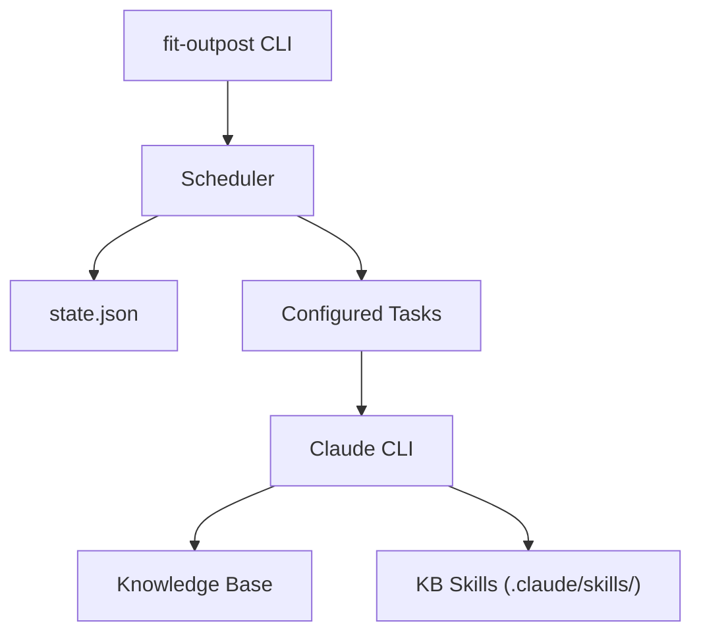

## Architecture



The composition root (`src/outpost.js`) wires `StateManager` -> `AgentRunner` ->
`Scheduler` -> `SocketServer` with explicit dependency passing.

---

## Components

| Component       | Path                                        | Purpose                               |
| --------------- | ------------------------------------------- | ------------------------------------- |
| CLI & Scheduler | `products/outpost/src/outpost.js`           | Main entry point, daemon, task runner |
| State Manager   | `products/outpost/src/state-manager.js`     | Task run state persistence            |
| Agent Runner    | `products/outpost/src/agent-runner.js`      | Claude CLI process spawning           |
| Scheduler       | `products/outpost/src/scheduler.js`         | Interval-based task execution         |
| Socket Server   | `products/outpost/src/socket-server.js`     | IPC for macOS app communication       |
| KB Manager      | `products/outpost/src/kb-manager.js`        | Knowledge base operations             |
| Default Config  | `products/outpost/config/scheduler.json`    | Default task definitions              |
| KB Template     | `products/outpost/template/`                | Template for new knowledge bases      |
| KB Skills       | `products/outpost/template/.claude/skills/` | AI skill definitions for KB tasks     |
| macOS App       | `products/outpost/macos/`                   | Native status menu bar app            |

---

## macOS App

Outpost includes a native macOS menu bar application built in Swift. The app
provides a status menu icon, scheduler status display, and task execution
controls.

```
products/outpost/macos/
  Info.plist
  Outpost.entitlements
  Outpost/
    Package.swift
    Sources/
      main.swift              # App entry point
      AppDelegate.swift       # Application delegate
      StatusMenu.swift        # Status menu implementation
      DaemonConnection.swift  # Daemon IPC
      ProcessManager.swift    # Process lifecycle
```

### Building

```sh
cd products/outpost
bun run build:macos
```

### Process Tree (App Bundle)

When running as an app bundle, the process hierarchy is:

```
Outpost.app (Swift launcher)
  -> fit-outpost daemon (Node.js scheduler)
     -> claude (spawned per task execution)
     -> claude (spawned per task execution)
```

The Swift launcher starts the daemon process and communicates with it via the
socket server for status updates and task control.

---

## State Management

Task state is stored in `~/.fit/outpost/state.json`:

```json
{
  "sync-apple-mail": {
    "lastRun": "2025-01-15T10:30:00.000Z",
    "status": "success"
  }
}
```

The `StateManager` class reads and writes this file, tracking last run times and
status for each task. The scheduler uses this state to determine which tasks are
due for execution based on their configured intervals.

---

## Cache Directory

```
~/.cache/fit/outpost/
  apple_mail/       Cached Apple Mail data
  apple_calendar/   Cached Apple Calendar data
  drafts/           Draft responses
  state/            Intermediate processing state
```

---

## Logging

Logs are written to `~/.fit/outpost/logs/scheduler-YYYY-MM-DD.log`. Outpost uses
a local `createLogger(logDir, fs)` function (not libtelemetry) since it is a
user-facing CLI tool.

---

## Related Documentation

- [Knowledge Systems Guide](/docs/products/knowledge-systems/) -- Knowledge base
  setup and usage
- [Pathway Internals](/docs/internals/pathway/) -- Agent profile format used by
  tasks
