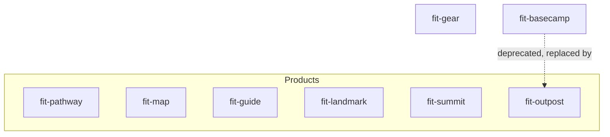

## Overview

The `forwardimpact/homebrew-tap` repository hosts eight cask files — seven live
casks (`fit-pathway`, `fit-map`, `fit-guide`, `fit-landmark`, `fit-summit`,
`fit-outpost`, `fit-gear`) and one deprecated alias (`fit-basecamp`). Each cask
points at a release asset on `forwardimpact/monorepo` and exposes the executables
bundled in that release on the user's `PATH` after `brew install`.

The `.github/workflows/publish-brew.yml` workflow in this monorepo writes two
fields — `version` and `sha256` — into the matching cask on every accepted tag.
Every other field — `url`, `app`, `binary`, `livecheck`, `zap`, `deprecate!` —
is human-edited in the tap repo and survives releases unchanged. This page is
the long-lived reference for the cross-cutting decisions behind those
human-edited fields. It lives in the monorepo because the conventions and the
workflow decay together: a workflow PR that breaks the contract is reviewed
alongside the conventions PR that documents it.

## Sed contract

The `tap-pr` job's "Update cask version and sha256" step rewrites exactly two
lines per cask using GNU `sed`:

```sh
sed -i \
  -e "s|^  version \".*\"|  version \"${VERSION}\"|" \
  -e "s|^  sha256 \".*\"|  sha256 \"${SHA256}\"|" \
  "$CASK_FILE"
```

The substitution requires each field to appear at the start of a line with a
two-space indent, the field name, a single space, and a double-quoted value:

```ruby
  version "1.2.3"
  sha256 "abc123…"
```

A cask whose `version` or `sha256` deviates from that shape — different indent,
single quotes, or interpolated value — silently survives the workflow without
being rewritten. Reviewers must keep both lines in the canonical shape on every
tap PR. Every other field is untouched by the workflow; binary stanzas,
livecheck blocks, and the `deprecate!` clause on `fit-basecamp` are
human-edited in the tap repo and survive releases unchanged.

## Cask topology



All eight casks are independently installable. There are no `depends_on cask:`
edges between them — a user who runs `brew install --cask fit-pathway` does not
pull in `fit-gear`, and vice versa. The six product casks each surface a single
CLI on `PATH`. The shared `fit-gear` cask bundles 25 service and library CLIs.
`fit-basecamp` is a deprecated alias that retains `url` and `sha256` for the
sed contract but exposes no executables; it exists for `brew search`
discoverability and points users at `fit-outpost`.

## Binary stanza mapping

Each cask exposes only the executables bundled in its own `.app`. This table is
authoritative; reviewers comparing a tap PR against the source bundle should
expect exact-name matches with no extras and no omissions.

| Cask           | Executables on PATH                                                                                                                                                                                                                                                                                                                                                          | Count |
| -------------- | ---------------------------------------------------------------------------------------------------------------------------------------------------------------------------------------------------------------------------------------------------------------------------------------------------------------------------------------------------------------------------- | ----- |
| `fit-pathway`  | `fit-pathway`                                                                                                                                                                                                                                                                                                                                                                | 1     |
| `fit-map`      | `fit-map`                                                                                                                                                                                                                                                                                                                                                                    | 1     |
| `fit-guide`    | `fit-guide`                                                                                                                                                                                                                                                                                                                                                                  | 1     |
| `fit-landmark` | `fit-landmark`                                                                                                                                                                                                                                                                                                                                                               | 1     |
| `fit-summit`   | `fit-summit`                                                                                                                                                                                                                                                                                                                                                                 | 1     |
| `fit-outpost`  | `fit-outpost`                                                                                                                                                                                                                                                                                                                                                                | 1     |
| `fit-gear`     | `fit-svcgraph`, `fit-svcmcp`, `fit-svcpathway`, `fit-svctrace`, `fit-svcvector`, `fit-codegen`, `fit-terrain`, `fit-eval`, `fit-doc`, `fit-rc`, `fit-xmr`, `fit-storage`, `fit-logger`, `fit-svscan`, `fit-trace`, `fit-visualize`, `fit-query`, `fit-subjects`, `fit-process-graphs`, `fit-process-resources`, `fit-process-vectors`, `fit-search`, `fit-unary`, `fit-tiktoken`, `fit-download-bundle` | 25    |

Outpost's `Outpost` launcher (the Swift GUI process) is reachable via the
installed `.app` in `/Applications/Forward Impact/` but is intentionally not
placed on `PATH` — it is a native GUI launcher, not a CLI.

## Livecheck regex pattern

Each live cask uses Homebrew's `:github_releases` strategy with a per-cask
regex anchored to its own tag prefix:

```ruby
livecheck do
  url :url
  strategy :github_releases
  regex(/^pathway@v(\d+(?:\.\d+)+)$/i)
end
```

The `:url` source reuses the cask's own download URL so livecheck discovers the
correct repository without a hardcoded path. Each regex anchors with `^...$` to
match only its own tag prefix from the monorepo's shared releases page — which
mixes seven independently-versioned bundles. An unanchored regex would surface
the highest semver across all bundles, which is wrong for every cask but
whichever happens to lead the alphabet on the latest tag.

## App install path

All casks install their `.app` bundle to a `Forward Impact/` subdirectory under
`/Applications/`:

```ruby
app "fit-pathway.app", target: "Forward Impact/fit-pathway.app"
```

Binary stanzas reference this subdirectory path when symlinking executables
into Homebrew's `bin/`:

```ruby
binary "#{appdir}/Forward Impact/fit-pathway.app/Contents/MacOS/fit-pathway"
```

The grouping was chosen over a flat `/Applications/` install because eight
bundles installed flat clutter the top-level Applications folder among
unrelated apps. Users who want to launch a Forward Impact tool via Finder find
all of them in one place; uninstalling the tap leaves a single empty directory
to clean up.

## Zap and uninstall paths

Each cask carries a `zap trash:` clause that removes the bundle's preferences
plist on `brew uninstall --zap`:

| Cask           | Zap path                                                  |
| -------------- | --------------------------------------------------------- |
| `fit-pathway`  | `~/Library/Preferences/team.forwardimpact.pathway.plist`  |
| `fit-map`      | `~/Library/Preferences/team.forwardimpact.map.plist`      |
| `fit-guide`    | `~/Library/Preferences/team.forwardimpact.guide.plist`    |
| `fit-landmark` | `~/Library/Preferences/team.forwardimpact.landmark.plist` |
| `fit-summit`   | `~/Library/Preferences/team.forwardimpact.summit.plist`   |
| `fit-outpost`  | `~/Library/Preferences/team.forwardimpact.outpost.plist`  |
| `fit-gear`     | `~/Library/Preferences/team.forwardimpact.gear.plist`     |

Each plist path matches the bundle's `CFBundleIdentifier` from its
`macos/{name}/Info.plist`. `fit-basecamp` carries no `zap` clause — it owns no
on-disk state of its own; users migrating from `fit-basecamp` to `fit-outpost`
follow the storage-path migration command referenced in the deprecation
precedent below.

## Verification commands

A human reviewer on a tap PR runs these commands locally before merging — the
tap repo does not yet automate them in CI:

```sh
brew style Casks/*.rb                       # style + syntax across all casks
brew audit --new-cask Casks/fit-pathway.rb  # full audit for one cask
```

`brew style` and `brew audit --new-cask` together catch the common authoring
mistakes (missing `desc`, unsorted stanzas, unanchored livecheck regex) before
they ship. To dry-run the workflow's sed contract against a specific cask
without tagging a release, run the literal substitution from the workflow:

```sh
SAMPLE_SHA256=$(printf 'sample' | shasum -a 256 | awk '{print $1}')
sed -i \
  -e "s|^  version \".*\"|  version \"9.9.9\"|" \
  -e "s|^  sha256 \".*\"|  sha256 \"${SAMPLE_SHA256}\"|" \
  Casks/fit-pathway.rb
```

The dry-run requires GNU `sed` — the literal contract runs on `ubuntu-latest`
in the workflow. On macOS, install `gnu-sed` via `brew install gnu-sed` and
substitute `gsed` for `sed` above; default BSD `sed` rejects the shape because
its `-i` flag requires a backup suffix as the next argument.

## Deprecation precedent

`fit-basecamp` is the first deprecated cask in the tap. It uses Homebrew's
`deprecate!` DSL with the rename date matching the Outpost rename's clean-break
stance:

```ruby
deprecate! date: "2026-04-30", because: "renamed to fit-outpost"
```

The cask retains `url` and `sha256` (so the sed contract still parses against
it) but carries no `app`, `binary`, `livecheck`, or `zap` stanzas. It exists
only for `brew search fit-basecamp` discoverability — a user who searches for
the legacy name sees the deprecation date, the rename rationale, and a
description naming `fit-outpost` as the replacement. The `desc` field also
references the storage-path manual-migration command from the Outpost rename's
release notes (#625 phase 8d) so legacy users moving their Outpost knowledge
base across the rename find the command alongside the deprecation notice:

```sh
cp -R ~/.fit/basecamp/. ~/.fit/outpost/
cp -R ~/.cache/fit/basecamp/. ~/.cache/fit/outpost/
```

Future deprecations follow the same shape: a standalone `<old>.rb` cask with
`deprecate! date:`, no behavioural stanzas, a `desc` that names the
replacement, and a tap-side PR landing on the deprecation date.

## What's next

<div class="grid">

<!-- part:card:../operations -->
<!-- part:card:../kata -->

</div>
