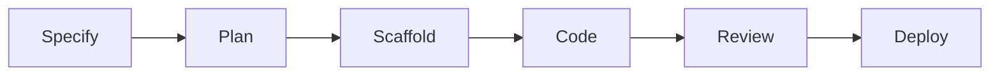

## Overview

The lifecycle model describes six phases that engineering work moves through,
from specification to deployment. Each phase has handoff triggers, constraints,
and checklists that guide quality transitions.

Phases are conceptual workflow vocabulary — they describe what kind of work is
happening and what discipline applies, not data entities backed by YAML files.

---

## The Six Phases



| Phase        | Purpose                                               |
| ------------ | ----------------------------------------------------- |
| **specify**  | Define WHAT users need and WHY                        |
| **plan**     | Design HOW to build (architecture, technical choices) |
| **scaffold** | Prepare dev environment, dependencies, credentials    |
| **code**     | Implement the solution and write tests                |
| **review**   | Verify implementation against acceptance criteria     |
| **deploy**   | Ship to production, monitor CI/CD                     |

---

## Handoffs

Handoffs are the transitions between phases. Each phase defines triggers that
specify where work flows next.

### Specify Phase

| Handoff                 | Target  | Trigger                  |
| ----------------------- | ------- | ------------------------ |
| Refine/Alternative Spec | specify | Requirements need rework |
| Plan                    | plan    | Spec accepted            |

### Plan Phase

| Handoff                 | Target   | Trigger             |
| ----------------------- | -------- | ------------------- |
| Refine/Alternative Plan | plan     | Design needs rework |
| Scaffold                | scaffold | Plan accepted       |

### Scaffold Phase

| Handoff     | Target   | Trigger                                     |
| ----------- | -------- | ------------------------------------------- |
| Retry Setup | scaffold | Environment setup failed                    |
| Update Plan | plan     | Plan needs revision based on setup findings |
| Code        | code     | Environment ready                           |

### Code Phase

| Handoff        | Target | Trigger                                |
| -------------- | ------ | -------------------------------------- |
| Request Review | review | Implementation complete, tests passing |

### Review Phase

| Handoff           | Target | Trigger                               |
| ----------------- | ------ | ------------------------------------- |
| Request Changes   | code   | Issues found, changes needed          |
| Needs Re-planning | plan   | Fundamental problems require redesign |
| Deploy            | deploy | Review approved                       |

### Deploy Phase

| Handoff      | Target | Trigger                      |
| ------------ | ------ | ---------------------------- |
| Fix Pipeline | deploy | CI/CD issues need resolution |

---

## Constraints

Each phase defines constraints that limit what actions are allowed. Constraints
are especially important for AI agents — they prevent scope creep and ensure
agents stay within their authorized boundaries.

| Phase        | Cannot                                        |
| ------------ | --------------------------------------------- |
| **specify**  | Write code, make architectural decisions      |
| **plan**     | Commit code, go beyond specified requirements |
| **scaffold** | Implement features, change the plan           |
| **code**     | Change architecture, deviate from the plan    |
| **review**   | Add features, only verify and request changes |
| **deploy**   | Change code, only fix pipeline configuration  |

---

## Checklists

Checklists ensure quality at phase transitions. Each skill defines its own
checklist items as flat fields in the agent section of the skill's YAML
definition.

### Two Types

| Type                | When                 | Purpose                       |
| ------------------- | -------------------- | ----------------------------- |
| **Read-Then-Do**    | Before starting work | Prerequisites and preparation |
| **Do-Then-Confirm** | Before handing off   | Verification criteria         |

Read-then-do checklists are entry gates — read each item, then do it.
Do-then-confirm checklists are exit gates — do from memory, then confirm every
item before crossing a boundary.

### How Checklists Are Defined

Skills define checklists as flat fields in their agent section:

- `agent.readChecklist` — items for the read-then-do gate
- `agent.confirmChecklist` — items for the do-then-confirm gate

These fields live directly on each skill, not derived from a phase x skill
matrix. Capability authors write checklist items at each proficiency level; the
agent's derived proficiency determines which items apply.

### Example

Given a practitioner-level CI/CD skill:

**Read-Then-Do (before coding):**

- Review the deployment pipeline configuration
- Understand the test infrastructure
- Check branch protection rules

**Do-Then-Confirm (before requesting review):**

- All new code has test coverage
- Pipeline passes on the feature branch
- Documentation updated for changed interfaces

---

## Phases and Agents

Agents are generated per discipline and track — one agent per combination, not
one per lifecycle phase. Phases guide an agent's workflow focus: what to
prioritize, what constraints apply, and which checklist items are relevant at
each point in the work.

Generate an agent profile for a discipline and track:

```sh
npx fit-pathway agent <discipline> --track=<track> --output=./agents
```

The generated profile includes the agent's full skill set, checklist items, and
behavioural expectations. Phases are not an input to agent generation — they
describe the workflow context in which the agent operates.

Run `npx fit-pathway agent --help` for the full command surface.

---

## What's next

<div class="grid">

<!-- part:card:../model -->
<!-- part:card:../yaml-schema -->

</div>
